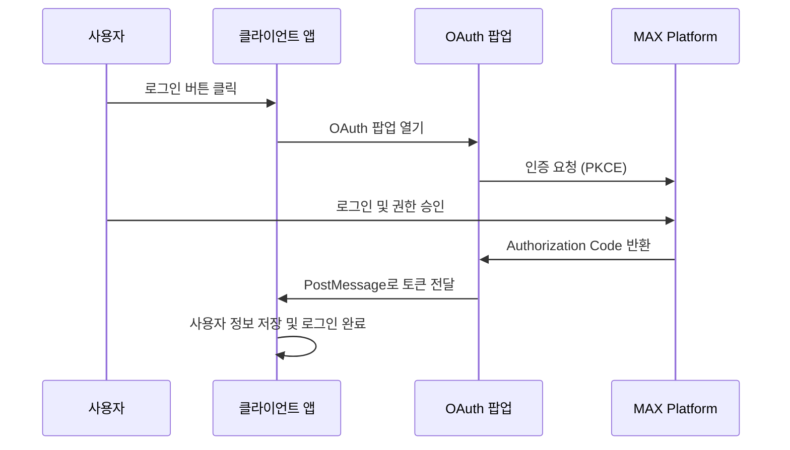
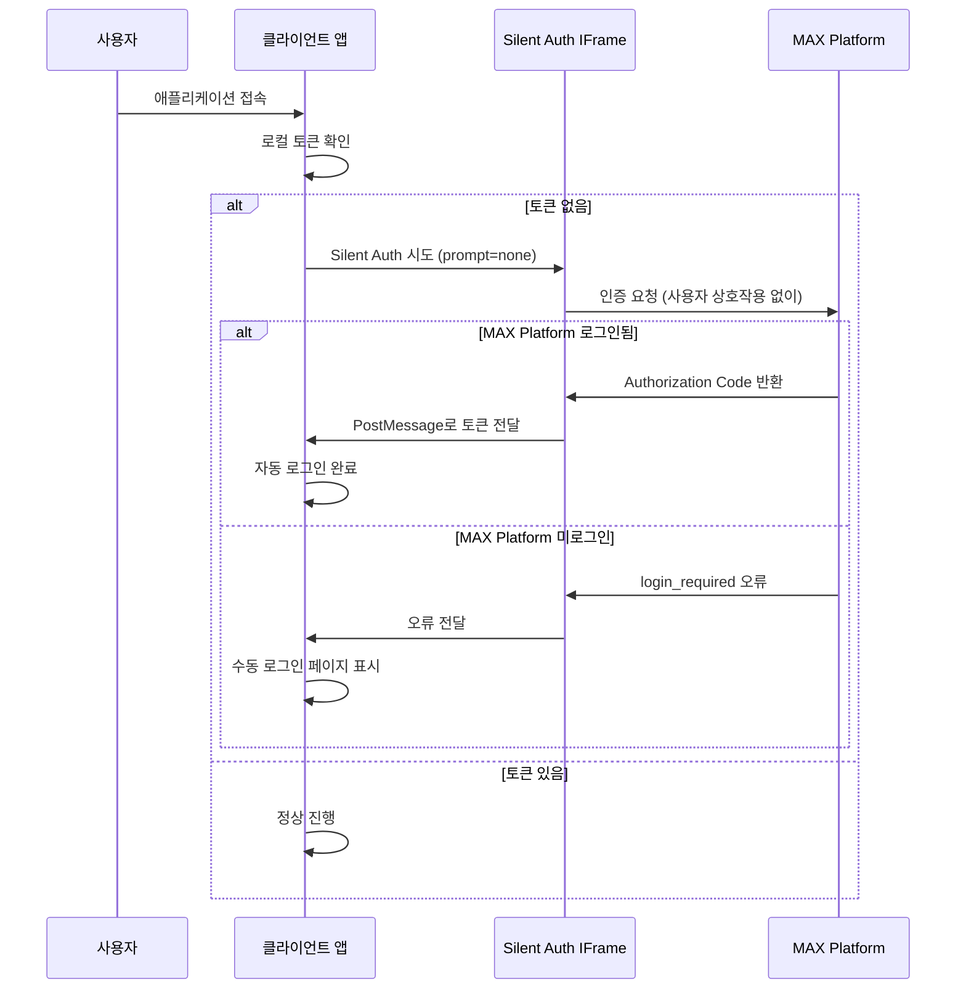

# MAX Platform OAuth 2.0 통합 가이드

이 문서는 MAX Platform 생태계의 모든 솔루션에서 OAuth 2.0 인증을 통합하기 위한 종합 가이드입니다.

## 목차
- [1. 개요](#1-개요)
- [2. 시스템 아키텍처](#2-시스템-아키텍처)
- [3. 시스템별 설정](#3-시스템별-설정)
- [4. Frontend 구현](#4-frontend-구현)
- [5. SSO 자동 로그인 구현](#5-sso-자동-로그인-구현)
- [6. Backend 구현](#6-backend-구현)
- [7. 보안 고려사항](#7-보안-고려사항)
- [8. 트러블슈팅](#8-트러블슈팅)
- [9. 체크리스트](#9-체크리스트)
- [10. 참고 자료](#10-참고-자료)

## 1. 개요

### OAuth 2.0 플로우
MAX Platform에서는 **Authorization Code Flow with PKCE**를 사용한 팝업 기반 인증을 구현합니다.



### 핵심 특징
- **팝업 기반**: 사용자가 원래 앱을 떠나지 않음
- **SSO 자동 로그인**: MAX Platform 로그인 상태 시 자동 인증
- **Silent Authentication**: iframe 기반 조용한 인증 시도
- **PKCE 보안**: Code Challenge/Verifier 사용
- **PostMessage 통신**: 안전한 크로스 윈도우 통신
- **표준 준수**: OAuth 2.0 RFC 8252 준수

## 2. 시스템 아키텍처

### 전체 구조
```
MAX Platform (OAuth 서버)
├── 인증 서비스 (localhost:8000)
├── 사용자 관리
└── 권한 관리

클라이언트 애플리케이션들
├── MaxFlowStudio (3005 ↔ 8005)
├── MaxLab (3010 ↔ 8010)
├── MaxTeamSync (3015 ↔ 8015)
├── MaxWorkspace (3020 ↔ 8020)
├── MaxQueryHub (3025 ↔ 8025)
├── MaxLLM (3030 ↔ 8030)
├── MaxAPA (3035 ↔ 8035)
└── MaxMLOps (3040 ↔ 8040)
```

### 통신 플로우

#### 기본 OAuth 플로우
1. **클라이언트** → **MAX Platform**: OAuth 인증 요청
2. **MAX Platform** → **클라이언트**: Authorization Code 반환
3. **클라이언트** → **MAX Platform**: 토큰 교환 요청
4. **MAX Platform** → **클라이언트**: Access Token 반환

#### SSO 자동 로그인 플로우
1. **사용자 접속** → **클라이언트**: 애플리케이션 접속
2. **클라이언트**: 저장된 토큰 확인
3. **토큰 없음** → **Silent Auth**: iframe으로 조용한 인증 시도 (`prompt=none`)
4. **성공 시**: 자동 로그인 완료
5. **실패 시**: 수동 로그인 페이지 표시

## 3. 시스템별 설정

### 포트 및 엔드포인트 매핑

| 솔루션 | 클라이언트 ID | Frontend | Backend | Redirect URI |
|--------|---------------|----------|---------|--------------|
| maxplatform | N/A (OAuth 서버) | localhost:3000 | localhost:8000 | N/A |
| maxflowstudio | `maxflowstudio` | localhost:3005 | localhost:8005 | `http://localhost:3005/oauth/callback` |
| maxlab | `maxlab` | localhost:3010 | localhost:8010 | `http://localhost:3010/oauth/callback` |
| maxteamsync | `maxteamsync` | localhost:3015 | localhost:8015 | `http://localhost:3015/oauth/callback` |
| maxworkspace | `maxworkspace` | localhost:3020 | localhost:8020 | `http://localhost:3020/oauth/callback` |
| maxqueryhub | `maxqueryhub` | localhost:3025 | localhost:8025 | `http://localhost:3025/oauth/callback` |
| maxllm | `maxllm` | localhost:3030 | localhost:8030 | `http://localhost:3030/oauth/callback` |
| maxapa | `maxapa` | localhost:3035 | localhost:8035 | `http://localhost:3035/oauth/callback` |
| maxmlops | `maxmlops` | localhost:3040 | localhost:8040 | `http://localhost:3040/oauth/callback` |

### OAuth 엔드포인트
- **Authorization**: `http://localhost:8000/api/oauth/authorize`
- **Token Exchange**: `http://localhost:8000/api/oauth/token`
- **User Info**: `http://localhost:8000/api/oauth/userinfo`
- **Token Revocation**: `http://localhost:8000/api/oauth/revoke`

## 4. Frontend 구현

### 4.1 환경변수 설정

```env
# .env (각 시스템별로 수정)
VITE_AUTH_SERVER_URL=http://localhost:8000
VITE_CLIENT_ID=maxflowstudio  # 시스템별로 변경
VITE_REDIRECT_URI=http://localhost:3005/oauth/callback  # 시스템별로 변경
```

### 4.2 OAuth 유틸리티 클래스

```typescript
// src/utils/popupOAuth.ts
interface TokenResponse {
  access_token: string;
  token_type: string;
  expires_in: number;
  scope: string;
}

interface OAuthMessage {
  type: 'OAUTH_SUCCESS' | 'OAUTH_ERROR';
  token?: string;
  tokenData?: TokenResponse;
  error?: string;
}

export class PopupOAuthLogin {
  private popup: Window | null = null;
  private checkInterval: NodeJS.Timeout | null = null;
  private messageHandler: ((event: MessageEvent) => void) | null = null;
  private messageReceived: boolean = false;

  private readonly clientId: string;
  private readonly redirectUri: string;
  private readonly authUrl: string;
  private readonly scopes = ['read:profile', 'read:groups', 'manage:workflows'];

  constructor() {
    this.clientId = import.meta.env.VITE_CLIENT_ID;
    this.redirectUri = import.meta.env.VITE_REDIRECT_URI;
    this.authUrl = import.meta.env.VITE_AUTH_SERVER_URL;
  }

  // PKCE 구현
  private generateCodeVerifier(): string {
    const array = new Uint8Array(32);
    crypto.getRandomValues(array);
    return this.base64URLEncode(array);
  }

  private async generateCodeChallenge(verifier: string): Promise<string> {
    const encoder = new TextEncoder();
    const data = encoder.encode(verifier);
    const digest = await crypto.subtle.digest('SHA-256', data);
    return this.base64URLEncode(new Uint8Array(digest));
  }

  private base64URLEncode(array: Uint8Array): string {
    return btoa(String.fromCharCode(...array))
      .replace(/\+/g, '-')
      .replace(/\//g, '_')
      .replace(/=/g, '');
  }

  // OAuth 시작
  async startAuth(): Promise<TokenResponse> {
    return new Promise(async (resolve, reject) => {
      try {
        // PKCE 파라미터 생성
        const state = this.generateCodeVerifier();
        const codeVerifier = this.generateCodeVerifier();
        const codeChallenge = await this.generateCodeChallenge(codeVerifier);

        // 세션 스토리지에 저장
        sessionStorage.setItem('oauth_state', state);
        sessionStorage.setItem('oauth_code_verifier', codeVerifier);
        sessionStorage.setItem('oauth_popup_mode', 'true');

        // OAuth URL 생성
        const params = new URLSearchParams({
          response_type: 'code',
          client_id: this.clientId,
          redirect_uri: this.redirectUri,
          scope: this.scopes.join(' '),
          state: state,
          code_challenge: codeChallenge,
          code_challenge_method: 'S256'
        });

        const authUrl = `${this.authUrl}/api/oauth/authorize?${params}`;
        console.log('🔐 Opening OAuth popup:', authUrl);

        // 팝업 열기
        this.popup = window.open(
          authUrl,
          'oauth_login',
          'width=500,height=600,scrollbars=yes,resizable=yes,top=100,left=100'
        );

        if (!this.popup) {
          reject(new Error('Popup was blocked. Please allow popups and try again.'));
          return;
        }

        // PostMessage 이벤트 리스너
        this.messageHandler = (event: MessageEvent<OAuthMessage>) => {
          // Origin 검증
          const trustedOrigins = [
            window.location.origin,
            'http://localhost:3000'  // MAX Platform
          ];
          
          if (!trustedOrigins.includes(event.origin)) {
            console.warn('Ignoring message from untrusted origin:', event.origin);
            return;
          }

          console.log('📨 Received OAuth message:', event.data);
          this.messageReceived = true;

          if (event.data.type === 'OAUTH_SUCCESS') {
            if (this.checkInterval) {
              clearInterval(this.checkInterval);
              this.checkInterval = null;
            }
            
            this.cleanup();
            if (event.data.tokenData) {
              resolve(event.data.tokenData);
            } else if (event.data.token) {
              resolve({
                access_token: event.data.token,
                token_type: 'Bearer',
                expires_in: 3600,
                scope: this.scopes.join(' ')
              });
            } else {
              reject(new Error('No token data received'));
            }
          } else if (event.data.type === 'OAUTH_ERROR') {
            this.cleanup();
            reject(new Error(event.data.error || 'OAuth authentication failed'));
          }
        };

        window.addEventListener('message', this.messageHandler);

        // 팝업 닫힘 감지
        this.checkInterval = setInterval(() => {
          if (this.popup?.closed) {
            setTimeout(() => {
              if (!this.messageReceived) {
                console.log('🚪 Popup closed without receiving message - user cancelled');
                this.cleanup();
                reject(new Error('Authentication was cancelled by the user'));
              }
            }, 100);
          }
        }, 500);

      } catch (error) {
        this.cleanup();
        reject(error);
      }
    });
  }

  // 정리
  private cleanup(): void {
    if (this.popup && !this.popup.closed) {
      this.popup.close();
    }
    
    if (this.checkInterval) {
      clearInterval(this.checkInterval);
      this.checkInterval = null;
    }

    if (this.messageHandler) {
      window.removeEventListener('message', this.messageHandler);
      this.messageHandler = null;
    }

    this.popup = null;
    this.messageReceived = false;
    
    sessionStorage.removeItem('oauth_popup_mode');
    sessionStorage.removeItem('oauth_state');
    sessionStorage.removeItem('oauth_code_verifier');
  }

  public forceCleanup(): void {
    this.cleanup();
  }
}

// 토큰 교환
export async function exchangeCodeForToken(code: string): Promise<TokenResponse> {
  const codeVerifier = sessionStorage.getItem('oauth_code_verifier');
  const authUrl = import.meta.env.VITE_AUTH_SERVER_URL;
  
  if (!codeVerifier) {
    throw new Error('No code verifier found in session storage');
  }

  const response = await fetch(`${authUrl}/api/oauth/token`, {
    method: 'POST',
    headers: {
      'Content-Type': 'application/x-www-form-urlencoded',
    },
    body: new URLSearchParams({
      grant_type: 'authorization_code',
      code: code,
      redirect_uri: import.meta.env.VITE_REDIRECT_URI,
      client_id: import.meta.env.VITE_CLIENT_ID,
      code_verifier: codeVerifier
    })
  });

  if (!response.ok) {
    const errorData = await response.json().catch(() => ({}));
    throw new Error(errorData.error_description || `Token exchange failed: ${response.statusText}`);
  }

  return response.json() as TokenResponse;
}

// 팝업 모드 확인
export function isPopupMode(): boolean {
  return sessionStorage.getItem('oauth_popup_mode') === 'true' || 
         window.opener !== null;
}

// 사용자 정보 가져오기
export async function getUserInfo(accessToken: string): Promise<any> {
  const authUrl = import.meta.env.VITE_AUTH_SERVER_URL;
  
  const response = await fetch(`${authUrl}/api/oauth/userinfo`, {
    headers: {
      'Authorization': `Bearer ${accessToken}`
    }
  });

  if (!response.ok) {
    throw new Error(`Failed to fetch user info: ${response.statusText}`);
  }

  return response.json();
}
```

### 4.3 OAuth 콜백 컴포넌트

```typescript
// src/pages/OAuthCallback.tsx
import React, { useEffect, useState } from 'react';
import { useNavigate, useSearchParams } from 'react-router-dom';
import { Spin, Alert, Typography, Card } from 'antd';
import { LoadingOutlined, CheckCircleOutlined, ExclamationCircleOutlined } from '@ant-design/icons';
import { authService } from '../services/auth';
import { exchangeCodeForToken, isPopupMode } from '../utils/popupOAuth';

const { Title, Paragraph } = Typography;

interface CallbackState {
  status: 'loading' | 'success' | 'error';
  message: string;
  error?: string;
}

export const OAuthCallback: React.FC = () => {
  const navigate = useNavigate();
  const [searchParams] = useSearchParams();
  const [state, setState] = useState<CallbackState>({
    status: 'loading',
    message: 'Processing OAuth callback...'
  });

  useEffect(() => {
    const handleOAuthCallback = async () => {
      try {
        const code = searchParams.get('code');
        const state = searchParams.get('state');
        const error = searchParams.get('error');
        const errorDescription = searchParams.get('error_description');
        
        const inPopupMode = isPopupMode();
        
        if (error) {
          const errorMessage = errorDescription || `OAuth error: ${error}`;
          
          if (inPopupMode) {
            window.opener?.postMessage({
              type: 'OAUTH_ERROR',
              error: errorMessage
            }, window.location.origin);
            window.close();
            return;
          } else {
            throw new Error(errorMessage);
          }
        }

        if (!code) {
          throw new Error('No authorization code received');
        }

        setState({
          status: 'loading',
          message: 'Exchanging authorization code for access token...'
        });

        if (inPopupMode) {
          try {
            // 상태 검증
            const storedState = sessionStorage.getItem('oauth_state');
            if (state !== storedState) {
              window.opener?.postMessage({
                type: 'OAUTH_ERROR',
                error: 'Invalid state parameter - possible security issue'
              }, window.location.origin);
              window.close();
              return;
            }

            // 토큰 교환
            const tokenResponse = await exchangeCodeForToken(code);
            
            // 세션 정리
            sessionStorage.removeItem('oauth_state');
            sessionStorage.removeItem('oauth_code_verifier');
            sessionStorage.removeItem('oauth_popup_mode');
            
            // 성공 메시지 전송
            window.opener?.postMessage({
              type: 'OAUTH_SUCCESS',
              token: tokenResponse.access_token,
              tokenData: tokenResponse
            }, window.location.origin);
            
            window.close();
            
          } catch (error: any) {
            console.error('Popup OAuth token exchange error:', error);
            window.opener?.postMessage({
              type: 'OAUTH_ERROR',
              error: error.message || 'Token exchange failed'
            }, window.location.origin);
            window.close();
          }
        } else {
          // 일반 모드
          const user = await authService.handleOAuthCallback();

          setState({
            status: 'success',
            message: `Welcome back, ${user.full_name || user.username}! Redirecting...`
          });

          setTimeout(() => {
            const redirectTo = sessionStorage.getItem('oauthRedirectTo') || '/';
            sessionStorage.removeItem('oauthRedirectTo');
            navigate(redirectTo, { replace: true });
          }, 2000);
        }

      } catch (error: any) {
        console.error('OAuth callback error:', error);
        
        if (isPopupMode()) {
          window.opener?.postMessage({
            type: 'OAUTH_ERROR',
            error: error.message || 'Authentication failed'
          }, window.location.origin);
          window.close();
        } else {
          setState({
            status: 'error',
            message: 'Authentication failed',
            error: error.message || 'An unexpected error occurred during authentication'
          });

          setTimeout(() => {
            navigate('/login', { replace: true });
          }, 5000);
        }
      }
    };

    handleOAuthCallback();
  }, [navigate, searchParams]);

  const renderIcon = () => {
    switch (state.status) {
      case 'loading':
        return <LoadingOutlined style={{ fontSize: 48, color: '#1890ff' }} spin />;
      case 'success':
        return <CheckCircleOutlined style={{ fontSize: 48, color: '#52c41a' }} />;
      case 'error':
        return <ExclamationCircleOutlined style={{ fontSize: 48, color: '#ff4d4f' }} />;
    }
  };

  // 팝업 모드일 때는 간단한 UI
  if (isPopupMode()) {
    return (
      <div style={{
        display: 'flex',
        justifyContent: 'center',
        alignItems: 'center',
        height: '100vh',
        fontFamily: '-apple-system, BlinkMacSystemFont, "Segoe UI", Roboto, sans-serif',
        background: '#f5f5f5'
      }}>
        <div style={{ textAlign: 'center', padding: '40px' }}>
          <div style={{
            border: '4px solid #f3f3f3',
            borderTop: '4px solid #1890ff',
            borderRadius: '50%',
            width: '40px',
            height: '40px',
            animation: 'spin 2s linear infinite',
            margin: '0 auto 20px'
          }}></div>
          <Title level={4} style={{ marginBottom: 8, color: '#262626' }}>
            Processing Authentication...
          </Title>
          <Paragraph style={{ fontSize: 14, color: '#666', margin: 0 }}>
            Please wait while we complete your login.
          </Paragraph>
          <style>{`
            @keyframes spin {
              0% { transform: rotate(0deg); }
              100% { transform: rotate(360deg); }
            }
          `}</style>
        </div>
      </div>
    );
  }

  // 일반 모드 UI
  return (
    <div style={{ 
      minHeight: '100vh',
      display: 'flex',
      alignItems: 'center',
      justifyContent: 'center',
      background: 'linear-gradient(135deg, #667eea 0%, #764ba2 100%)',
      padding: '20px'
    }}>
      <Card
        style={{
          width: '100%',
          maxWidth: 500,
          textAlign: 'center',
          borderRadius: 12,
          boxShadow: '0 8px 32px rgba(0,0,0,0.1)'
        }}
        styles={{ body: { padding: '48px 32px' } }}
      >
        <div style={{ marginBottom: 24 }}>
          {renderIcon()}
        </div>
        
        <Title level={3} style={{ marginBottom: 16, color: '#262626' }}>
          {state.status === 'loading' && 'Authenticating...'}
          {state.status === 'success' && 'Login Successful!'}
          {state.status === 'error' && 'Authentication Failed'}
        </Title>
        
        <Paragraph style={{ fontSize: 16, color: '#666', marginBottom: 8 }}>
          {state.message}
        </Paragraph>
        
        {state.error && (
          <Alert
            message="Authentication Error"
            description={state.error}
            type="error"
            showIcon
            style={{ marginTop: 24 }}
          />
        )}
      </Card>
    </div>
  );
};
```

### 4.4 인증 서비스

```typescript
// src/services/auth.ts
import { PopupOAuthLogin, getUserInfo } from '../utils/popupOAuth';
import type { User } from '../types';

export const authService = {
  /**
   * 팝업 OAuth 로그인
   */
  loginWithPopupOAuth: async (): Promise<User> => {
    const oauthInstance = new PopupOAuthLogin();
    
    try {
      console.log('🔐 Starting popup OAuth login...');
      
      const tokenResponse = await oauthInstance.startAuth();
      console.log('✅ Popup OAuth successful, getting user info...');
      
      const userInfo = await getUserInfo(tokenResponse.access_token);
      
      // 토큰 저장
      localStorage.setItem('accessToken', tokenResponse.access_token);
      localStorage.setItem('tokenType', tokenResponse.token_type);
      localStorage.setItem('expiresIn', tokenResponse.expires_in.toString());
      localStorage.setItem('scope', tokenResponse.scope);
      
      // 사용자 정보 매핑
      const user: User = {
        id: userInfo.sub,
        email: userInfo.email,
        username: userInfo.display_name,
        full_name: userInfo.real_name,
        is_active: true,
        is_superuser: userInfo.is_admin,
        created_at: new Date().toISOString(),
        updated_at: new Date().toISOString(),
        group_id: userInfo.groups?.[0]?.id
      };
      
      localStorage.setItem('user', JSON.stringify(user));
      return user;
      
    } catch (error: any) {
      console.error('Popup OAuth login error:', error);
      
      // 구체적인 에러 메시지
      if (error.message?.includes('blocked')) {
        throw new Error('Popup was blocked. Please allow popups for this site and try again.');
      } else if (error.message?.includes('cancelled')) {
        throw new Error('Login was cancelled by the user.');
      } else if (error.message?.includes('login_required')) {
        throw new Error('Please log in to MAX Platform first, then try OAuth login again.');
      } else {
        throw new Error('OAuth login failed. Please try again or contact support if the problem persists.');
      }
    } finally {
      oauthInstance.forceCleanup();
    }
  },

  /**
   * 현재 사용자 정보 가져오기
   */
  getCurrentUser: async (): Promise<User> => {
    const accessToken = localStorage.getItem('accessToken');
    if (!accessToken) {
      throw new Error('No access token available');
    }

    const userInfo = await getUserInfo(accessToken);
    
    return {
      id: userInfo.sub,
      email: userInfo.email,
      username: userInfo.display_name,
      full_name: userInfo.real_name,
      is_active: true,
      is_superuser: userInfo.is_admin,
      created_at: new Date().toISOString(),
      updated_at: new Date().toISOString(),
      group_id: userInfo.groups?.[0]?.id
    };
  },

  /**
   * 로그아웃
   */
  logout: async (): Promise<void> => {
    try {
      const accessToken = localStorage.getItem('accessToken');
      if (accessToken) {
        // 토큰 취소 요청
        const authUrl = import.meta.env.VITE_AUTH_SERVER_URL;
        await fetch(`${authUrl}/api/oauth/revoke`, {
          method: 'POST',
          headers: {
            'Content-Type': 'application/x-www-form-urlencoded',
          },
          body: new URLSearchParams({
            token: accessToken,
            client_id: import.meta.env.VITE_CLIENT_ID
          })
        });
      }
    } catch (error) {
      console.error('Logout error:', error);
    } finally {
      // 로컬 데이터 정리
      localStorage.removeItem('accessToken');
      localStorage.removeItem('tokenType');
      localStorage.removeItem('expiresIn');
      localStorage.removeItem('scope');
      localStorage.removeItem('user');
    }
  },

  /**
   * 인증 상태 확인
   */
  isAuthenticated: (): boolean => {
    return !!localStorage.getItem('accessToken');
  },

  /**
   * 저장된 사용자 정보 가져오기
   */
  getStoredUser: (): User | null => {
    const userStr = localStorage.getItem('user');
    return userStr ? JSON.parse(userStr) : null;
  },

  /**
   * 회원가입 리다이렉트
   */
  redirectToSignup: (): void => {
    window.location.href = 'http://localhost:3000/signup?redirect=' + 
      encodeURIComponent(window.location.origin);
  }
};
```

### 4.5 인증 컨텍스트

```typescript
// src/contexts/AuthContext.tsx
import React, { createContext, useContext, useState, useEffect, type ReactNode } from 'react';
import { useNavigate, useLocation } from 'react-router-dom';
import { App } from 'antd';
import { authService } from '../services/auth';
import type { User } from '../types';

interface AuthContextType {
  user: User | null;
  isLoading: boolean;
  logout: () => Promise<void>;
  checkAuth: () => Promise<void>;
}

const AuthContext = createContext<AuthContextType | undefined>(undefined);

export const useAuth = () => {
  const context = useContext(AuthContext);
  if (!context) {
    throw new Error('useAuth must be used within an AuthProvider');
  }
  return context;
};

interface AuthProviderProps {
  children: ReactNode;
}

export const AuthProvider: React.FC<AuthProviderProps> = ({ children }) => {
  const [user, setUser] = useState<User | null>(null);
  const [isLoading, setIsLoading] = useState(true);
  const navigate = useNavigate();
  const location = useLocation();
  const { message } = App.useApp();

  // 로그인/OAuth 콜백 페이지에서는 인증 체크 건너뛰기
  useEffect(() => {
    const isOAuthCallback = location.pathname === '/oauth/callback';
    const isLoginPage = location.pathname === '/login';
    
    if (!isOAuthCallback && !isLoginPage) {
      checkAuth();
    } else {
      setIsLoading(false);
    }
  }, [location.pathname]);

  const checkAuth = async () => {
    try {
      if (authService.isAuthenticated()) {
        const currentUser = await authService.getCurrentUser();
        setUser(currentUser);
        localStorage.setItem('user', JSON.stringify(currentUser));
      } else {
        if (location.pathname !== '/login') {
          console.log('🚫 No authentication token, redirecting to login');
          navigate('/login');
        }
      }
    } catch (error: any) {
      console.error('Auth check failed:', error);
      
      // 인증 데이터 정리
      localStorage.removeItem('accessToken');
      localStorage.removeItem('user');
      setUser(null);
      
      if (location.pathname !== '/login') {
        navigate('/login');
      }
    } finally {
      setIsLoading(false);
    }
  };

  const logout = async () => {
    try {
      await authService.logout();
      setUser(null);
      message.success('Logged out successfully');
      navigate('/login');
    } catch (error) {
      console.error('Logout error:', error);
      setUser(null);
      navigate('/login');
    }
  };

  const value: AuthContextType = {
    user,
    isLoading,
    logout,
    checkAuth,
  };

  return <AuthContext.Provider value={value}>{children}</AuthContext.Provider>;
};
```

### 4.6 로그인 페이지

```typescript
// src/pages/LoginPage.tsx
import React from 'react';
import { Button, Card, Typography, App } from 'antd';
import { PartitionOutlined, LoginOutlined } from '@ant-design/icons';
import { authService } from '../services/auth';

const { Title, Text } = Typography;

export const LoginPage: React.FC = () => {
  const [oauthLoading, setOauthLoading] = React.useState(false);
  const { message } = App.useApp();

  const handleOAuthLogin = async () => {
    setOauthLoading(true);
    
    try {
      const user = await authService.loginWithPopupOAuth();
      
      message.success(`Welcome back, ${user.full_name || user.username}!`);
      window.location.href = '/dashboard';
      
    } catch (error: any) {
      console.error('OAuth login error:', error);
      
      if (error.message?.includes('blocked')) {
        message.warning({
          content: (
            <div>
              <strong>Popup Blocked</strong><br />
              Please allow popups for this site and try again.
            </div>
          ),
          duration: 8
        });
      } else if (error.message?.includes('cancelled')) {
        message.info('Login was cancelled by user.');
      } else if (error.message?.includes('login_required')) {
        message.warning({
          content: (
            <div>
              <strong>MAX Platform Login Required</strong><br />
              Please log in to MAX Platform first at{' '}
              <a href="http://localhost:3000" target="_blank" rel="noopener noreferrer">
                localhost:3000
              </a>
              , then try again.
            </div>
          ),
          duration: 12
        });
      } else {
        message.error({
          content: (
            <div>
              <strong>Authentication Failed</strong><br />
              {error.message || 'Please try again or contact support.'}
            </div>
          ),
          duration: 8
        });
      }
      
      setOauthLoading(false);
    }
  };

  const handleSignupRedirect = () => {
    authService.redirectToSignup();
  };

  return (
    <div className="min-h-screen flex items-center justify-center" style={{ 
      backgroundColor: '#ffffff',
      fontFamily: '-apple-system, BlinkMacSystemFont, "Segoe UI", Roboto, "Helvetica Neue", Arial, sans-serif'
    }}>
      <div className="w-full max-w-sm" style={{ padding: '0 24px' }}>
        {/* 로고 및 제목 */}
        <div className="text-center" style={{ marginBottom: '48px' }}>
          <div style={{ marginBottom: '24px' }}>
            <PartitionOutlined style={{ 
              fontSize: '48px', 
              color: '#000000',
              display: 'block',
              margin: '0 auto'
            }} />
          </div>
          <Title level={1} style={{ 
            color: '#000000', 
            marginBottom: '8px', 
            fontWeight: 700,
            fontSize: '32px',
            lineHeight: 1.2
          }}>
            {/* 시스템별로 변경 */}
            MAX FlowStudio
          </Title>
          <Text style={{ 
            color: '#666666', 
            fontSize: '16px', 
            fontWeight: 400,
            lineHeight: 1.5
          }}>
            No-Code LLMOps Platform
          </Text>
        </div>

        {/* 로그인 카드 */}
        <Card 
          style={{ 
            border: '1px solid #f1f1f1',
            borderRadius: '12px',
            boxShadow: '0 1px 3px rgba(0, 0, 0, 0.1)',
            backgroundColor: '#ffffff'
          }}
          styles={{ body: { padding: '32px' } }}
        >
          <div style={{ textAlign: 'center' }}>
            <Text style={{ 
              color: '#666666', 
              fontSize: '15px', 
              display: 'block', 
              marginBottom: '28px',
              lineHeight: 1.5,
              fontWeight: 400
            }}>
              Access with your MAX Platform account
            </Text>
            
            <Button
              type="primary"
              icon={<LoginOutlined />}
              onClick={handleOAuthLogin}
              loading={oauthLoading}
              block
              size="large"
              style={{ 
                height: '48px',
                borderRadius: '8px',
                backgroundColor: '#000000',
                borderColor: '#000000',
                fontSize: '15px',
                fontWeight: 500,
                marginBottom: '20px',
                boxShadow: '0 2px 4px rgba(0, 0, 0, 0.1)',
                transition: 'all 0.15s ease'
              }}
            >
              Sign in with MAX Platform
            </Button>

            <div className="text-center">
              <Text style={{ color: '#888888', fontSize: '14px', fontWeight: 400 }}>
                Don't have a MAX Platform account?{' '}
              </Text>
              <Button 
                type="link" 
                onClick={handleSignupRedirect}
                style={{ 
                  color: '#000000',
                  fontSize: '14px',
                  fontWeight: 500,
                  padding: '0 4px',
                  textDecoration: 'none',
                  height: 'auto'
                }}
              >
                Sign up here
              </Button>
            </div>
          </div>
        </Card>
      </div>
    </div>
  );
};
```

## 5. SSO 자동 로그인 구현

MAX Platform에 이미 로그인된 사용자가 클라이언트 애플리케이션에 접속할 때 자동으로 로그인되는 기능을 구현합니다.

### 5.1 Silent Authentication 개요



### 5.2 Silent Authentication 유틸리티

```typescript
// src/utils/silentAuth.ts
interface SilentAuthResult {
  success: boolean;
  token?: string;
  tokenData?: {
    access_token: string;
    token_type: string;
    expires_in: number;
    scope: string;
  };
  error?: string;
}

export class SilentAuth {
  private iframe: HTMLIFrameElement | null = null;
  private messageHandler: ((event: MessageEvent) => void) | null = null;
  private timeoutId: NodeJS.Timeout | null = null;

  private readonly clientId = 'maxflowstudio';  // 시스템별로 변경
  private readonly redirectUri: string;
  private readonly authUrl: string;
  private readonly scopes = ['read:profile', 'read:groups', 'manage:workflows'];
  private readonly timeout = 5000; // 5초 타임아웃

  constructor() {
    this.redirectUri = `${window.location.origin}/oauth/callback`;
    this.authUrl = import.meta.env.VITE_AUTH_SERVER_URL || 'http://localhost:8000';
  }

  async attemptSilentAuth(): Promise<SilentAuthResult> {
    const codeVerifier = this.generateCodeVerifier();
    const codeChallenge = await this.generateCodeChallenge(codeVerifier);
    
    return new Promise((resolve) => {
      try {
        console.log('🔇 Starting silent authentication...');

        // PKCE 파라미터 생성
        const state = this.generateCodeVerifier();

        // 세션 스토리지에 저장
        sessionStorage.setItem('silent_oauth_state', state);
        sessionStorage.setItem('silent_oauth_code_verifier', codeVerifier);

        // Silent OAuth URL 생성 (prompt=none이 핵심)
        const params = new URLSearchParams({
          response_type: 'code',
          client_id: this.clientId,
          redirect_uri: this.redirectUri,
          scope: this.scopes.join(' '),
          state: state,
          code_challenge: codeChallenge,
          code_challenge_method: 'S256',
          prompt: 'none' // 🔑 사용자 상호작용 없이 인증 시도
        });

        const silentAuthUrl = `${this.authUrl}/api/oauth/authorize?${params}`;

        // 숨겨진 iframe 생성
        this.iframe = document.createElement('iframe');
        this.iframe.style.display = 'none';
        this.iframe.style.position = 'absolute';
        this.iframe.style.top = '-1000px';
        this.iframe.style.left = '-1000px';
        this.iframe.style.width = '1px';
        this.iframe.style.height = '1px';

        // PostMessage 이벤트 리스너 설정
        this.messageHandler = (event: MessageEvent) => {
          // 보안: origin 검증
          const trustedOrigins = [
            window.location.origin,
            'http://localhost:3000'  // MAX Platform
          ];
          
          if (!trustedOrigins.includes(event.origin)) {
            return;
          }

          if (event.data.type === 'OAUTH_SUCCESS') {
            this.cleanup();
            resolve({
              success: true,
              token: event.data.token,
              tokenData: event.data.tokenData
            });
          } else if (event.data.type === 'OAUTH_ERROR') {
            this.cleanup();
            resolve({
              success: false,
              error: event.data.error === 'login_required' ? 'login_required' : event.data.error
            });
          }
        };

        window.addEventListener('message', this.messageHandler);

        // 타임아웃 설정
        this.timeoutId = setTimeout(() => {
          console.log('🔇 Silent auth timeout');
          this.cleanup();
          resolve({
            success: false,
            error: 'silent_auth_timeout'
          });
        }, this.timeout);

        // iframe 로드
        document.body.appendChild(this.iframe);
        this.iframe.src = silentAuthUrl;

      } catch (error) {
        this.cleanup();
        resolve({
          success: false,
          error: error instanceof Error ? error.message : 'Silent authentication setup failed'
        });
      }
    });
  }

  private cleanup(): void {
    if (this.iframe && this.iframe.parentNode) {
      this.iframe.parentNode.removeChild(this.iframe);
    }
    if (this.messageHandler) {
      window.removeEventListener('message', this.messageHandler);
    }
    if (this.timeoutId) {
      clearTimeout(this.timeoutId);
    }
    
    // 세션 스토리지 정리
    sessionStorage.removeItem('silent_oauth_state');
    sessionStorage.removeItem('silent_oauth_code_verifier');
  }

  // PKCE 구현 메소드들 (기존과 동일)
  private generateCodeVerifier(): string { /* ... */ }
  private async generateCodeChallenge(verifier: string): Promise<string> { /* ... */ }
  private base64URLEncode(array: Uint8Array): string { /* ... */ }
}

// 편의 함수
export async function attemptSilentLogin(): Promise<SilentAuthResult> {
  if (window.location.pathname === '/login' || window.location.pathname === '/oauth/callback') {
    return { success: false, error: 'Cannot attempt silent auth on current page' };
  }

  const silentAuth = new SilentAuth();
  try {
    return await silentAuth.attemptSilentAuth();
  } finally {
    silentAuth.forceCleanup();
  }
}
```

### 5.3 AuthContext 통합

```typescript
// src/contexts/AuthContext.tsx
import { attemptSilentLogin } from '../utils/silentAuth';
import { getUserInfo } from '../utils/popupOAuth';

export const AuthProvider: React.FC<AuthProviderProps> = ({ children }) => {
  const [user, setUser] = useState<User | null>(null);
  const [isLoading, setIsLoading] = useState(true);
  const [isAttemptingSilentLogin, setIsAttemptingSilentLogin] = useState(false);

  const checkAuthWithAutoLogin = useCallback(async () => {
    try {
      // 1. 기존 토큰 확인
      if (authService.isAuthenticated()) {
        const currentUser = await authService.getCurrentUser();
        setUser(currentUser);
        setIsLoading(false);
        return;
      }

      // 2. Silent SSO 로그인 시도
      console.log('🔄 No token found, attempting silent SSO login...');
      setIsAttemptingSilentLogin(true);
      
      const silentResult = await attemptSilentLogin();
      
      if (silentResult.success && silentResult.token) {
        // 3. 자동 로그인 성공
        console.log('✅ Silent SSO login successful');
        
        const userInfo = await getUserInfo(silentResult.token);
        
        // 토큰 저장
        localStorage.setItem('accessToken', silentResult.token);
        if (silentResult.tokenData) {
          localStorage.setItem('tokenType', silentResult.tokenData.token_type || 'Bearer');
          localStorage.setItem('expiresIn', (silentResult.tokenData.expires_in || 3600).toString());
          localStorage.setItem('scope', silentResult.tokenData.scope || 'read:profile read:groups manage:workflows');
        }
        
        // 사용자 정보 매핑
        const user: User = {
          id: userInfo.sub,
          email: userInfo.email,
          username: userInfo.display_name,
          full_name: userInfo.real_name,
          is_active: true,
          is_superuser: userInfo.is_admin,
          created_at: new Date().toISOString(),
          updated_at: new Date().toISOString(),
          group_id: userInfo.groups?.[0]?.id
        };
        
        localStorage.setItem('user', JSON.stringify(user));
        setUser(user);
        
        message.success(`자동 로그인되었습니다. 환영합니다, ${user.full_name || user.username}!`);
        
      } else {
        // 4. Silent 로그인 실패 - 수동 로그인 필요
        console.log('ℹ️ Silent SSO login failed, manual login required:', silentResult.error);
        
        if (location.pathname !== '/login') {
          if (silentResult.error === 'silent_auth_timeout' || silentResult.error === 'login_required') {
            navigate('/login');
          } else {
            message.info('로그인이 필요합니다. 로그인 페이지로 이동합니다.');
            setTimeout(() => navigate('/login'), 1000);
          }
        }
      }
      
    } catch (error) {
      console.error('Auto-login error:', error);
      localStorage.removeItem('accessToken');
      localStorage.removeItem('user');
      setUser(null);
      
      if (location.pathname !== '/login') {
        navigate('/login');
      }
    } finally {
      setIsAttemptingSilentLogin(false);
      setIsLoading(false);
    }
  }, [navigate, location.pathname, message]);

  // 로그인/콜백 페이지가 아닐 때만 자동 로그인 시도
  useEffect(() => {
    const isOAuthCallback = location.pathname === '/oauth/callback';
    const isLoginPage = location.pathname === '/login';
    
    if (!isOAuthCallback && !isLoginPage) {
      checkAuthWithAutoLogin();
    } else {
      setIsLoading(false);
    }
  }, [location.pathname, checkAuthWithAutoLogin]);

  return (
    <AuthContext.Provider value={{
      user,
      isLoading,
      isAttemptingSilentLogin,  // Silent 로그인 진행 상태
      logout,
      checkAuth
    }}>
      {children}
    </AuthContext.Provider>
  );
};
```

### 5.4 로딩 UI 구현

```typescript
// src/components/SilentLoginLoader.tsx
export const SilentLoginLoader: React.FC<{ isVisible: boolean }> = ({ isVisible }) => {
  if (!isVisible) return null;

  return (
    <div style={{
      position: 'fixed',
      top: 0, left: 0, right: 0, bottom: 0,
      backgroundColor: 'rgba(255, 255, 255, 0.95)',
      display: 'flex',
      alignItems: 'center',
      justifyContent: 'center',
      zIndex: 9999
    }}>
      <Card style={{ textAlign: 'center', borderRadius: '16px' }}>
        <UserOutlined style={{ fontSize: '48px', color: '#000000' }} />
        <Spin indicator={<LoadingOutlined style={{ fontSize: 24 }} spin />} />
        
        <Title level={4} style={{ marginBottom: '12px' }}>
          MAX Platform 로그인 상태 확인 중
        </Title>
        
        <Text style={{ color: '#666666' }}>
          자동 로그인을 시도하고 있습니다...
        </Text>
        
        <Text style={{ color: '#999999', fontSize: '12px' }}>
          MAX Platform에 로그인되어 있다면 자동으로 연결됩니다
        </Text>
      </Card>
    </div>
  );
};

// App.tsx에서 사용
const AppContent: React.FC = () => {
  const { isAttemptingSilentLogin } = useAuth();

  return (
    <>
      <SilentLoginLoader isVisible={isAttemptingSilentLogin} />
      {/* ... 기존 라우터 및 컴포넌트들 */}
    </>
  );
};
```

### 5.5 OAuth 콜백 핸들러 업데이트

기존 `OAuthCallback.tsx`에서 silent auth도 지원하도록 수정:

```typescript
// src/pages/OAuthCallback.tsx
export const OAuthCallback: React.FC = () => {
  useEffect(() => {
    const handleOAuthCallback = async () => {
      const code = searchParams.get('code');
      const state = searchParams.get('state');
      const error = searchParams.get('error');
      
      const inPopupMode = isPopupMode();
      const isSilentAuth = sessionStorage.getItem('silent_oauth_state') !== null;
      
      if (error) {
        const errorMessage = errorDescription || `OAuth error: ${error}`;
        
        if (inPopupMode || isSilentAuth) {
          window.opener?.postMessage({
            type: 'OAUTH_ERROR',
            error: errorMessage
          }, window.location.origin);
          
          if (inPopupMode) window.close();
          return;
        }
        // ... 일반 모드 에러 처리
      }

      if (inPopupMode || isSilentAuth) {
        try {
          // 상태 검증 (popup과 silent auth 모두 지원)
          const storedState = sessionStorage.getItem('oauth_state') || 
                             sessionStorage.getItem('silent_oauth_state');
          
          if (state !== storedState) {
            window.opener?.postMessage({
              type: 'OAUTH_ERROR',
              error: 'Invalid state parameter'
            }, window.location.origin);
            if (inPopupMode) window.close();
            return;
          }

          // 토큰 교환 (popup과 silent auth 공통 로직)
          const tokenResponse = await exchangeCodeForToken(code);
          
          // 세션 정리
          sessionStorage.removeItem('oauth_state');
          sessionStorage.removeItem('oauth_code_verifier');
          sessionStorage.removeItem('oauth_popup_mode');
          sessionStorage.removeItem('silent_oauth_state');
          sessionStorage.removeItem('silent_oauth_code_verifier');
          
          // 성공 메시지 전송
          window.opener?.postMessage({
            type: 'OAUTH_SUCCESS',
            token: tokenResponse.access_token,
            tokenData: tokenResponse
          }, window.location.origin);
          
          if (inPopupMode) window.close();
          
        } catch (error) {
          window.opener?.postMessage({
            type: 'OAUTH_ERROR',
            error: error.message || 'Token exchange failed'
          }, window.location.origin);
          if (inPopupMode) window.close();
        }
      }
      // ... 일반 모드 처리
    };

    handleOAuthCallback();
  }, [navigate, searchParams]);
  
  // ... UI 렌더링
};
```

### 5.6 exchangeCodeForToken 함수 업데이트

```typescript
// src/utils/popupOAuth.ts
export async function exchangeCodeForToken(code: string): Promise<TokenResponse> {
  // popup OAuth와 silent auth 모두의 code verifier 확인
  const codeVerifier = sessionStorage.getItem('oauth_code_verifier') || 
                      sessionStorage.getItem('silent_oauth_code_verifier');
  
  if (!codeVerifier) {
    throw new Error('No code verifier found in session storage');
  }

  const response = await fetch(`${authUrl}/api/oauth/token`, {
    method: 'POST',
    headers: { 'Content-Type': 'application/x-www-form-urlencoded' },
    body: new URLSearchParams({
      grant_type: 'authorization_code',
      code: code,
      redirect_uri: `${window.location.origin}/oauth/callback`,
      client_id: 'maxflowstudio',  // 시스템별로 변경
      code_verifier: codeVerifier
    })
  });

  if (!response.ok) {
    const errorData = await response.json().catch(() => ({}));
    throw new Error(errorData.error_description || `Token exchange failed: ${response.statusText}`);
  }

  return response.json();
}
```

### 5.7 사용자 경험 시나리오

#### 시나리오 1: 완전 자동 로그인 (이상적)
1. 사용자가 클라이언트 앱 접속
2. MAX Platform 로그인 상태이고 `prompt=none` 지원
3. ✨ 즉시 자동 로그인 완료

#### 시나리오 2: 빠른 수동 로그인
1. 사용자가 클라이언트 앱 접속  
2. 5초간 "로그인 상태 확인 중..." 표시
3. Silent auth 실패 → 로그인 페이지
4. 🔑 원클릭 OAuth 로그인 (MAX Platform 로그인 상태)

#### 시나리오 3: 일반 수동 로그인
1. 사용자가 클라이언트 앱 접속
2. MAX Platform 미로그인 상태
3. 5초 후 로그인 페이지 → 수동 로그인

### 5.8 MAX Platform 서버 지원 사항

Silent Authentication이 완전히 작동하려면 MAX Platform OAuth 서버에서 다음을 지원해야 합니다:

```http
GET /api/oauth/authorize?
  response_type=code&
  client_id=maxflowstudio&
  redirect_uri=http://localhost:3005/oauth/callback&
  scope=read:profile read:groups manage:workflows&
  state=xxx&
  code_challenge=xxx&
  code_challenge_method=S256&
  prompt=none  ← 이 파라미터 지원 필요
```

`prompt=none` 미지원 시에도 5초 타임아웃으로 빠른 fallback을 제공하여 사용자 경험에 큰 영향을 주지 않습니다.

## 6. Backend 구현

### 6.1 인증 미들웨어

```python
# src/middleware/auth.py
import httpx
from fastapi import HTTPException, status
from fastapi.security import HTTPBearer, HTTPAuthorizationCredentials
from fastapi import Request, Depends
from src.core.config import settings

security = HTTPBearer()

async def get_current_user(
    request: Request,
    credentials: HTTPAuthorizationCredentials = Depends(security)
):
    """
    OAuth 토큰 검증 및 사용자 정보 반환
    """
    token = credentials.credentials
    
    async with httpx.AsyncClient() as client:
        try:
            # MAX Platform에서 사용자 정보 가져오기
            response = await client.get(
                f"{settings.AUTH_SERVER_URL}/api/oauth/userinfo",
                headers={"Authorization": f"Bearer {token}"},
                timeout=5.0,
            )
            
            if response.status_code == 401:
                raise HTTPException(
                    status_code=status.HTTP_401_UNAUTHORIZED,
                    detail="Invalid authentication credentials",
                    headers={"WWW-Authenticate": "Bearer"},
                )
            
            response.raise_for_status()
            user_data = response.json()
            
            # 사용자 ID 추출
            user_id = user_data.get('sub') or user_data.get('id') or user_data.get('user_id')
            if not user_id:
                raise HTTPException(
                    status_code=status.HTTP_401_UNAUTHORIZED,
                    detail="Invalid user data",
                )
            
            # 그룹 정보 추출
            groups = user_data.get('groups', [])
            group_id = groups[0].get('id') if groups else None
            
            return {
                'user_id': user_id,
                'email': user_data.get('email'),
                'username': user_data.get('display_name'),
                'full_name': user_data.get('real_name'),
                'is_admin': user_data.get('is_admin', False),
                'group_id': group_id,
                'groups': groups
            }
            
        except httpx.RequestError as e:
            raise HTTPException(
                status_code=status.HTTP_503_SERVICE_UNAVAILABLE,
                detail="Authentication service unavailable"
            )
        except httpx.HTTPStatusError as e:
            raise HTTPException(
                status_code=status.HTTP_401_UNAUTHORIZED,
                detail="Authentication failed"
            )

# 옵셔널 인증 (인증되지 않아도 허용)
async def get_current_user_optional(
    request: Request,
    credentials: HTTPAuthorizationCredentials = Depends(HTTPBearer(auto_error=False))
):
    """
    옵셔널 인증 - 토큰이 없어도 None 반환
    """
    if not credentials:
        return None
    
    try:
        return await get_current_user(request, credentials)
    except HTTPException:
        return None

# 관리자 권한 확인
async def require_admin(
    current_user: dict = Depends(get_current_user)
):
    """
    관리자 권한 필요
    """
    if not current_user.get('is_admin'):
        raise HTTPException(
            status_code=status.HTTP_403_FORBIDDEN,
            detail="Admin privileges required"
        )
    return current_user
```

### 6.2 설정

```python
# src/core/config.py
from pydantic_settings import BaseSettings
from typing import List

class Settings(BaseSettings):
    # 기본 설정
    PROJECT_NAME: str = "MAX FlowStudio"  # 시스템별로 변경
    VERSION: str = "1.0.0"
    API_V1_STR: str = "/api/v1"
    
    # 인증 서버 설정
    AUTH_SERVER_URL: str = "http://localhost:8000"
    
    # OAuth 2.0 설정
    OAUTH_CLIENT_ID: str = "maxflowstudio"  # 시스템별로 변경
    OAUTH_REDIRECT_URI: str = "http://localhost:3005/oauth/callback"  # 시스템별로 변경
    OAUTH_SCOPES: List[str] = [
        "read:profile", 
        "read:groups", 
        "manage:workflows"  # 시스템별로 변경
    ]
    
    # CORS 설정
    BACKEND_CORS_ORIGINS: List[str] = [
        "http://localhost:3005",  # 시스템별로 변경
        "http://localhost:3000"   # MAX Platform
    ]
    
    class Config:
        env_file = ".env"

settings = Settings()
```

### 6.3 라우터 예제

```python
# src/api/v1/endpoints/workflows.py
from fastapi import APIRouter, Depends, HTTPException
from src.middleware.auth import get_current_user, require_admin
from typing import Dict, Any

router = APIRouter()

@router.get("/")
async def get_workflows(
    current_user: Dict[str, Any] = Depends(get_current_user)
):
    """
    사용자의 워크플로우 목록 조회
    """
    user_id = current_user['user_id']
    group_id = current_user.get('group_id')
    
    # 사용자별 워크플로우 조회 로직
    # ...
    
    return {
        "workflows": [],
        "user": {
            "id": user_id,
            "username": current_user['username'],
            "group_id": group_id
        }
    }

@router.post("/")
async def create_workflow(
    workflow_data: dict,
    current_user: Dict[str, Any] = Depends(get_current_user)
):
    """
    새 워크플로우 생성
    """
    user_id = current_user['user_id']
    
    # 워크플로우 생성 로직
    # ...
    
    return {"message": "Workflow created", "workflow_id": "new_id"}

@router.delete("/{workflow_id}")
async def delete_workflow(
    workflow_id: str,
    current_user: Dict[str, Any] = Depends(require_admin)
):
    """
    워크플로우 삭제 (관리자만)
    """
    # 관리자 권한으로 워크플로우 삭제
    # ...
    
    return {"message": "Workflow deleted"}
```

## 7. 보안 고려사항

### 7.1 PKCE (Proof Key for Code Exchange)
- **Code Verifier**: 랜덤 생성된 43-128자 문자열
- **Code Challenge**: SHA256(Code Verifier) → Base64URL 인코딩
- **보안 효과**: Authorization Code 가로채기 공격 방지

### 7.2 Origin 검증
```typescript
// 신뢰할 수 있는 Origin만 허용
const trustedOrigins = [
  window.location.origin,     // 현재 애플리케이션
  'http://localhost:3000'     // MAX Platform
];

if (!trustedOrigins.includes(event.origin)) {
  console.warn('Ignoring message from untrusted origin:', event.origin);
  return;
}
```

### 7.3 State 매개변수
- **목적**: CSRF 공격 방지
- **구현**: 랜덤 문자열 생성 → 요청/응답 검증
- **저장**: sessionStorage (임시 저장)

### 7.4 토큰 관리
- **저장**: localStorage (영구), sessionStorage (임시)
- **만료**: expires_in 필드 확인
- **취소**: 로그아웃 시 /api/oauth/revoke 호출

### 7.5 HTTPS 사용 (프로덕션)
```typescript
// 프로덕션 환경에서는 HTTPS 필수
const isProd = process.env.NODE_ENV === 'production';
const protocol = isProd ? 'https' : 'http';
const authUrl = `${protocol}://auth.maxplatform.com`;
```

## 8. 트러블슈팅

### 8.1 일반적인 문제들

#### 팝업 차단
**증상**: 팝업이 열리지 않음
**해결책**:
```typescript
if (!this.popup) {
  // 사용자에게 팝업 허용 안내
  alert('Please allow popups for this site and try again.');
  return;
}
```

#### Origin 검증 실패
**증상**: `Ignoring message from untrusted origin`
**해결책**: 
- trustedOrigins 배열에 올바른 도메인 추가
- 개발/프로덕션 환경 구분

#### 무한 새로고침
**증상**: 로그인 페이지에서 계속 새로고침
**해결책**:
```typescript
// AuthContext에서 로그인 페이지는 인증 체크 제외
const isLoginPage = location.pathname === '/login';
if (!isLoginPage) {
  checkAuth();
}
```

#### CORS 오류
**증상**: 브라우저에서 CORS 오류
**해결책**:
```python
# FastAPI CORS 설정
from fastapi.middleware.cors import CORSMiddleware

app.add_middleware(
    CORSMiddleware,
    allow_origins=settings.BACKEND_CORS_ORIGINS,
    allow_credentials=True,
    allow_methods=["*"],
    allow_headers=["*"],
)
```

### 8.2 SSO 자동 로그인 문제들

#### 1. Silent Auth 타임아웃
**증상**: "Silent auth timeout" 메시지와 함께 5초 후 로그인 페이지로 이동

**원인 및 해결방법**:
```typescript
// 1. MAX Platform OAuth 서버가 prompt=none 미지원
// → 정상적인 동작 (5초 후 수동 로그인 제공)

// 2. iframe 로드 실패
// → 개발자 도구 Network 탭에서 OAuth 요청 확인

// 3. Origin 검증 실패
console.log('🔇 Silent auth received message:', event.data);
// → 메시지 수신이 안 되면 origin 검증 문제
```

#### 2. Code Verifier 없음 오류
**증상**: "No code verifier found in session storage"

**해결방법**:
```typescript
// exchangeCodeForToken 함수에서 두 가지 모두 확인
const codeVerifier = sessionStorage.getItem('oauth_code_verifier') || 
                    sessionStorage.getItem('silent_oauth_code_verifier');
```

#### 3. 무한 로딩
**증상**: "MAX Platform 로그인 상태 확인 중..." 화면에서 멈춤

**해결방법**:
```typescript
// AuthContext에서 isAttemptingSilentLogin 상태 확인
const { isAttemptingSilentLogin } = useAuth();

// 5초 후에도 계속되면 cleanup 함수 호출
useEffect(() => {
  const timeout = setTimeout(() => {
    if (isAttemptingSilentLogin) {
      console.warn('Silent auth hanging, force cleanup');
      // 강제 정리 로직
    }
  }, 6000);
  return () => clearTimeout(timeout);
}, [isAttemptingSilentLogin]);
```

#### 4. 로그인 성공했지만 자동 로그인 안됨
**원인**: MAX Platform과 클라이언트 앱의 세션/쿠키가 분리됨

**확인방법**:
```javascript
// MAX Platform (localhost:3000)에서 로그인 상태 확인
fetch('http://localhost:8000/api/oauth/userinfo', {
  credentials: 'include'  // 쿠키 포함
}).then(r => console.log('MAX Platform 로그인 상태:', r.status));
```

#### 5. PostMessage 통신 실패
**증상**: iframe에서 콜백을 받았지만 부모 창에 메시지가 전달되지 않음

**디버깅**:
```typescript
// OAuthCallback.tsx에서 메시지 전송 확인
console.log('Sending message to parent:', {
  type: 'OAUTH_SUCCESS',
  token: tokenResponse.access_token
});

window.opener?.postMessage({
  type: 'OAUTH_SUCCESS',
  token: tokenResponse.access_token,
  tokenData: tokenResponse
}, window.location.origin);
```

#### 디버깅 도구
```typescript
// Silent Auth 디버깅용 헬퍼 함수
function debugSilentAuth() {
  console.log('🔍 Silent Auth Debug Info:');
  console.log('- oauth_state:', sessionStorage.getItem('oauth_state'));
  console.log('- silent_oauth_state:', sessionStorage.getItem('silent_oauth_state'));
  console.log('- oauth_code_verifier:', sessionStorage.getItem('oauth_code_verifier'));
  console.log('- silent_oauth_code_verifier:', sessionStorage.getItem('silent_oauth_code_verifier'));
  console.log('- accessToken:', localStorage.getItem('accessToken'));
  console.log('- Current origin:', window.location.origin);
}

// 개발자 도구에서 실행
debugSilentAuth();
```

### 8.3 디버깅 팁

#### 콘솔 로그 확인
```typescript
console.log('🔐 Opening OAuth popup:', authUrl);
console.log('📨 Received OAuth message:', event.data);
console.log('🚪 Popup closed without receiving message');
console.log('🔇 Starting silent authentication...');
console.log('✅ Silent SSO login successful');
```

#### 네트워크 탭 확인
- OAuth 요청/응답 상태 코드
- 토큰 교환 요청 내용
- CORS preflight 요청
- iframe 내부 네트워크 요청

#### localStorage 확인
```javascript
// 개발자 도구 Console에서
console.log('Access Token:', localStorage.getItem('accessToken'));
console.log('User Info:', localStorage.getItem('user'));
```

### 8.4 환경별 설정

#### 개발 환경
```env
VITE_AUTH_SERVER_URL=http://localhost:8000
VITE_CLIENT_ID=maxflowstudio-dev
VITE_REDIRECT_URI=http://localhost:3005/oauth/callback
```

#### 프로덕션 환경
```env
VITE_AUTH_SERVER_URL=https://auth.maxplatform.com
VITE_CLIENT_ID=maxflowstudio
VITE_REDIRECT_URI=https://flowstudio.maxplatform.com/oauth/callback
```

## 9. 체크리스트

### 9.1 구현 전 준비
- [ ] 시스템별 포트 확인
- [ ] 클라이언트 ID 등록 (MAX Platform)
- [ ] 리다이렉트 URI 등록
- [ ] 환경변수 설정

### 9.2 Frontend 구현
- [ ] OAuth 유틸리티 클래스 구현
- [ ] 콜백 페이지 구현
- [ ] 인증 서비스 구현
- [ ] 인증 컨텍스트 구현
- [ ] 로그인 페이지 구현
- [ ] Protected Route 구현

### 9.3 SSO 자동 로그인 구현
- [ ] Silent Authentication 유틸리티 구현
- [ ] AuthContext에 자동 로그인 로직 추가
- [ ] SilentLoginLoader 컴포넌트 구현
- [ ] OAuthCallback에 silent auth 지원 추가
- [ ] exchangeCodeForToken 함수 업데이트
- [ ] 타임아웃 및 fallback 처리

### 9.4 Backend 구현
- [ ] 인증 미들웨어 구현
- [ ] CORS 설정
- [ ] 라우터에 인증 적용
- [ ] 에러 핸들링

### 9.5 테스트
- [ ] 기본 로그인 플로우 테스트
- [ ] SSO 자동 로그인 테스트
- [ ] Silent auth 타임아웃 테스트
- [ ] 팝업 차단 상황 테스트
- [ ] 토큰 만료 처리 테스트
- [ ] 로그아웃 테스트
- [ ] 권한 검증 테스트

### 9.6 보안 검토
- [ ] Origin 검증 확인 (팝업 및 silent auth)
- [ ] PKCE 구현 확인
- [ ] State 매개변수 검증
- [ ] 토큰 안전 저장
- [ ] 세션 스토리지 정리
- [ ] HTTPS 사용 (프로덕션)

## 10. 참고 자료

- [OAuth 2.0 RFC 6749](https://tools.ietf.org/html/rfc6749)
- [PKCE RFC 7636](https://tools.ietf.org/html/rfc7636)
- [OAuth 2.0 for Browser-Based Apps](https://tools.ietf.org/html/draft-ietf-oauth-browser-based-apps)
- [FastAPI Security](https://fastapi.tiangolo.com/tutorial/security/)
- [React Router Authentication](https://reactrouter.com/web/example/auth-workflow)

---

## 지원 및 문의

이 가이드에 대한 질문이나 개선 사항이 있으면 MAX Platform 개발팀에 문의하세요.

**작성자**: MAX Platform 개발팀  
**최종 수정**: 2025년 1월  
**버전**: 1.0