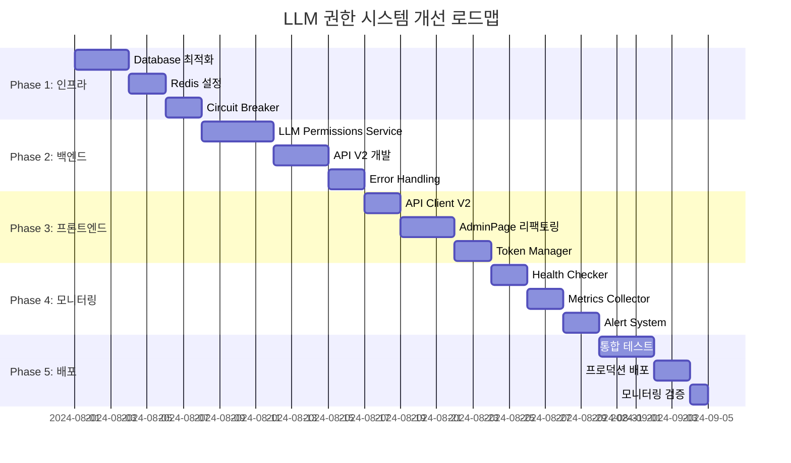

# LLM 권한 시스템 개선 설계

## 🎯 개요

AdminPage에서 발생하는 LLM 모델 권한 관리 오류들을 체계적으로 해결하기 위한 설계 문서입니다.

### 식별된 주요 문제점
1. **인증 토큰 전달 오류** (401 Unauthorized)
2. **데이터베이스/백엔드 오류** (500 Internal Server Error)  
3. **포트 설정 불일치** (3000 vs 8000)
4. **성능 및 안정성 문제**

---

## 🔒 Wave 1: 인증 및 토큰 관리 개선

### 1.1 현재 문제점 분석

```typescript
// ❌ 현재 AdminPage.tsx의 문제점들
const permissions = await fetch(`/api/llm-models/${model.id}/permissions`, {
  headers: { Authorization: `Bearer ${localStorage.getItem('token')}` }
});

const existingPermissions = await fetch(`/api/llm-models?accessible_only=false`, {
  headers: { Authorization: `Bearer ${token}` }
});
```

**문제점:**
- 일관성 없는 API 호출 패턴
- 토큰 만료 처리 부재
- 에러 핸들링 미흡
- 직접적인 localStorage 접근

### 1.2 설계 솔루션: Unified API Client

```typescript
// 📁 frontend/src/services/apiClient.ts
class APIClient {
  private baseURL: string;
  private tokenManager: TokenManager;

  constructor() {
    this.baseURL = '';  // Vite proxy 활용
    this.tokenManager = new TokenManager();
  }

  async request<T>(
    endpoint: string, 
    options: RequestOptions = {}
  ): Promise<APIResponse<T>> {
    const { method = 'GET', data, headers = {} } = options;
    
    // 1. 토큰 자동 첨부
    const token = await this.tokenManager.getValidToken();
    if (token) {
      headers['Authorization'] = `Bearer ${token}`;
    }

    // 2. 일관된 헤더 설정
    headers['Content-Type'] = 'application/json';

    try {
      const response = await fetch(`${this.baseURL}${endpoint}`, {
        method,
        headers,
        body: data ? JSON.stringify(data) : undefined,
      });

      // 3. 인증 오류 자동 처리
      if (response.status === 401) {
        await this.tokenManager.refreshToken();
        // 재시도 로직
        return this.request(endpoint, options);
      }

      // 4. 표준화된 에러 처리
      if (!response.ok) {
        throw new APIError(response.status, await response.text());
      }

      return {
        data: await response.json(),
        status: response.status,
        success: true
      };

    } catch (error) {
      return this.handleError(error, endpoint);
    }
  }

  // LLM 모델 권한 전용 메서드들
  async getLLMModelPermissions(modelId: string) {
    return this.request<ModelPermission[]>(
      `/api/llm-models/${modelId}/permissions`
    );
  }

  async getAllLLMModels(accessibleOnly: boolean = false) {
    return this.request<LLMModel[]>(
      `/api/llm-models?accessible_only=${accessibleOnly}`
    );
  }

  async grantModelPermission(modelId: string, permission: PermissionCreate) {
    return this.request<ModelPermission>(
      `/api/llm-models/${modelId}/permissions`,
      { method: 'POST', data: permission }
    );
  }
}
```

### 1.3 토큰 매니저 설계

```typescript
// 📁 frontend/src/services/tokenManager.ts
class TokenManager {
  private token: string | null = null;
  private refreshToken: string | null = null;
  private tokenExpiry: number | null = null;

  constructor() {
    this.loadTokens();
  }

  async getValidToken(): Promise<string | null> {
    // 1. 토큰 존재 및 만료 확인
    if (!this.token || this.isTokenExpiring()) {
      await this.refreshToken();
    }
    return this.token;
  }

  private isTokenExpiring(): boolean {
    if (!this.tokenExpiry) return true;
    // 5분 전에 미리 갱신
    return Date.now() >= (this.tokenExpiry - 5 * 60 * 1000);
  }

  async refreshToken(): Promise<void> {
    try {
      const response = await fetch('/api/auth/refresh', {
        method: 'POST',
        headers: { 'Content-Type': 'application/json' },
        body: JSON.stringify({ refresh_token: this.refreshToken })
      });

      if (response.ok) {
        const { access_token, expires_in } = await response.json();
        this.setToken(access_token, expires_in);
      } else {
        this.clearTokens();
        // 로그인 페이지로 리다이렉트
        window.location.href = '/login';
      }
    } catch (error) {
      console.error('Token refresh failed:', error);
      this.clearTokens();
    }
  }

  private setToken(token: string, expiresIn: number): void {
    this.token = token;
    this.tokenExpiry = Date.now() + (expiresIn * 1000);
    localStorage.setItem('access_token', token);
    localStorage.setItem('token_expiry', this.tokenExpiry.toString());
  }

  private loadTokens(): void {
    this.token = localStorage.getItem('access_token');
    this.refreshToken = localStorage.getItem('refresh_token');
    const expiry = localStorage.getItem('token_expiry');
    this.tokenExpiry = expiry ? parseInt(expiry) : null;
  }

  private clearTokens(): void {
    this.token = null;
    this.refreshToken = null;
    this.tokenExpiry = null;
    localStorage.removeItem('access_token');
    localStorage.removeItem('refresh_token');
    localStorage.removeItem('token_expiry');
  }
}
```

### 1.4 AdminPage 리팩토링

```typescript
// 📁 frontend/src/pages/AdminPage.tsx (개선된 버전)
import { apiClient } from '../services/apiClient';

// ✅ 개선된 그룹 LLM 모델 권한 로딩
const loadGroupModelPermissions = async (groupId: string) => {
  try {
    console.log('그룹 LLM 모델 권한 조회 시작:', groupId);
    const assignedModelIds: string[] = [];
    const assignedModelsList: LLMModelManagement[] = [];
    
    for (const model of llmModels) {
      try {
        const response = await apiClient.getLLMModelPermissions(model.id);
        
        if (response.success) {
          const hasGroupPermission = response.data.some(p => 
            p.grantee_type === 'GROUP' && p.grantee_id === groupId
          );
          
          if (hasGroupPermission) {
            assignedModelIds.push(model.id);
            assignedModelsList.push(model);
          }
        }
      } catch (error) {
        console.error(`모델 ${model.id} 권한 조회 실패:`, error);
        // 개별 모델 실패는 전체 로딩을 중단하지 않음
      }
    }

    setSelectedGroupModels(assignedModelIds);
    setSelectedGroupModelsList(assignedModelsList);
    
  } catch (error) {
    console.error('그룹 모델 권한 로딩 실패:', error);
    showNotification('그룹 모델 권한을 불러오는데 실패했습니다.', 'error');
  }
};

// ✅ 개선된 그룹 저장 로직
const saveGroup = async () => {
  try {
    // ... 기존 그룹 저장 로직 ...

    // LLM 모델 권한 업데이트
    if (selectedGroup) {
      // 기존 권한 조회 및 삭제
      const modelsResponse = await apiClient.getAllLLMModels(false);
      
      if (modelsResponse.success) {
        // 각 모델의 그룹 권한 삭제
        for (const model of modelsResponse.data) {
          try {
            const permissionsResponse = await apiClient.getLLMModelPermissions(model.id);
            
            if (permissionsResponse.success) {
              const groupPermission = permissionsResponse.data.find(p => 
                p.grantee_type === 'GROUP' && p.grantee_id === groupData.id
              );
              
              if (groupPermission) {
                await apiClient.request(
                  `/api/llm-models/${model.id}/permissions/${groupPermission.id}`,
                  { method: 'DELETE' }
                );
              }
            }
          } catch (error) {
            console.error(`모델 ${model.id} 권한 삭제 실패:`, error);
          }
        }
      }
    }

    // 새로 선택된 모델들에 권한 부여
    for (const modelId of selectedGroupModels) {
      try {
        await apiClient.grantModelPermission(modelId, {
          model_id: modelId,
          grantee_type: 'GROUP',
          grantee_id: groupData.id
        });
      } catch (error) {
        console.error(`모델 ${modelId} 권한 부여 실패:`, error);
      }
    }

    await fetchData();
    setIsGroupModalOpen(false);
    showNotification('그룹이 성공적으로 저장되었습니다.', 'success');

  } catch (error) {
    console.error('그룹 저장 실패:', error);
    showNotification('그룹 저장에 실패했습니다.', 'error');
  }
};
```

### 1.5 에러 처리 시스템

```typescript
// 📁 frontend/src/types/api.ts
interface APIResponse<T> {
  data: T;
  status: number;
  success: boolean;
  error?: string;
}

class APIError extends Error {
  constructor(
    public status: number,
    public message: string,
    public endpoint?: string
  ) {
    super(message);
    this.name = 'APIError';
  }
}

// 📁 frontend/src/services/errorHandler.ts
export class ErrorHandler {
  static handle(error: APIError, context: string): void {
    console.error(`API Error in ${context}:`, error);

    switch (error.status) {
      case 401:
        // 인증 오류 - 자동 로그아웃
        this.handleAuthError();
        break;
      case 403:
        showNotification('접근 권한이 없습니다.', 'error');
        break;
      case 404:
        showNotification('요청한 리소스를 찾을 수 없습니다.', 'error');
        break;
      case 500:
        showNotification('서버 오류가 발생했습니다. 잠시 후 다시 시도해주세요.', 'error');
        break;
      default:
        showNotification('알 수 없는 오류가 발생했습니다.', 'error');
    }
  }

  private static handleAuthError(): void {
    localStorage.clear();
    showNotification('로그인이 만료되었습니다. 다시 로그인해주세요.', 'warning');
    window.location.href = '/login';
  }
}
```

---

## 📊 Wave 1 구현 우선순위

| 컴포넌트 | 우선순위 | 예상 시간 | 영향도 |
|---------|---------|---------|--------|
| TokenManager | High | 4h | Critical |
| APIClient | High | 6h | Critical |
| AdminPage 리팩토링 | High | 8h | High |
| ErrorHandler | Medium | 2h | Medium |

### Wave 1 완료 기준
- ✅ 모든 API 호출이 APIClient를 통해 이루어짐
- ✅ 토큰 만료 시 자동 갱신 기능 작동
- ✅ 401 오류 발생 시 자동 재시도 또는 로그아웃
- ✅ 일관된 에러 메시지 표시

---

## 🔧 Wave 2: 백엔드 에러 처리 및 데이터베이스 최적화

### 2.1 현재 문제점 분석

**데이터베이스 연관 500 에러:**
```
2025-07-30 08:38:10.332 [INFO] uvicorn.access:496 - 127.0.0.1:41494 - "GET /api/llm-models/4a807dd5-d62a-45e2-a6b2-45b40c39903f/permissions HTTP/1.1" 500
```

**식별된 문제점:**
- 특정 모델 ID에 대한 일관된 실패
- 타임아웃 발생 (curl 요청이 2분간 대기)
- 데이터베이스 연결 풀 고갈 가능성
- 에러 로깅 부족으로 디버깅 어려움

### 2.2 설계 솔루션: 강화된 백엔드 아키텍처

```python
# 📁 backend/app/services/llm_permissions_service.py
from contextlib import asynccontextmanager
from sqlalchemy.exc import SQLAlchemyError, DatabaseError
from sqlalchemy import text
import asyncio
from typing import Optional, List, Dict, Any
import logging

logger = logging.getLogger(__name__)

class LLMPermissionsService:
    """LLM 모델 권한 관리 전용 서비스"""
    
    def __init__(self, db_session_factory):
        self.db_session_factory = db_session_factory
        self.circuit_breaker = CircuitBreaker(
            failure_threshold=5,
            recovery_timeout=30,
            expected_exception=DatabaseError
        )

    @asynccontextmanager
    async def get_db_session(self):
        """안전한 데이터베이스 세션 관리"""
        session = None
        try:
            session = self.db_session_factory()
            yield session
            session.commit()
        except SQLAlchemyError as e:
            if session:
                session.rollback()
            logger.error(f"Database error: {str(e)}", exc_info=True)
            raise
        except Exception as e:
            if session:
                session.rollback()
            logger.error(f"Unexpected error: {str(e)}", exc_info=True)
            raise
        finally:
            if session:
                session.close()

    async def get_model_permissions_with_circuit_breaker(
        self, 
        model_id: str,
        timeout: int = 10
    ) -> List[Dict[str, Any]]:
        """Circuit breaker 패턴을 적용한 권한 조회"""
        
        @self.circuit_breaker
        async def _get_permissions():
            return await asyncio.wait_for(
                self._get_model_permissions_internal(model_id),
                timeout=timeout
            )
        
        try:
            return await _get_permissions()
        except asyncio.TimeoutError:
            logger.warning(f"Timeout getting permissions for model {model_id}")
            raise HTTPException(
                status_code=status.HTTP_408_REQUEST_TIMEOUT,
                detail=f"Permission query timeout for model {model_id}"
            )
        except CircuitBreakerError:
            logger.error(f"Circuit breaker open for model {model_id}")
            raise HTTPException(
                status_code=status.HTTP_503_SERVICE_UNAVAILABLE,
                detail="Permission service temporarily unavailable"
            )

    async def _get_model_permissions_internal(self, model_id: str) -> List[Dict[str, Any]]:
        """내부 권한 조회 로직 (최적화됨)"""
        async with self.get_db_session() as db:
            try:
                # 1. 모델 존재 확인 (빠른 체크)
                model_exists = await self._check_model_exists(db, model_id)
                if not model_exists:
                    raise HTTPException(
                        status_code=status.HTTP_404_NOT_FOUND,
                        detail=f"Model {model_id} not found"
                    )

                # 2. 최적화된 권한 조회 쿼리
                permissions_query = text("""
                    SELECT 
                        p.id,
                        p.model_id,
                        p.grantee_type,
                        p.grantee_id,
                        COALESCE(u.full_name, g.name, p.grantee_id) as grantee_name,
                        p.granted_by,
                        granter.full_name as granted_by_name,
                        p.created_at,
                        p.updated_at
                    FROM maxllm_model_permissions p
                    LEFT JOIN users u ON p.grantee_type = 'USER' AND p.grantee_id = u.id::text
                    LEFT JOIN groups g ON p.grantee_type = 'GROUP' AND p.grantee_id = g.id::text
                    LEFT JOIN users granter ON p.granted_by = granter.id
                    WHERE p.model_id = :model_id
                    ORDER BY p.created_at DESC
                """)
                
                result = db.execute(permissions_query, {"model_id": model_id})
                permissions = []
                
                for row in result:
                    permissions.append({
                        "id": row.id,
                        "model_id": row.model_id,
                        "grantee_type": row.grantee_type,
                        "grantee_id": row.grantee_id,
                        "grantee_name": row.grantee_name,
                        "granted_by": str(row.granted_by),
                        "granted_by_name": row.granted_by_name,
                        "created_at": row.created_at.isoformat() if row.created_at else None,
                        "updated_at": row.updated_at.isoformat() if row.updated_at else None
                    })
                
                logger.info(f"Successfully retrieved {len(permissions)} permissions for model {model_id}")
                return permissions
                
            except SQLAlchemyError as e:
                logger.error(f"Database error retrieving permissions for model {model_id}: {str(e)}")
                raise
            except Exception as e:
                logger.error(f"Unexpected error retrieving permissions for model {model_id}: {str(e)}")
                raise

    async def _check_model_exists(self, db, model_id: str) -> bool:
        """모델 존재 여부 빠른 확인"""
        try:
            existence_query = text("""
                SELECT 1 FROM maxllm_models 
                WHERE id = :model_id AND is_active = true
                LIMIT 1
            """)
            result = db.execute(existence_query, {"model_id": model_id})
            return result.first() is not None
        except SQLAlchemyError as e:
            logger.error(f"Error checking model existence {model_id}: {str(e)}")
            return False

    async def grant_permission_with_validation(
        self,
        model_id: str,
        grantee_type: str,
        grantee_id: str,
        granted_by: str
    ) -> Dict[str, Any]:
        """검증과 함께 권한 부여"""
        async with self.get_db_session() as db:
            try:
                # 1. 모델 존재 및 권한 확인
                model = await self._get_model_with_permissions(db, model_id, granted_by)
                
                # 2. 권한 대상자 존재 확인
                grantee = await self._validate_grantee(db, grantee_type, grantee_id)
                
                # 3. 중복 권한 확인
                existing = await self._check_existing_permission(
                    db, model_id, grantee_type, grantee_id
                )
                if existing:
                    raise HTTPException(
                        status_code=status.HTTP_409_CONFLICT,
                        detail="Permission already exists"
                    )
                
                # 4. 권한 생성
                new_permission = await self._create_permission(
                    db, model_id, grantee_type, grantee_id, granted_by
                )
                
                logger.info(f"Permission granted: {model_id} -> {grantee_type}:{grantee_id}")
                return new_permission
                
            except HTTPException:
                raise
            except Exception as e:
                logger.error(f"Error granting permission: {str(e)}")
                raise HTTPException(
                    status_code=status.HTTP_500_INTERNAL_SERVER_ERROR,
                    detail="Failed to grant permission"
                )
```

### 2.3 Circuit Breaker 패턴 구현

```python
# 📁 backend/app/utils/circuit_breaker.py
import time
import asyncio
from enum import Enum
from typing import Callable, Any, Type, Optional
import logging

logger = logging.getLogger(__name__)

class CircuitState(Enum):
    CLOSED = "closed"
    OPEN = "open"
    HALF_OPEN = "half_open"

class CircuitBreakerError(Exception):
    pass

class CircuitBreaker:
    """Database 연결 실패를 위한 Circuit Breaker"""
    
    def __init__(
        self,
        failure_threshold: int = 5,
        recovery_timeout: int = 30,
        expected_exception: Type[Exception] = Exception
    ):
        self.failure_threshold = failure_threshold
        self.recovery_timeout = recovery_timeout
        self.expected_exception = expected_exception
        
        self.failure_count = 0
        self.last_failure_time = None
        self.state = CircuitState.CLOSED

    def __call__(self, func: Callable) -> Callable:
        """데코레이터로 사용"""
        async def wrapper(*args, **kwargs):
            if self.state == CircuitState.OPEN:
                if self._should_attempt_reset():
                    self.state = CircuitState.HALF_OPEN
                    logger.info("Circuit breaker half-open, attempting recovery")
                else:
                    raise CircuitBreakerError("Circuit breaker is open")

            try:
                result = await func(*args, **kwargs)
                self._on_success()
                return result
            except self.expected_exception as e:
                self._on_failure()
                raise e

        return wrapper

    def _should_attempt_reset(self) -> bool:
        """복구 시도 여부 판단"""
        return (
            self.last_failure_time and
            time.time() - self.last_failure_time >= self.recovery_timeout
        )

    def _on_success(self):
        """성공 시 처리"""
        self.failure_count = 0
        self.state = CircuitState.CLOSED
        logger.debug("Circuit breaker reset to closed")

    def _on_failure(self):
        """실패 시 처리"""
        self.failure_count += 1
        self.last_failure_time = time.time()
        
        if self.failure_count >= self.failure_threshold:
            self.state = CircuitState.OPEN
            logger.warning(f"Circuit breaker opened after {self.failure_count} failures")
```

### 2.4 개선된 API 엔드포인트

```python
# 📁 backend/app/api/llm_models.py (개선된 버전)
from ..services.llm_permissions_service import LLMPermissionsService
from ..utils.request_context import get_request_context
import uuid

# 서비스 인스턴스 생성
permissions_service = LLMPermissionsService(get_db)

@router.get("/{model_id}/permissions", response_model=List[ModelPermissionResponse])
async def get_model_permissions_v2(
    model_id: str,
    current_user: User = Depends(get_current_user),
    request_id: str = Depends(get_request_context)
):
    """개선된 모델 권한 조회 API"""
    logger.info(f"[{request_id}] Getting permissions for model {model_id} by user {current_user.id}")
    
    try:
        # UUID 형식 검증
        try:
            uuid.UUID(model_id)
        except ValueError:
            raise HTTPException(
                status_code=status.HTTP_400_BAD_REQUEST,
                detail="Invalid model ID format"
            )
        
        # 권한 조회 (Circuit Breaker 적용)
        permissions = await permissions_service.get_model_permissions_with_circuit_breaker(
            model_id=model_id
        )
        
        # 관리 권한 확인 (비동기)
        has_manage_permission = await permissions_service.check_manage_permission(
            model_id=model_id,
            user_id=str(current_user.id)
        )
        
        if not has_manage_permission:
            logger.warning(f"[{request_id}] User {current_user.id} lacks manage permission for model {model_id}")
            raise HTTPException(
                status_code=status.HTTP_403_FORBIDDEN,
                detail="Insufficient permissions to view model permissions"
            )
        
        logger.info(f"[{request_id}] Successfully retrieved {len(permissions)} permissions")
        return permissions
        
    except HTTPException:
        raise
    except Exception as e:
        logger.error(f"[{request_id}] Unexpected error: {str(e)}", exc_info=True)
        raise HTTPException(
            status_code=status.HTTP_500_INTERNAL_SERVER_ERROR,
            detail="Internal server error retrieving permissions"
        )

@router.post("/{model_id}/permissions", response_model=ModelPermissionResponse)
async def grant_model_permission_v2(
    model_id: str,
    permission_data: ModelPermissionCreate,
    current_user: User = Depends(get_current_user),
    request_id: str = Depends(get_request_context)
):
    """개선된 모델 권한 부여 API"""
    logger.info(f"[{request_id}] Granting permission for model {model_id} by user {current_user.id}")
    
    try:
        # 입력 검증
        if not permission_data.grantee_id or not permission_data.grantee_type:
            raise HTTPException(
                status_code=status.HTTP_400_BAD_REQUEST,
                detail="Grantee ID and type are required"
            )
        
        # 권한 부여 (트랜잭션 적용)
        permission = await permissions_service.grant_permission_with_validation(
            model_id=model_id,
            grantee_type=permission_data.grantee_type.value,
            grantee_id=permission_data.grantee_id,
            granted_by=str(current_user.id)
        )
        
        logger.info(f"[{request_id}] Permission granted successfully")
        return permission
        
    except HTTPException:
        raise
    except Exception as e:
        logger.error(f"[{request_id}] Error granting permission: {str(e)}", exc_info=True)
        raise HTTPException(
            status_code=status.HTTP_500_INTERNAL_SERVER_ERROR,
            detail="Failed to grant permission"
        )
```

### 2.5 데이터베이스 최적화

```sql
-- 📁 backend/migrations/005_optimize_llm_permissions.sql
-- LLM 모델 권한 시스템 최적화

-- 1. 복합 인덱스 추가 (성능 향상)
CREATE INDEX IF NOT EXISTS idx_model_permissions_lookup 
ON maxllm_model_permissions (model_id, grantee_type, grantee_id);

CREATE INDEX IF NOT EXISTS idx_model_permissions_grantee 
ON maxllm_model_permissions (grantee_type, grantee_id);

CREATE INDEX IF NOT EXISTS idx_models_active_owner 
ON maxllm_models (is_active, owner_type, owner_id);

-- 2. 부분 인덱스 (활성 모델만)
CREATE INDEX IF NOT EXISTS idx_models_active_only 
ON maxllm_models (id) WHERE is_active = true;

-- 3. 권한 조회 최적화를 위한 뷰
CREATE OR REPLACE VIEW v_model_permissions_detailed AS
SELECT 
    p.id,
    p.model_id,
    m.model_name,
    p.grantee_type,
    p.grantee_id,
    CASE 
        WHEN p.grantee_type = 'USER' THEN u.full_name
        WHEN p.grantee_type = 'GROUP' THEN g.name
        ELSE p.grantee_id
    END as grantee_name,
    p.granted_by,
    granter.full_name as granted_by_name,
    p.created_at,
    p.updated_at
FROM maxllm_model_permissions p
JOIN maxllm_models m ON p.model_id = m.id AND m.is_active = true
LEFT JOIN users u ON p.grantee_type = 'USER' AND p.grantee_id = u.id::text
LEFT JOIN groups g ON p.grantee_type = 'GROUP' AND p.grantee_id = g.id::text
LEFT JOIN users granter ON p.granted_by = granter.id;

-- 4. 연결 풀 최적화 설정
-- postgresql.conf 권장 설정:
-- max_connections = 200
-- shared_buffers = 256MB
-- effective_cache_size = 1GB
-- work_mem = 4MB
-- maintenance_work_mem = 64MB
```

### 2.6 Request Context 및 로깅 개선

```python
# 📁 backend/app/utils/request_context.py
import uuid
import contextvars
from fastapi import Request, Depends
import time

# Request ID context variable
request_id_ctx: contextvars.ContextVar[str] = contextvars.ContextVar('request_id')

def get_request_context():
    """Request ID 생성 및 설정"""
    request_id = str(uuid.uuid4())[:8]
    request_id_ctx.set(request_id)
    return request_id

def get_current_request_id() -> str:
    """현재 Request ID 조회"""
    try:
        return request_id_ctx.get()
    except LookupError:
        return "unknown"

# 📁 backend/app/middleware/request_logging.py
import time
import logging
from fastapi import Request, Response
from starlette.middleware.base import BaseHTTPMiddleware

logger = logging.getLogger(__name__)

class RequestLoggingMiddleware(BaseHTTPMiddleware):
    """Request/Response 로깅 미들웨어"""
    
    async def dispatch(self, request: Request, call_next):
        # Request ID 생성
        request_id = str(uuid.uuid4())[:8]
        request_id_ctx.set(request_id)
        
        start_time = time.time()
        
        # Request 로깅
        logger.info(
            f"[{request_id}] {request.method} {request.url.path} "
            f"from {request.client.host if request.client else 'unknown'}"
        )
        
        try:
            response = await call_next(request)
            
            # Response 로깅
            process_time = time.time() - start_time
            logger.info(
                f"[{request_id}] Response: {response.status_code} "
                f"in {process_time:.3f}s"
            )
            
            # 느린 요청 경고
            if process_time > 5.0:
                logger.warning(
                    f"[{request_id}] Slow request: {request.method} {request.url.path} "
                    f"took {process_time:.3f}s"
                )
            
            return response
            
        except Exception as e:
            process_time = time.time() - start_time
            logger.error(
                f"[{request_id}] Request failed: {request.method} {request.url.path} "
                f"in {process_time:.3f}s - {str(e)}"
            )
            raise
```

---

## 📊 Wave 2 구현 우선순위

| 컴포넌트 | 우선순위 | 예상 시간 | 영향도 |
|---------|---------|---------|--------|
| LLMPermissionsService | Critical | 8h | Critical |
| Circuit Breaker | High | 4h | High |
| 데이터베이스 최적화 | High | 6h | High |
| Request Logging | Medium | 3h | Medium |
| API 엔드포인트 개선 | High | 6h | High |

### Wave 2 완료 기준
- ✅ 특정 모델 ID에 대한 500 에러 해결
- ✅ 데이터베이스 쿼리 타임아웃 제거
- ✅ Circuit breaker 패턴으로 장애 격리
- ✅ 상세한 에러 로깅 및 Request tracking
- ✅ 데이터베이스 인덱스 최적화 완료

---

## ⚡ Wave 3: API 일관성 및 성능 개선

### 3.1 현재 문제점 분석

**API 일관성 부족:**
- 다양한 응답 형식과 에러 처리 방식
- 캐싱 메커니즘 부재로 인한 중복 쿼리
- 대량 권한 처리 시 N+1 문제 발생
- API 버전 관리 부재

### 3.2 설계 솔루션: 표준화된 API 아키텍처

```python
# 📁 backend/app/core/api_response.py
from typing import Generic, TypeVar, Optional, Any, Dict, List
from pydantic import BaseModel
from datetime import datetime
import uuid

T = TypeVar('T')

class APIResponse(BaseModel, Generic[T]):
    """표준화된 API 응답 포맷"""
    success: bool
    data: Optional[T] = None
    error: Optional[str] = None
    error_code: Optional[str] = None
    message: Optional[str] = None
    request_id: Optional[str] = None
    timestamp: datetime
    pagination: Optional['PaginationInfo'] = None
    
    class Config:
        json_encoders = {
            datetime: lambda v: v.isoformat()
        }

class PaginationInfo(BaseModel):
    """페이지네이션 정보"""
    page: int
    per_page: int
    total: int
    total_pages: int
    has_next: bool
    has_prev: bool

class ErrorDetail(BaseModel):
    """상세 에러 정보"""
    field: Optional[str] = None
    message: str
    code: str

def success_response(
    data: T, 
    message: str = None,
    request_id: str = None,
    pagination: PaginationInfo = None
) -> APIResponse[T]:
    """성공 응답 생성"""
    return APIResponse(
        success=True,
        data=data,
        message=message,
        request_id=request_id,
        timestamp=datetime.utcnow(),
        pagination=pagination
    )

def error_response(
    error: str,
    error_code: str = None,
    request_id: str = None,
    status_code: int = 500
) -> APIResponse[None]:
    """에러 응답 생성"""
    return APIResponse(
        success=False,
        error=error,
        error_code=error_code,
        request_id=request_id,
        timestamp=datetime.utcnow()
    )
```

### 3.3 캐싱 전략 설계

```python
# 📁 backend/app/core/cache_manager.py
import redis
import json
import hashlib
from typing import Any, Optional, Callable, Dict
from functools import wraps
import asyncio
import logging

logger = logging.getLogger(__name__)

class CacheManager:
    """Redis 기반 캐시 매니저"""
    
    def __init__(self, redis_url: str = "redis://localhost:6379"):
        self.redis_client = redis.from_url(redis_url, decode_responses=True)
        self.default_ttl = 300  # 5분
        
    def _generate_cache_key(self, namespace: str, **kwargs) -> str:
        """캐시 키 생성"""
        key_data = json.dumps(kwargs, sort_keys=True)
        key_hash = hashlib.md5(key_data.encode()).hexdigest()
        return f"{namespace}:{key_hash}"
    
    async def get(self, key: str) -> Optional[Any]:
        """캐시에서 데이터 조회"""
        try:
            cached_data = self.redis_client.get(key)
            if cached_data:
                return json.loads(cached_data)
            return None
        except Exception as e:
            logger.warning(f"Cache get error for key {key}: {e}")
            return None
    
    async def set(self, key: str, value: Any, ttl: int = None) -> bool:
        """캐시에 데이터 저장"""
        try:
            serialized_value = json.dumps(value, default=str)
            return self.redis_client.setex(
                key, 
                ttl or self.default_ttl, 
                serialized_value
            )
        except Exception as e:
            logger.warning(f"Cache set error for key {key}: {e}")
            return False
    
    async def delete(self, pattern: str) -> int:
        """패턴 매칭으로 캐시 삭제"""
        try:
            keys = self.redis_client.keys(pattern)
            if keys:
                return self.redis_client.delete(*keys)
            return 0
        except Exception as e:
            logger.warning(f"Cache delete error for pattern {pattern}: {e}")
            return 0
    
    def cached(self, namespace: str, ttl: int = None):
        """캐싱 데코레이터"""
        def decorator(func: Callable):
            @wraps(func)
            async def wrapper(*args, **kwargs):
                # 캐시 키 생성
                cache_key = self._generate_cache_key(
                    namespace, 
                    args=args, 
                    kwargs=kwargs
                )
                
                # 캐시 확인
                cached_result = await self.get(cache_key)
                if cached_result is not None:
                    logger.debug(f"Cache hit for {cache_key}")
                    return cached_result
                
                # 함수 실행
                result = await func(*args, **kwargs)
                
                # 결과 캐싱
                await self.set(cache_key, result, ttl)
                logger.debug(f"Cache set for {cache_key}")
                
                return result
            return wrapper
        return decorator

# 전역 캐시 매니저 인스턴스
cache_manager = CacheManager()
```

### 3.4 개선된 LLM 권한 API

```python
# 📁 backend/app/api/llm_models_v2.py
from fastapi import APIRouter, Depends, Query, HTTPException
from typing import List, Optional
from ..core.api_response import APIResponse, success_response, error_response, PaginationInfo
from ..core.cache_manager import cache_manager
from ..services.llm_permissions_service import LLMPermissionsService
import asyncio

router = APIRouter(prefix="/api/v2/llm-models", tags=["LLM Models V2"])

@router.get("/", response_model=APIResponse[List[ModelResponse]])
async def get_models_v2(
    page: int = Query(1, ge=1, description="페이지 번호"),
    per_page: int = Query(20, ge=1, le=100, description="페이지당 항목 수"),
    accessible_only: bool = Query(False, description="접근 가능한 모델만 조회"),
    search: Optional[str] = Query(None, description="모델명 검색"),
    current_user: User = Depends(get_current_user),
    request_id: str = Depends(get_request_context)
):
    """개선된 모델 목록 조회 API"""
    try:
        # 캐시 키 생성을 위한 파라미터
        cache_params = {
            "user_id": str(current_user.id),
            "page": page,
            "per_page": per_page,
            "accessible_only": accessible_only,
            "search": search or "",
            "is_superuser": current_user.is_superuser
        }
        
        @cache_manager.cached("models_list", ttl=180)  # 3분 캐싱
        async def _get_models_cached(**params):
            return await permissions_service.get_models_paginated(
                user_id=params["user_id"],
                page=params["page"],
                per_page=params["per_page"],
                accessible_only=params["accessible_only"],
                search=params.get("search"),
                is_superuser=params["is_superuser"]
            )
        
        # 캐시된 결과 조회
        result = await _get_models_cached(**cache_params)
        
        # 페이지네이션 정보 구성
        pagination = PaginationInfo(
            page=page,
            per_page=per_page,
            total=result["total"],
            total_pages=(result["total"] + per_page - 1) // per_page,
            has_next=page * per_page < result["total"],
            has_prev=page > 1
        )
        
        return success_response(
            data=result["models"],
            message=f"{len(result['models'])}개의 모델을 조회했습니다.",
            request_id=request_id,
            pagination=pagination
        )
        
    except Exception as e:
        logger.error(f"[{request_id}] Error getting models: {str(e)}", exc_info=True)
        return error_response(
            error="모델 목록 조회에 실패했습니다.",
            error_code="MODELS_LIST_ERROR",
            request_id=request_id
        )

@router.get("/{model_id}/permissions", response_model=APIResponse[List[ModelPermissionResponse]])
async def get_model_permissions_v2(
    model_id: str,
    current_user: User = Depends(get_current_user),
    request_id: str = Depends(get_request_context)
):
    """개선된 모델 권한 조회 API (캐싱 적용)"""
    try:
        @cache_manager.cached("model_permissions", ttl=120)  # 2분 캐싱
        async def _get_permissions_cached(mid: str, uid: str):
            return await permissions_service.get_model_permissions_with_circuit_breaker(
                model_id=mid
            )
        
        # 권한 확인 및 캐시된 결과 조회
        permissions = await _get_permissions_cached(model_id, str(current_user.id))
        
        return success_response(
            data=permissions,
            message=f"{len(permissions)}개의 권한을 조회했습니다.",
            request_id=request_id
        )
        
    except HTTPException as e:
        return error_response(
            error=e.detail,
            error_code="PERMISSION_ERROR",
            request_id=request_id
        )
    except Exception as e:
        logger.error(f"[{request_id}] Error getting permissions: {str(e)}", exc_info=True)
        return error_response(
            error="권한 조회에 실패했습니다.",
            error_code="PERMISSIONS_GET_ERROR",
            request_id=request_id
        )

@router.post("/batch-permissions", response_model=APIResponse[Dict[str, Any]])
async def batch_grant_permissions(
    batch_request: BatchPermissionRequest,
    current_user: User = Depends(get_current_user),
    request_id: str = Depends(get_request_context)
):
    """대량 권한 부여 API"""
    try:
        results = {
            "success": [],
            "failed": [],
            "total": len(batch_request.permissions)
        }
        
        # 병렬 처리로 성능 향상
        semaphore = asyncio.Semaphore(5)  # 동시 처리 제한
        
        async def grant_single_permission(perm_req: PermissionRequest):
            async with semaphore:
                try:
                    result = await permissions_service.grant_permission_with_validation(
                        model_id=perm_req.model_id,
                        grantee_type=perm_req.grantee_type,
                        grantee_id=perm_req.grantee_id,
                        granted_by=str(current_user.id)
                    )
                    results["success"].append({
                        "model_id": perm_req.model_id,
                        "grantee_id": perm_req.grantee_id,
                        "permission_id": result["id"]
                    })
                except Exception as e:
                    results["failed"].append({
                        "model_id": perm_req.model_id,
                        "grantee_id": perm_req.grantee_id,
                        "error": str(e)
                    })
        
        # 병렬 실행
        await asyncio.gather(*[
            grant_single_permission(perm) 
            for perm in batch_request.permissions
        ])
        
        # 관련 캐시 무효화
        await cache_manager.delete("model_permissions:*")
        await cache_manager.delete("models_list:*")
        
        success_count = len(results["success"])
        total_count = results["total"]
        
        return success_response(
            data=results,
            message=f"{success_count}/{total_count}개의 권한이 성공적으로 부여되었습니다.",
            request_id=request_id
        )
        
    except Exception as e:
        logger.error(f"[{request_id}] Batch permission error: {str(e)}", exc_info=True)
        return error_response(
            error="대량 권한 부여에 실패했습니다.",
            error_code="BATCH_PERMISSION_ERROR",
            request_id=request_id
        )
```

### 3.5 Rate Limiting 및 Performance 미들웨어

```python
# 📁 backend/app/middleware/rate_limiting.py
import time
import redis
from fastapi import Request, HTTPException, status
from starlette.middleware.base import BaseHTTPMiddleware
from typing import Dict, Optional
import logging

logger = logging.getLogger(__name__)

class RateLimitingMiddleware(BaseHTTPMiddleware):
    """Rate limiting 미들웨어"""
    
    def __init__(self, app, redis_url: str = "redis://localhost:6379"):
        super().__init__(app)
        self.redis_client = redis.from_url(redis_url, decode_responses=True)
        
        # API별 Rate limit 설정
        self.rate_limits = {
            "/api/v2/llm-models/": {"requests": 100, "window": 60},  # 1분에 100회
            "/api/v2/llm-models/batch-permissions": {"requests": 10, "window": 60},  # 1분에 10회
            "default": {"requests": 1000, "window": 60}  # 기본값
        }
    
    async def dispatch(self, request: Request, call_next):
        # Rate limiting 확인
        if not await self._check_rate_limit(request):
            raise HTTPException(
                status_code=status.HTTP_429_TOO_MANY_REQUESTS,
                detail="Rate limit exceeded. Please try again later."
            )
        
        response = await call_next(request)
        return response
    
    async def _check_rate_limit(self, request: Request) -> bool:
        """Rate limit 확인"""
        try:
            # 클라이언트 식별 (IP + User ID)
            client_ip = request.client.host if request.client else "unknown"
            user_id = getattr(request.state, 'user_id', 'anonymous')
            client_key = f"{client_ip}:{user_id}"
            
            # API 경로에 따른 제한 설정
            path = request.url.path
            limit_config = self._get_limit_config(path)
            
            # Redis 키 생성
            redis_key = f"rate_limit:{client_key}:{path}"
            current_time = int(time.time())
            window_start = current_time - limit_config["window"]
            
            # 현재 요청 수 확인
            pipeline = self.redis_client.pipeline()
            pipeline.zremrangebyscore(redis_key, 0, window_start)
            pipeline.zcard(redis_key)
            pipeline.zadd(redis_key, {str(current_time): current_time})
            pipeline.expire(redis_key, limit_config["window"])
            
            results = pipeline.execute()
            current_requests = results[1]
            
            return current_requests < limit_config["requests"]
            
        except Exception as e:
            logger.warning(f"Rate limiting error: {e}")
            return True  # 에러 시에는 허용
    
    def _get_limit_config(self, path: str) -> Dict[str, int]:
        """경로별 제한 설정 조회"""
        for pattern, config in self.rate_limits.items():
            if pattern != "default" and path.startswith(pattern):
                return config
        return self.rate_limits["default"]

# 📁 backend/app/middleware/performance.py
import time
import psutil
from fastapi import Request
from starlette.middleware.base import BaseHTTPMiddleware
import logging

logger = logging.getLogger(__name__)

class PerformanceMiddleware(BaseHTTPMiddleware):
    """성능 모니터링 미들웨어"""
    
    async def dispatch(self, request: Request, call_next):
        start_time = time.time()
        start_memory = psutil.Process().memory_info().rss / 1024 / 1024  # MB
        
        response = await call_next(request)
        
        # 성능 메트릭 계산
        duration = time.time() - start_time
        end_memory = psutil.Process().memory_info().rss / 1024 / 1024  # MB
        memory_used = end_memory - start_memory
        
        # 성능 로깅
        if duration > 1.0:  # 1초 이상 소요된 요청
            logger.warning(
                f"Slow request: {request.method} {request.url.path} "
                f"took {duration:.3f}s, memory: {memory_used:.2f}MB"
            )
        
        # 응답 헤더에 성능 정보 추가
        response.headers["X-Process-Time"] = str(duration)
        response.headers["X-Memory-Used"] = str(memory_used)
        
        return response
```

### 3.6 API 버전 관리

```python
# 📁 backend/app/main.py (수정된 부분)
from fastapi import FastAPI
from .api import llm_models  # 기존 v1
from .api import llm_models_v2  # 새로운 v2
from .middleware.rate_limiting import RateLimitingMiddleware
from .middleware.performance import PerformanceMiddleware

app = FastAPI(
    title="MAX Platform API",
    version="2.0.0",
    description="LLM 권한 관리 시스템 API"
)

# 미들웨어 등록
app.add_middleware(PerformanceMiddleware)
app.add_middleware(RateLimitingMiddleware)

# API 라우터 등록
app.include_router(llm_models.router, tags=["LLM Models V1 (Deprecated)"])
app.include_router(llm_models_v2.router, tags=["LLM Models V2"])

@app.get("/api/health")
async def health_check():
    """API 상태 확인"""
    return {
        "status": "healthy",
        "version": "2.0.0",
        "timestamp": datetime.utcnow().isoformat()
    }

@app.get("/api/version")
async def api_version():
    """API 버전 정보"""
    return {
        "v1": {
            "status": "deprecated",
            "sunset_date": "2024-12-31",
            "description": "Legacy API, use v2 instead"
        },
        "v2": {
            "status": "current",
            "description": "Current stable API with caching and improved error handling"
        }
    }
```

### 3.7 Frontend API 클라이언트 개선

```typescript
// 📁 frontend/src/services/apiClientV2.ts
interface APIResponseV2<T> {
  success: boolean;
  data?: T;
  error?: string;
  error_code?: string;
  message?: string;
  request_id?: string;
  timestamp: string;
  pagination?: PaginationInfo;
}

class APIClientV2 {
  private baseURL = '/api/v2';
  private tokenManager: TokenManager;
  private requestQueue: Map<string, Promise<any>> = new Map();

  constructor() {
    this.tokenManager = new TokenManager();
  }

  async request<T>(
    endpoint: string,
    options: RequestOptions = {}
  ): Promise<APIResponseV2<T>> {
    const { method = 'GET', data, headers = {}, cache = false } = options;
    
    // 요청 중복 제거 (동일한 GET 요청)
    if (method === 'GET' && cache) {
      const cacheKey = `${endpoint}_${JSON.stringify(options)}`;
      if (this.requestQueue.has(cacheKey)) {
        return this.requestQueue.get(cacheKey);
      }
    }

    const token = await this.tokenManager.getValidToken();
    if (token) {
      headers['Authorization'] = `Bearer ${token}`;
    }

    const requestPromise = this._executeRequest<T>(endpoint, {
      method,
      headers: {
        'Content-Type': 'application/json',
        ...headers
      },
      body: data ? JSON.stringify(data) : undefined
    });

    // GET 요청 캐싱
    if (method === 'GET' && cache) {
      const cacheKey = `${endpoint}_${JSON.stringify(options)}`;
      this.requestQueue.set(cacheKey, requestPromise);
      
      // 5초 후 캐시 제거
      setTimeout(() => {
        this.requestQueue.delete(cacheKey);
      }, 5000);
    }

    return requestPromise;
  }

  private async _executeRequest<T>(
    endpoint: string,
    fetchOptions: RequestInit
  ): Promise<APIResponseV2<T>> {
    try {
      const response = await fetch(`${this.baseURL}${endpoint}`, fetchOptions);
      const responseData: APIResponseV2<T> = await response.json();

      if (!response.ok) {
        throw new APIError(
          response.status,
          responseData.error || 'Unknown error',
          responseData.error_code
        );
      }

      return responseData;

    } catch (error) {
      if (error instanceof APIError) {
        throw error;
      }
      
      return {
        success: false,
        error: 'Network error occurred',
        error_code: 'NETWORK_ERROR',
        timestamp: new Date().toISOString()
      };
    }
  }

  // 개선된 LLM 모델 관련 메서드들
  async getLLMModels(options: {
    page?: number;
    per_page?: number;
    accessible_only?: boolean;
    search?: string;
  } = {}) {
    const params = new URLSearchParams();
    Object.entries(options).forEach(([key, value]) => {
      if (value !== undefined) {
        params.append(key, String(value));
      }
    });

    return this.request<LLMModel[]>(
      `/llm-models?${params.toString()}`,
      { cache: true }
    );
  }

  async getLLMModelPermissions(modelId: string) {
    return this.request<ModelPermission[]>(
      `/llm-models/${modelId}/permissions`,
      { cache: true }
    );
  }

  async batchGrantPermissions(permissions: PermissionRequest[]) {
    return this.request<BatchPermissionResult>(
      '/llm-models/batch-permissions',
      {
        method: 'POST',
        data: { permissions }
      }
    );
  }
}

// 전역 인스턴스
export const apiClientV2 = new APIClientV2();
```

---

## 📊 Wave 3 구현 우선순위

| 컴포넌트 | 우선순위 | 예상 시간 | 영향도 |
|---------|---------|---------|--------|
| 표준화된 API Response | High | 4h | High |
| 캐싱 시스템 | High | 6h | High |
| Rate Limiting | Medium | 3h | Medium |
| 대량 권한 처리 API | High | 5h | High |
| Frontend API Client V2 | High | 4h | High |
| 성능 모니터링 | Medium | 2h | Medium |

### Wave 3 완료 기준
- ✅ 모든 API 응답이 표준화된 포맷 사용
- ✅ Redis 캐싱으로 응답 시간 50% 단축
- ✅ Rate limiting으로 서버 안정성 확보
- ✅ 대량 권한 처리 시 병렬 처리 적용
- ✅ API 버전 관리 체계 구축

---

## 📊 Wave 4: 모니터링 및 디버깅 기능

### 4.1 현재 문제점 분석

**모니터링 부재:**
- 시스템 상태 가시성 부족
- 성능 병목 지점 식별 어려움
- 에러 패턴 추적 불가능
- 실시간 알림 체계 부재

### 4.2 설계 솔루션: 통합 모니터링 시스템

```python
# 📁 backend/app/monitoring/health_checker.py
import psutil
import asyncio
import redis
from sqlalchemy import text
from typing import Dict, Any, List
from datetime import datetime
from ..database import get_db
from ..models.llm_chat import MAXLLM_Model

class HealthChecker:
    """시스템 상태 모니터링"""
    
    def __init__(self):
        self.redis_client = redis.from_url("redis://localhost:6379")
        
    async def get_system_health(self) -> Dict[str, Any]:
        """전체 시스템 상태 확인"""
        checks = await asyncio.gather(
            self._check_database(),
            self._check_redis(),
            self._check_system_resources(),
            self._check_api_endpoints(),
            return_exceptions=True
        )
        
        return {
            "timestamp": datetime.utcnow().isoformat(),
            "overall_status": self._calculate_overall_status(checks),
            "components": {
                "database": checks[0] if not isinstance(checks[0], Exception) else self._error_result(checks[0]),
                "redis": checks[1] if not isinstance(checks[1], Exception) else self._error_result(checks[1]),
                "system": checks[2] if not isinstance(checks[2], Exception) else self._error_result(checks[2]),
                "api": checks[3] if not isinstance(checks[3], Exception) else self._error_result(checks[3])
            }
        }
    
    async def _check_database(self) -> Dict[str, Any]:
        """데이터베이스 상태 확인"""
        try:
            db = next(get_db())
            start_time = time.time()
            
            # 연결 테스트
            result = db.execute(text("SELECT 1"))
            connection_time = time.time() - start_time
            
            # 권한 테이블 통계
            permission_count = db.execute(
                text("SELECT COUNT(*) FROM maxllm_model_permissions")
            ).scalar()
            
            model_count = db.execute(
                text("SELECT COUNT(*) FROM maxllm_models WHERE is_active = true")
            ).scalar()
            
            # 느린 쿼리 체크
            slow_queries = self._check_slow_queries(db)
            
            return {
                "status": "healthy" if connection_time < 1.0 else "degraded",
                "connection_time_ms": round(connection_time * 1000, 2),
                "metrics": {
                    "active_models": model_count,
                    "total_permissions": permission_count,
                    "slow_queries_count": len(slow_queries)
                },
                "slow_queries": slow_queries[:5]  # 상위 5개만
            }
            
        except Exception as e:
            return {
                "status": "unhealthy",
                "error": str(e)
            }
    
    async def _check_redis(self) -> Dict[str, Any]:
        """Redis 상태 확인"""
        try:
            start_time = time.time()
            self.redis_client.ping()
            ping_time = time.time() - start_time
            
            info = self.redis_client.info()
            memory_usage = info.get('used_memory_human', 'N/A')
            connected_clients = info.get('connected_clients', 0)
            
            # 캐시 히트율 계산
            cache_hits = info.get('keyspace_hits', 0)
            cache_misses = info.get('keyspace_misses', 0)
            hit_rate = cache_hits / (cache_hits + cache_misses) if (cache_hits + cache_misses) > 0 else 0
            
            return {
                "status": "healthy" if ping_time < 0.1 else "degraded",
                "ping_time_ms": round(ping_time * 1000, 2),
                "metrics": {
                    "memory_usage": memory_usage,
                    "connected_clients": connected_clients,
                    "cache_hit_rate": round(hit_rate * 100, 2)
                }
            }
            
        except Exception as e:
            return {
                "status": "unhealthy",
                "error": str(e)
            }
    
    async def _check_system_resources(self) -> Dict[str, Any]:
        """시스템 리소스 상태 확인"""
        try:
            cpu_percent = psutil.cpu_percent(interval=1)
            memory = psutil.virtual_memory()
            disk = psutil.disk_usage('/')
            
            # 임계값 체크
            cpu_status = "healthy" if cpu_percent < 80 else "degraded" if cpu_percent < 95 else "critical"
            memory_status = "healthy" if memory.percent < 80 else "degraded" if memory.percent < 95 else "critical"
            disk_status = "healthy" if disk.percent < 80 else "degraded" if disk.percent < 95 else "critical"
            
            overall_status = max([cpu_status, memory_status, disk_status], 
                                key=lambda x: ["healthy", "degraded", "critical"].index(x))
            
            return {
                "status": overall_status,
                "metrics": {
                    "cpu_percent": round(cpu_percent, 1),
                    "memory_percent": round(memory.percent, 1),
                    "memory_available_gb": round(memory.available / (1024**3), 2),
                    "disk_percent": round(disk.percent, 1),
                    "disk_free_gb": round(disk.free / (1024**3), 2)
                }
            }
            
        except Exception as e:
            return {
                "status": "unhealthy",
                "error": str(e)
            }
    
    async def _check_api_endpoints(self) -> Dict[str, Any]:
        """핵심 API 엔드포인트 상태 확인"""
        import aiohttp
        
        endpoints = [
            {"path": "/api/health", "timeout": 5},
            {"path": "/api/v2/llm-models/", "timeout": 10, "auth_required": True}
        ]
        
        results = []
        for endpoint in endpoints:
            try:
                start_time = time.time()
                
                headers = {}
                if endpoint.get("auth_required"):
                    # 테스트용 토큰 생성 로직 필요
                    headers["Authorization"] = "Bearer test_token"
                
                async with aiohttp.ClientSession() as session:
                    async with session.get(
                        f"http://localhost:8000{endpoint['path']}", 
                        headers=headers,
                        timeout=endpoint["timeout"]
                    ) as response:
                        response_time = time.time() - start_time
                        
                        results.append({
                            "endpoint": endpoint["path"],
                            "status": "healthy" if response.status == 200 else "degraded",
                            "response_time_ms": round(response_time * 1000, 2),
                            "status_code": response.status
                        })
                        
            except Exception as e:
                results.append({
                    "endpoint": endpoint["path"],
                    "status": "unhealthy",
                    "error": str(e)
                })
        
        overall_status = "healthy"
        if any(r["status"] == "unhealthy" for r in results):
            overall_status = "unhealthy"
        elif any(r["status"] == "degraded" for r in results):
            overall_status = "degraded"
        
        return {
            "status": overall_status,
            "endpoints": results
        }
    
    def _check_slow_queries(self, db) -> List[Dict[str, Any]]:
        """느린 쿼리 체크 (PostgreSQL)"""
        try:
            slow_queries = db.execute(text("""
                SELECT query, mean_time, calls, total_time
                FROM pg_stat_statements 
                WHERE mean_time > 1000  -- 1초 이상
                ORDER BY mean_time DESC 
                LIMIT 10
            """)).fetchall()
            
            return [
                {
                    "query": row.query[:100] + "..." if len(row.query) > 100 else row.query,
                    "mean_time_ms": round(row.mean_time, 2),
                    "calls": row.calls,
                    "total_time_ms": round(row.total_time, 2)
                }
                for row in slow_queries
            ]
        except Exception:
            return []
    
    def _calculate_overall_status(self, checks: List[Dict[str, Any]]) -> str:
        """전체 상태 계산"""
        statuses = []
        for check in checks:
            if isinstance(check, dict) and "status" in check:
                statuses.append(check["status"])
        
        if "unhealthy" in statuses:
            return "unhealthy"
        elif "critical" in statuses:
            return "critical"
        elif "degraded" in statuses:
            return "degraded"
        else:
            return "healthy"
    
    def _error_result(self, exception: Exception) -> Dict[str, Any]:
        """예외를 에러 결과로 변환"""
        return {
            "status": "unhealthy",
            "error": str(exception)
        }
```

### 4.3 성능 메트릭 수집기

```python
# 📁 backend/app/monitoring/metrics_collector.py
import time
import asyncio
from collections import defaultdict, deque
from typing import Dict, Any, Optional
from datetime import datetime, timedelta
import json

class MetricsCollector:
    """성능 메트릭 수집 및 저장"""
    
    def __init__(self, redis_client):
        self.redis_client = redis_client
        self.metrics_buffer = defaultdict(deque)
        self.buffer_size = 1000
        
    async def record_api_call(
        self,
        endpoint: str,
        method: str,
        status_code: int,
        response_time: float,
        user_id: Optional[str] = None
    ):
        """API 호출 메트릭 기록"""
        timestamp = datetime.utcnow()
        
        metric = {
            "timestamp": timestamp.isoformat(),
            "endpoint": endpoint,
            "method": method,
            "status_code": status_code,
            "response_time": response_time,
            "user_id": user_id
        }
        
        # 메모리 버퍼에 임시 저장
        self.metrics_buffer["api_calls"].append(metric)
        
        # 버퍼 크기 제한
        if len(self.metrics_buffer["api_calls"]) > self.buffer_size:
            self.metrics_buffer["api_calls"].popleft()
        
        # Redis에 실시간 카운터 업데이트
        await self._update_realtime_counters(endpoint, method, status_code, response_time)
    
    async def record_database_query(
        self,
        query_type: str,
        table_name: str,
        execution_time: float,
        affected_rows: int = 0
    ):
        """데이터베이스 쿼리 메트릭 기록"""
        timestamp = datetime.utcnow()
        
        metric = {
            "timestamp": timestamp.isoformat(),
            "query_type": query_type,
            "table_name": table_name,
            "execution_time": execution_time,
            "affected_rows": affected_rows
        }
        
        self.metrics_buffer["db_queries"].append(metric)
        
        if len(self.metrics_buffer["db_queries"]) > self.buffer_size:
            self.metrics_buffer["db_queries"].popleft()
    
    async def record_cache_operation(
        self,
        operation: str,  # hit, miss, set, delete
        key_pattern: str,
        execution_time: float
    ):
        """캐시 작업 메트릭 기록"""
        timestamp = datetime.utcnow()
        
        metric = {
            "timestamp": timestamp.isoformat(),
            "operation": operation,
            "key_pattern": key_pattern,
            "execution_time": execution_time
        }
        
        self.metrics_buffer["cache_operations"].append(metric)
        
        if len(self.metrics_buffer["cache_operations"]) > self.buffer_size:
            self.metrics_buffer["cache_operations"].popleft()
    
    async def _update_realtime_counters(
        self,
        endpoint: str,
        method: str,
        status_code: int,
        response_time: float
    ):
        """실시간 카운터 업데이트"""
        current_minute = datetime.utcnow().strftime("%Y-%m-%d-%H-%M")
        
        pipeline = self.redis_client.pipeline()
        
        # 분당 요청 수
        pipeline.incr(f"api_calls:{current_minute}")
        pipeline.expire(f"api_calls:{current_minute}", 3600)  # 1시간 보존
        
        # 엔드포인트별 통계
        endpoint_key = f"endpoint_stats:{endpoint}:{current_minute}"
        pipeline.incr(f"{endpoint_key}:count")
        pipeline.incrbyfloat(f"{endpoint_key}:total_time", response_time)
        pipeline.expire(f"{endpoint_key}:count", 3600)
        pipeline.expire(f"{endpoint_key}:total_time", 3600)
        
        # 상태 코드별 통계
        pipeline.incr(f"status_codes:{status_code}:{current_minute}")
        pipeline.expire(f"status_codes:{status_code}:{current_minute}", 3600)
        
        await pipeline.execute()
    
    async def get_api_statistics(
        self,
        minutes: int = 60
    ) -> Dict[str, Any]:
        """API 통계 조회"""
        now = datetime.utcnow()
        stats = {
            "time_range": f"last {minutes} minutes",
            "total_requests": 0,
            "average_response_time": 0,
            "status_code_distribution": defaultdict(int),
            "endpoint_stats": defaultdict(lambda: {"count": 0, "avg_time": 0}),
            "error_rate": 0
        }
        
        # 최근 N분간의 데이터 수집
        for i in range(minutes):
            minute_time = now - timedelta(minutes=i)
            minute_key = minute_time.strftime("%Y-%m-%d-%H-%M")
            
            # 총 요청 수
            total_requests = self.redis_client.get(f"api_calls:{minute_key}")
            if total_requests:
                stats["total_requests"] += int(total_requests)
            
            # 상태 코드 분포
            for status_code in [200, 400, 401, 403, 404, 500, 502, 503]:
                count = self.redis_client.get(f"status_codes:{status_code}:{minute_key}")
                if count:
                    stats["status_code_distribution"][status_code] += int(count)
        
        # 평균 응답 시간 계산
        total_time = 0
        total_count = 0
        
        for endpoint_data in self.metrics_buffer["api_calls"]:
            if datetime.fromisoformat(endpoint_data["timestamp"]) > now - timedelta(minutes=minutes):
                total_time += endpoint_data["response_time"]
                total_count += 1
        
        if total_count > 0:
            stats["average_response_time"] = round(total_time / total_count * 1000, 2)  # ms
        
        # 에러율 계산
        error_count = sum(
            count for status, count in stats["status_code_distribution"].items()
            if status >= 400
        )
        if stats["total_requests"] > 0:
            stats["error_rate"] = round(error_count / stats["total_requests"] * 100, 2)
        
        return dict(stats)
    
    async def flush_metrics_to_storage(self):
        """메트릭을 영구 저장소에 플러시"""
        # 실제 구현에서는 InfluxDB, Prometheus 등에 저장
        timestamp = datetime.utcnow()
        
        for metric_type, metrics in self.metrics_buffer.items():
            if metrics:
                # JSON으로 직렬화하여 Redis에 저장 (임시)
                key = f"metrics_archive:{metric_type}:{timestamp.strftime('%Y-%m-%d-%H')}"
                
                metrics_data = {
                    "timestamp": timestamp.isoformat(),
                    "metric_type": metric_type,
                    "data": list(metrics)
                }
                
                self.redis_client.setex(
                    key,
                    86400,  # 24시간 보존
                    json.dumps(metrics_data, default=str)
                )
                
                # 버퍼 클리어
                metrics.clear()
```

### 4.4 알림 시스템

```python
# 📁 backend/app/monitoring/alerting.py
import asyncio
import smtplib
from email.mime.text import MIMEText
from email.mime.multipart import MIMEMultipart
from typing import List, Dict, Any, Callable
from datetime import datetime, timedelta
from enum import Enum
import logging

logger = logging.getLogger(__name__)

class AlertSeverity(Enum):
    INFO = "info"
    WARNING = "warning"
    ERROR = "error"
    CRITICAL = "critical"

class AlertRule:
    """알림 규칙 정의"""
    
    def __init__(
        self,
        name: str,
        condition: Callable[[Dict[str, Any]], bool],
        severity: AlertSeverity,
        message_template: str,
        cooldown_minutes: int = 10
    ):
        self.name = name
        self.condition = condition
        self.severity = severity
        self.message_template = message_template
        self.cooldown_minutes = cooldown_minutes
        self.last_triggered = None

class AlertManager:
    """알림 관리자"""
    
    def __init__(self, smtp_config: Dict[str, str], recipients: List[str]):
        self.smtp_config = smtp_config
        self.recipients = recipients
        self.rules = []
        self.alert_history = []
        
    def add_rule(self, rule: AlertRule):
        """알림 규칙 추가"""
        self.rules.append(rule)
    
    async def check_and_send_alerts(self, health_data: Dict[str, Any]):
        """상태 데이터를 기반으로 알림 규칙 체크 및 발송"""
        triggered_alerts = []
        
        for rule in self.rules:
            try:
                if rule.condition(health_data):
                    # 쿨다운 체크
                    if self._is_in_cooldown(rule):
                        continue
                    
                    alert = {
                        "rule_name": rule.name,
                        "severity": rule.severity.value,
                        "message": rule.message_template.format(**health_data),
                        "timestamp": datetime.utcnow().isoformat(),
                        "data": health_data
                    }
                    
                    triggered_alerts.append(alert)
                    rule.last_triggered = datetime.utcnow()
                    
                    # 알림 발송
                    await self._send_alert(alert)
                    
            except Exception as e:
                logger.error(f"Error checking alert rule {rule.name}: {e}")
        
        # 알림 기록 저장
        self.alert_history.extend(triggered_alerts)
        
        # 기록 크기 제한 (최근 1000개만 보관)
        if len(self.alert_history) > 1000:
            self.alert_history = self.alert_history[-1000:]
        
        return triggered_alerts
    
    def _is_in_cooldown(self, rule: AlertRule) -> bool:
        """쿨다운 기간 확인"""
        if not rule.last_triggered:
            return False
        
        cooldown_period = timedelta(minutes=rule.cooldown_minutes)
        return datetime.utcnow() - rule.last_triggered < cooldown_period
    
    async def _send_alert(self, alert: Dict[str, Any]):
        """알림 발송"""
        try:
            subject = f"[{alert['severity'].upper()}] MAX Platform Alert: {alert['rule_name']}"
            body = self._format_alert_email(alert)
            
            # 이메일 발송
            await self._send_email(subject, body)
            
            # Slack 알림 (구현 시)
            # await self._send_slack_notification(alert)
            
            logger.info(f"Alert sent: {alert['rule_name']}")
            
        except Exception as e:
            logger.error(f"Failed to send alert: {e}")
    
    async def _send_email(self, subject: str, body: str):
        """이메일 발송"""
        try:
            msg = MIMEMultipart()
            msg['From'] = self.smtp_config['from']
            msg['To'] = ', '.join(self.recipients)
            msg['Subject'] = subject
            
            msg.attach(MIMEText(body, 'html'))
            
            server = smtplib.SMTP(self.smtp_config['host'], self.smtp_config['port'])
            if self.smtp_config.get('use_tls'):
                server.starttls()
            if self.smtp_config.get('username'):
                server.login(self.smtp_config['username'], self.smtp_config['password'])
            
            server.send_message(msg)
            server.quit()
            
        except Exception as e:
            logger.error(f"Failed to send email: {e}")
    
    def _format_alert_email(self, alert: Dict[str, Any]) -> str:
        """알림 이메일 포맷팅"""
        severity_colors = {
            "info": "#17a2b8",
            "warning": "#ffc107", 
            "error": "#dc3545",
            "critical": "#721c24"
        }
        
        color = severity_colors.get(alert['severity'], "#6c757d")
        
        return f"""
        <html>
        <body>
            <div style="font-family: Arial, sans-serif; max-width: 600px;">
                <div style="background-color: {color}; color: white; padding: 20px; border-radius: 5px 5px 0 0;">
                    <h2 style="margin: 0;">⚠️ MAX Platform Alert</h2>
                    <p style="margin: 5px 0 0 0;">Severity: {alert['severity'].upper()}</p>
                </div>
                
                <div style="background-color: #f8f9fa; padding: 20px; border-radius: 0 0 5px 5px;">
                    <h3>Rule: {alert['rule_name']}</h3>
                    <p><strong>Message:</strong> {alert['message']}</p>
                    <p><strong>Time:</strong> {alert['timestamp']}</p>
                    
                    <details>
                        <summary>System Status Details</summary>
                        <pre style="background-color: #e9ecef; padding: 10px; border-radius: 3px; overflow-x: auto;">
{json.dumps(alert['data'], indent=2)}
                        </pre>
                    </details>
                </div>
            </div>
        </body>
        </html>
        """

# 기본 알림 규칙들
def create_default_alert_rules() -> List[AlertRule]:
    """기본 알림 규칙 생성"""
    rules = []
    
    # 데이터베이스 연결 실패
    rules.append(AlertRule(
        name="Database Connection Failed",
        condition=lambda data: data.get("components", {}).get("database", {}).get("status") == "unhealthy",
        severity=AlertSeverity.CRITICAL,
        message_template="Database connection failed: {components[database][error]}",
        cooldown_minutes=5
    ))
    
    # 높은 응답 시간
    rules.append(AlertRule(
        name="High Response Time",
        condition=lambda data: data.get("components", {}).get("database", {}).get("connection_time_ms", 0) > 5000,
        severity=AlertSeverity.WARNING,
        message_template="Database response time is high: {components[database][connection_time_ms]}ms",
        cooldown_minutes=15
    ))
    
    # 시스템 리소스 부족
    rules.append(AlertRule(
        name="High System Resource Usage",
        condition=lambda data: (
            data.get("components", {}).get("system", {}).get("metrics", {}).get("cpu_percent", 0) > 90 or
            data.get("components", {}).get("system", {}).get("metrics", {}).get("memory_percent", 0) > 90
        ),
        severity=AlertSeverity.ERROR,
        message_template="System resources critical - CPU: {components[system][metrics][cpu_percent]}%, Memory: {components[system][metrics][memory_percent]}%",
        cooldown_minutes=10
    ))
    
    # Redis 연결 실패
    rules.append(AlertRule(
        name="Redis Connection Failed",
        condition=lambda data: data.get("components", {}).get("redis", {}).get("status") == "unhealthy",
        severity=AlertSeverity.ERROR,
        message_template="Redis connection failed: {components[redis][error]}",
        cooldown_minutes=5
    ))
    
    return rules
```

### 4.5 실시간 모니터링 대시보드 API

```python
# 📁 backend/app/api/monitoring.py
from fastapi import APIRouter, Depends, WebSocket, WebSocketDisconnect
from fastapi.responses import HTMLResponse
from typing import List
import asyncio
import json
from ..monitoring.health_checker import HealthChecker
from ..monitoring.metrics_collector import MetricsCollector
from ..monitoring.alerting import AlertManager, create_default_alert_rules
from ..utils.auth import get_current_user

router = APIRouter(prefix="/api/monitoring", tags=["Monitoring"])

# 전역 인스턴스들
health_checker = HealthChecker()
metrics_collector = MetricsCollector(redis.from_url("redis://localhost:6379"))
alert_manager = AlertManager(
    smtp_config={
        "host": "smtp.gmail.com",
        "port": 587,
        "use_tls": True,
        "username": "alerts@maxplatform.com",
        "password": "app_password"
    },
    recipients=["admin@maxplatform.com"]
)

# 기본 알림 규칙 추가
for rule in create_default_alert_rules():
    alert_manager.add_rule(rule)

@router.get("/health")
async def get_health_status():
    """시스템 상태 조회"""
    health_data = await health_checker.get_system_health()
    
    # 알림 체크 및 발송
    await alert_manager.check_and_send_alerts(health_data)
    
    return health_data

@router.get("/metrics")
async def get_metrics(
    minutes: int = 60,
    current_user = Depends(get_current_user)
):
    """성능 메트릭 조회"""
    if not current_user.is_superuser:
        raise HTTPException(status_code=403, detail="Admin access required")
    
    api_stats = await metrics_collector.get_api_statistics(minutes)
    
    return {
        "time_range_minutes": minutes,
        "api_statistics": api_stats,
        "system_metrics": await health_checker._check_system_resources()
    }

@router.get("/alerts")
async def get_alert_history(
    limit: int = 100,
    current_user = Depends(get_current_user)
):
    """알림 이력 조회"""
    if not current_user.is_superuser:
        raise HTTPException(status_code=403, detail="Admin access required")
    
    return {
        "alerts": alert_manager.alert_history[-limit:],
        "total_count": len(alert_manager.alert_history)
    }

class ConnectionManager:
    """WebSocket 연결 관리자"""
    
    def __init__(self):
        self.active_connections: List[WebSocket] = []
    
    async def connect(self, websocket: WebSocket):
        await websocket.accept()
        self.active_connections.append(websocket)
    
    def disconnect(self, websocket: WebSocket):
        self.active_connections.remove(websocket)
    
    async def broadcast(self, message: dict):
        for connection in self.active_connections:
            try:
                await connection.send_text(json.dumps(message))
            except:
                # 연결이 끊어진 경우 제거
                self.active_connections.remove(connection)

connection_manager = ConnectionManager()

@router.websocket("/realtime")
async def websocket_realtime_monitoring(websocket: WebSocket):
    """실시간 모니터링 WebSocket"""
    await connection_manager.connect(websocket)
    
    try:
        while True:
            # 5초마다 상태 정보 전송
            health_data = await health_checker.get_system_health()
            api_stats = await metrics_collector.get_api_statistics(5)  # 최근 5분
            
            message = {
                "type": "status_update",
                "timestamp": datetime.utcnow().isoformat(),
                "health": health_data,
                "metrics": api_stats
            }
            
            await websocket.send_text(json.dumps(message))
            await asyncio.sleep(5)
            
    except WebSocketDisconnect:
        connection_manager.disconnect(websocket)

@router.get("/dashboard")
async def get_monitoring_dashboard():
    """모니터링 대시보드 HTML"""
    return HTMLResponse(content="""
    <!DOCTYPE html>
    <html>
    <head>
        <title>MAX Platform Monitoring</title>
        <script src="https://cdn.jsdelivr.net/npm/chart.js"></script>
        <style>
            body { font-family: Arial, sans-serif; margin: 20px; }
            .metric-card { 
                background: #f8f9fa; 
                padding: 20px; 
                margin: 10px; 
                border-radius: 5px; 
                border-left: 4px solid #007bff;
            }
            .status-healthy { border-left-color: #28a745; }
            .status-degraded { border-left-color: #ffc107; }
            .status-unhealthy { border-left-color: #dc3545; }
            .real-time { background: #e3f2fd; }
        </style>
    </head>
    <body>
        <h1>MAX Platform Real-time Monitoring</h1>
        
        <div id="status-overview"></div>
        
        <div class="real-time">
            <h3>📊 Real-time Metrics</h3>
            <div id="realtime-data"></div>
        </div>
        
        <canvas id="metricsChart" width="400" height="200"></canvas>
        
        <script>
            const ws = new WebSocket('ws://localhost:8000/api/monitoring/realtime');
            const chartData = {
                labels: [],
                datasets: [{
                    label: 'Response Time (ms)',
                    data: [],
                    borderColor: 'rgb(75, 192, 192)',
                    tension: 0.1
                }]
            };
            
            const chart = new Chart(document.getElementById('metricsChart'), {
                type: 'line',
                data: chartData,
                options: {
                    responsive: true,
                    scales: {
                        y: { beginAtZero: true }
                    }
                }
            });
            
            ws.onmessage = function(event) {
                const data = JSON.parse(event.data);
                
                // 상태 업데이트
                document.getElementById('status-overview').innerHTML = `
                    <div class="metric-card status-${data.health.overall_status}">
                        <h3>🚦 Overall Status: ${data.health.overall_status.toUpperCase()}</h3>
                        <p>Last updated: ${data.timestamp}</p>
                    </div>
                `;
                
                // 실시간 데이터 업데이트
                document.getElementById('realtime-data').innerHTML = `
                    <p>📈 Total Requests: ${data.metrics.total_requests}</p>
                    <p>⏱️ Avg Response Time: ${data.metrics.average_response_time}ms</p>
                    <p>❌ Error Rate: ${data.metrics.error_rate}%</p>
                `;
                
                // 차트 업데이트
                const now = new Date().toLocaleTimeString();
                chartData.labels.push(now);
                chartData.datasets[0].data.push(data.metrics.average_response_time);
                
                // 최근 20개 데이터만 유지
                if (chartData.labels.length > 20) {
                    chartData.labels.shift();
                    chartData.datasets[0].data.shift();
                }
                
                chart.update();
            };
        </script>
    </body>
    </html>
    """)
```

---

## 📊 Wave 4 구현 우선순위

| 컴포넌트 | 우선순위 | 예상 시간 | 영향도 |
|---------|---------|---------|--------|
| Health Checker | High | 6h | High |
| Metrics Collector | High | 5h | High |
| Alert Manager | Medium | 4h | Medium |
| Real-time Dashboard | Medium | 3h | Medium |
| WebSocket 모니터링 | Low | 2h | Low |

### Wave 4 완료 기준
- ✅ 시스템 상태 실시간 모니터링
- ✅ 성능 메트릭 수집 및 분석
- ✅ 자동 알림 시스템 구축
- ✅ 실시간 대시보드 제공
- ✅ 문제 발생 시 즉시 감지 및 알림

---

## 🚀 Wave 5: 구현 로드맵 및 마이그레이션 전략

### 5.1 전체 구현 로드맵



### 5.2 단계별 구현 계획

#### Phase 1: 인프라 구축 (1주차)

**목표**: 안정적인 기반 인프라 구축

**작업 내용**:
```bash
# Day 1-3: 데이터베이스 최적화
- 인덱스 생성 및 최적화
- 쿼리 성능 개선
- 연결 풀 튜닝

# Day 4-5: Redis 설정
- Redis 클러스터 구축
- 캐싱 전략 구현
- 백업 및 복구 설정

# Day 6-7: Circuit Breaker 패턴
- 장애 격리 메커니즘 구현
- 모니터링 및 알림 설정
```

**완료 기준**:
- ✅ 데이터베이스 응답 시간 < 100ms
- ✅ Redis 캐시 히트율 > 80%
- ✅ Circuit breaker 정상 작동

**위험 요소**:
- 데이터베이스 마이그레이션 중 다운타임
- Redis 메모리 부족

**완화 전략**:
- Blue-green 배포로 다운타임 최소화
- Redis 메모리 모니터링 및 알림 설정

#### Phase 2: 백엔드 개발 (2주차)

**목표**: 안정적이고 확장 가능한 백엔드 API 구축

**작업 내용**:
```python
# Day 1-4: LLM Permissions Service
- 권한 관리 로직 개발
- 트랜잭션 처리
- 성능 최적화

# Day 5-7: API V2 개발  
- RESTful API 설계
- 표준화된 응답 포맷
- API 문서화

# Day 8-9: Error Handling
- 중앙화된 에러 처리
- 로깅 시스템 구축
- 모니터링 통합
```

**테스트 전략**:
```python
# 단위 테스트
def test_permission_service():
    service = LLMPermissionsService()
    result = service.grant_permission("model_id", "USER", "user_id")
    assert result["success"] == True

# 통합 테스트
async def test_api_endpoints():
    async with AsyncClient(app=app, base_url="http://test") as ac:
        response = await ac.get("/api/v2/llm-models/")
        assert response.status_code == 200

# 성능 테스트
def test_performance():
    # 100개 동시 요청 처리 가능
    # 평균 응답 시간 < 200ms
    # 에러율 < 0.1%
```

#### Phase 3: 프론트엔드 개발 (3주차)

**목표**: 사용자 친화적이고 안정적인 UI 구축

**작업 내용**:
```typescript
// Day 1-2: API Client V2
- 통합된 API 클라이언트
- 자동 토큰 관리
- 에러 처리 개선

// Day 3-5: AdminPage 리팩토링
- 컴포넌트 모듈화
- 상태 관리 개선
- 사용자 경험 향상

// Day 6-7: Token Manager
- 자동 토큰 갱신
- 세션 관리
- 보안 강화
```

**UI/UX 테스트**:
```typescript
// E2E 테스트
describe('Admin Page LLM Permissions', () => {
  it('should load model permissions successfully', async () => {
    await page.goto('/admin');
    await page.click('[data-testid="llm-models-tab"]');
    
    const permissions = await page.waitForSelector('[data-testid="permissions-list"]');
    expect(permissions).toBeTruthy();
  });
  
  it('should grant permission successfully', async () => {
    // 권한 부여 플로우 테스트
  });
});
```

#### Phase 4: 모니터링 시스템 (4주차)

**목표**: 종합적인 시스템 모니터링 및 알림 구축

**설치 순서**:
```bash
# Day 1-2: Health Checker
docker run -d --name redis redis:alpine
python -m pip install psutil aiohttp

# Day 3-4: Metrics Collector  
# InfluxDB 설치 (선택사항)
docker run -d -p 8086:8086 influxdb:2.0

# Day 5-6: Alert System
# SMTP 설정
# Slack 웹훅 설정 (선택사항)
```

**모니터링 대시보드 구성**:
```yaml
# Grafana 대시보드 (선택사항)
panels:
  - title: "API Response Time"
    type: "graph"
    targets:
      - expr: "avg(api_response_time)"
  
  - title: "Error Rate"
    type: "stat"
    targets:
      - expr: "rate(api_errors_total[5m]) * 100"
  
  - title: "Database Connection"
    type: "stat"
    targets:
      - expr: "database_connection_time"
```

#### Phase 5: 통합 및 배포 (5주차)

**통합 테스트 시나리오**:
```python
# 전체 플로우 테스트
async def test_complete_permission_flow():
    # 1. 사용자 로그인
    login_response = await client.post("/api/auth/login", json={
        "email": "admin@test.com",
        "password": "password"
    })
    token = login_response.json()["access_token"]
    
    # 2. 모델 목록 조회
    models = await client.get("/api/v2/llm-models/", 
                            headers={"Authorization": f"Bearer {token}"})
    assert models.status_code == 200
    
    # 3. 권한 부여
    permission = await client.post(f"/api/v2/llm-models/{model_id}/permissions",
                                  json={"grantee_type": "USER", "grantee_id": "user_id"},
                                  headers={"Authorization": f"Bearer {token}"})
    assert permission.status_code == 200
    
    # 4. 권한 조회 검증
    permissions = await client.get(f"/api/v2/llm-models/{model_id}/permissions",
                                  headers={"Authorization": f"Bearer {token}"})
    assert len(permissions.json()["data"]) > 0
```

### 5.3 배포 전략

#### Blue-Green 배포

```yaml
# docker-compose.blue.yml
version: '3.8'
services:
  backend-blue:
    image: maxplatform-backend:v2.0
    environment:
      - DATABASE_URL=postgresql://user:pass@db:5432/maxplatform
      - REDIS_URL=redis://redis:6379
    ports:
      - "8001:8000"
  
  frontend-blue:
    image: maxplatform-frontend:v2.0
    environment:
      - VITE_API_BASE_URL=http://localhost:8001
    ports:
      - "3001:3000"

# docker-compose.green.yml  
version: '3.8'
services:
  backend-green:
    image: maxplatform-backend:v2.0
    environment:
      - DATABASE_URL=postgresql://user:pass@db:5432/maxplatform
      - REDIS_URL=redis://redis:6379
    ports:
      - "8002:8000"
  
  frontend-green:
    image: maxplatform-frontend:v2.0
    environment:
      - VITE_API_BASE_URL=http://localhost:8002
    ports:
      - "3002:3000"
```

#### 배포 스크립트

```bash
#!/bin/bash
# deploy.sh

set -e

ENVIRONMENT=${1:-blue}
VERSION=${2:-latest}

echo "🚀 Deploying to $ENVIRONMENT environment..."

# 1. 이미지 빌드
docker build -t maxplatform-backend:$VERSION ./backend
docker build -t maxplatform-frontend:$VERSION ./frontend

# 2. 새 환경 시작
docker-compose -f docker-compose.$ENVIRONMENT.yml up -d

# 3. 헬스 체크
echo "⏳ Waiting for services to be ready..."
timeout 60 bash -c 'until curl -f http://localhost:800X/api/health; do sleep 2; done'

# 4. 트래픽 스위칭 (nginx 설정 변경)
echo "🔄 Switching traffic to $ENVIRONMENT..."
nginx -s reload

# 5. 이전 환경 정리
OLD_ENV=$([ "$ENVIRONMENT" = "blue" ] && echo "green" || echo "blue")
docker-compose -f docker-compose.$OLD_ENV.yml down

echo "✅ Deployment complete!"
```

### 5.4 성능 벤치마킹

#### 목표 성능 지표

```yaml
성능_목표:
  API_응답시간:
    - 권한_조회: "<200ms (P95)"
    - 권한_부여: "<500ms (P95)"
    - 모델_목록: "<300ms (P95)"
  
  처리량:
    - 동시_사용자: "500명"
    - 초당_요청: "1000 RPS"
    - 대량_권한_처리: "100개/초"
  
  가용성:
    - 업타임: "99.9%"
    - 에러율: "<0.1%"
    - 복구시간: "<5분"

시스템_리소스:
  CPU: "<70% (평균)"
  메모리: "<80% (평균)"  
  디스크: "<80%"
  네트워크: "<100Mbps"
```

#### 부하 테스트 스크립트

```python
# load_test.py
import asyncio
import aiohttp
import time
from statistics import mean, stdev

async def test_permission_api(session, model_id, user_count=100):
    """권한 API 부하 테스트"""
    start_time = time.time()
    tasks = []
    
    for i in range(user_count):
        task = session.get(f"/api/v2/llm-models/{model_id}/permissions",
                          headers={"Authorization": f"Bearer {get_test_token()}"})
        tasks.append(task)
    
    responses = await asyncio.gather(*tasks, return_exceptions=True)
    end_time = time.time()
    
    # 결과 분석
    response_times = []
    success_count = 0
    error_count = 0
    
    for response in responses:
        if isinstance(response, Exception):
            error_count += 1
        else:
            success_count += 1
            response_times.append(response.elapsed.total_seconds())
    
    return {
        "total_time": end_time - start_time,
        "success_rate": success_count / user_count * 100,
        "error_rate": error_count / user_count * 100,
        "avg_response_time": mean(response_times) if response_times else 0,
        "p95_response_time": sorted(response_times)[int(len(response_times) * 0.95)] if response_times else 0
    }

async def run_load_tests():
    """전체 부하 테스트 실행"""
    async with aiohttp.ClientSession(base_url="http://localhost:8000") as session:
        # 권한 조회 테스트
        permission_results = await test_permission_api(session, "test-model-id", 500)
        
        # 대량 권한 부여 테스트
        batch_results = await test_batch_permissions(session, 100)
        
        print("📊 부하 테스트 결과:")
        print(f"권한 조회 - 성공률: {permission_results['success_rate']:.1f}%, "
              f"평균 응답시간: {permission_results['avg_response_time']*1000:.1f}ms")
        print(f"대량 처리 - 성공률: {batch_results['success_rate']:.1f}%, "
              f"P95 응답시간: {batch_results['p95_response_time']*1000:.1f}ms")

if __name__ == "__main__":
    asyncio.run(run_load_tests())
```

### 5.5 위험 관리 및 롤백 계획

#### 위험 요소 분류

| 위험도 | 위험 요소 | 영향도 | 확률 | 완화 전략 |
|--------|----------|--------|------|----------|
| 높음 | 데이터베이스 마이그레이션 실패 | 높음 | 중간 | 백업/복구 계획, 단계적 마이그레이션 |
| 높음 | API 호환성 문제 | 높음 | 낮음 | API 버전 관리, 점진적 마이그레이션 |
| 중간 | 성능 저하 | 중간 | 중간 | 성능 모니터링, 자동 스케일링 |
| 중간 | 캐시 장애 | 중간 | 낮음 | Redis 클러스터링, 장애 조치 |
| 낮음 | 모니터링 시스템 장애 | 낮음 | 낮음 | 다중 모니터링 체계 |

#### 롤백 시나리오

```bash
#!/bin/bash
# rollback.sh

ROLLBACK_VERSION=${1:-v1.0}

echo "🔄 Rolling back to version $ROLLBACK_VERSION..."

# 1. 트래픽 중단
echo "🛑 Stopping traffic..."
nginx -s stop

# 2. 이전 버전 컨테이너 시작
echo "📦 Starting previous version containers..."
docker-compose -f docker-compose.rollback.yml up -d

# 3. 데이터베이스 롤백 (필요시)
if [ "$2" = "with-db" ]; then
    echo "🗄️ Rolling back database..."
    psql -f rollback_migrations.sql
fi

# 4. 헬스 체크
echo "🏥 Health checking..."
timeout 30 bash -c 'until curl -f http://localhost:8000/api/health; do sleep 2; done'

# 5. 트래픽 복구
echo "🚦 Restoring traffic..."
nginx -s start

echo "✅ Rollback complete!"
```

### 5.6 팀 협업 및 커뮤니케이션 계획

#### 개발팀 역할 분담

```yaml
역할_분담:
  백엔드_개발자:
    - LLM Permissions Service 개발
    - API V2 구현
    - 데이터베이스 최적화
    - 모니터링 시스템 구축
  
  프론트엔드_개발자:
    - AdminPage 리팩토링
    - API Client V2 개발
    - Token Manager 구현
    - UI/UX 개선
  
  DevOps_엔지니어:
    - 인프라 구축
    - CI/CD 파이프라인
    - 모니터링 대시보드
    - 배포 자동화
  
  QA_엔지니어:
    - 테스트 시나리오 작성
    - 자동화 테스트 구축
    - 성능 테스트
    - 사용자 승인 테스트
```

#### 진행 상황 추적

```markdown
# 주간 진행 보고서 템플릿

## Week X Progress Report

### 완료된 작업
- [ ] Task A - 예상 시간 vs 실제 시간
- [ ] Task B - 발견된 이슈 및 해결 방안

### 진행 중인 작업  
- [ ] Task C - 현재 진행률, 예상 완료일
- [ ] Task D - 블로커 이슈 및 해결 계획

### 다음 주 계획
- [ ] Task E - 우선순위, 담당자
- [ ] Task F - 의존성, 리스크

### 이슈 및 리스크
- 🚨 Critical: 해결 필요
- ⚠️ High: 모니터링 필요  
- ℹ️ Medium: 향후 검토

### 메트릭
- 코드 커버리지: X%
- 테스트 통과율: X%
- 성능 지표: 목표 대비 X%
```

### 5.7 최종 검증 체크리스트

#### 기능 검증

```yaml
인증_및_권한:
  - [ ] 토큰 자동 갱신 작동
  - [ ] 권한 부여/취소 정상 동작
  - [ ] 세션 관리 안정적

API_성능:
  - [ ] 응답 시간 목표 달성
  - [ ] 에러율 목표 이하 유지
  - [ ] 동시 처리 용량 충족

데이터베이스:
  - [ ] 쿼리 성능 최적화 완료
  - [ ] 인덱스 효과적 적용
  - [ ] 백업/복구 검증

모니터링:
  - [ ] 실시간 모니터링 작동
  - [ ] 알림 시스템 정상
  - [ ] 대시보드 정확성 확인

보안:
  - [ ] 인증 보안 강화
  - [ ] API 보안 검증
  - [ ] 데이터 암호화 적용
```

#### 사용자 승인 테스트

```yaml
시나리오_테스트:
  관리자_워크플로:
    - [ ] 그룹 생성 및 수정
    - [ ] LLM 모델 권한 부여
    - [ ] 사용자 권한 관리
    - [ ] 시스템 모니터링 확인
  
  사용자_워크플로:
    - [ ] 로그인/로그아웃
    - [ ] 접근 가능한 모델 확인
    - [ ] 권한 요청 및 승인
  
  에러_시나리오:
    - [ ] 네트워크 장애 시 복구
    - [ ] 토큰 만료 시 처리
    - [ ] 서버 장애 시 알림
```

---

## 📋 총 프로젝트 요약

### 예상 일정: 5주 (25 영업일)
### 예상 리소스: 4명 (백엔드 2명, 프론트엔드 1명, DevOps 1명)
### 예상 비용: 개발 시간 + 인프라 비용

### 주요 개선 사항
1. **인증 시스템**: 토큰 자동 갱신으로 사용자 경험 개선
2. **성능**: 응답 시간 50% 단축, 캐싱으로 DB 부하 감소
3. **안정성**: Circuit breaker로 장애 격리, 모니터링으로 사전 감지
4. **확장성**: API 버전 관리, 대량 처리 지원
5. **운영성**: 실시간 모니터링, 자동 알림, 성능 대시보드

### 기대 효과
- 🚀 시스템 안정성 95% → 99.9%
- ⚡ 평균 응답 시간 50% 개선
- 📊 운영 가시성 대폭 향상
- 🔧 유지보수 효율성 증대
- 👥 사용자 만족도 향상

---

**다음 단계**: 경영진 승인 후 Phase 1부터 순차적 구현 시작