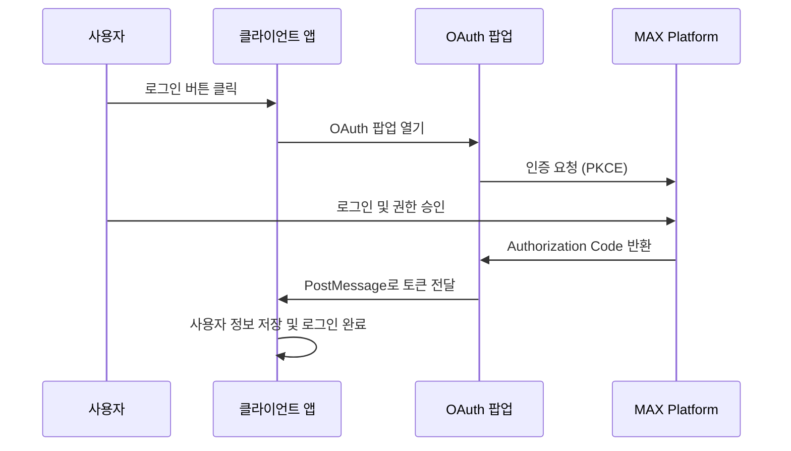

# MAX Platform OAuth 2.0 Complete Developer Guide

이 문서는 MAX Platform 생태계의 모든 솔루션에서 OAuth 2.0 인증을 통합하기 위한 완전한 가이드입니다. 이 가이드만으로 OAuth 2.0 기본 인증과 Refresh Token 기능을 포함한 완전한 OAuth 시스템을 구현할 수 있습니다.

## 목차
- [1. 개요](#1-개요)
- [2. 시스템 아키텍처](#2-시스템-아키텍처)
- [3. 시스템별 설정](#3-시스템별-설정)
- [4. Frontend 구현](#4-frontend-구현)
- [5. SSO 자동 로그인 구현](#5-sso-자동-로그인-구현)
- [6. Refresh Token 구현](#6-refresh-token-구현)
- [7. Backend 구현](#7-backend-구현)
- [8. 데이터베이스 스키마](#8-데이터베이스-스키마)
- [9. 보안 고려사항](#9-보안-고려사항)
- [10. 트러블슈팅](#10-트러블슈팅)
- [11. 체크리스트](#11-체크리스트)
- [12. API 레퍼런스](#12-api-레퍼런스)

## 1. 개요

### 1.1 OAuth 2.0 플로우
MAX Platform에서는 **Authorization Code Flow with PKCE**를 사용한 팝업 기반 인증을 구현합니다.



### 1.2 핵심 특징
- **팝업 기반**: 사용자가 원래 앱을 떠나지 않음
- **SSO 자동 로그인**: MAX Platform 로그인 상태 시 자동 인증
- **Silent Authentication**: iframe 기반 조용한 인증 시도
- **PKCE 보안**: Code Challenge/Verifier 사용
- **PostMessage 통신**: 안전한 크로스 윈도우 통신
- **Refresh Token**: 장기간 인증 세션 지원
- **Token Rotation**: 보안 강화를 위한 토큰 순환
- **표준 준수**: OAuth 2.0 RFC 6749, RFC 8252 준수

### 1.3 지원되는 Grant Types
- `authorization_code`: 기본 인증 코드 플로우
- `refresh_token`: 토큰 갱신을 위한 플로우

## 2. 시스템 아키텍처

### 2.1 전체 구조
```
MAX Platform (OAuth 서버)
├── 인증 서비스 (localhost:8000)
├── 사용자 관리
└── 권한 관리

클라이언트 애플리케이션들
├── MaxFlowStudio (3005 ↔ 8005)
├── MaxLab (3010 ↔ 8010)
├── MaxTeamSync (3015 ↔ 8015)
├── MaxWorkspace (3020 ↔ 8020)
├── MaxQueryHub (3025 ↔ 8025)
├── MaxLLM (3030 ↔ 8030)
├── MaxAPA (3035 ↔ 8035)
└── MaxMLOps (3040 ↔ 8040)
```

### 2.2 통신 플로우

#### 기본 OAuth 플로우
1. **클라이언트** → **MAX Platform**: OAuth 인증 요청
2. **MAX Platform** → **클라이언트**: Authorization Code 반환
3. **클라이언트** → **MAX Platform**: 토큰 교환 요청
4. **MAX Platform** → **클라이언트**: Access Token + Refresh Token 반환

#### SSO 자동 로그인 플로우
1. **사용자 접속** → **클라이언트**: 애플리케이션 접속
2. **클라이언트**: 저장된 토큰 확인
3. **토큰 없음** → **Silent Auth**: iframe으로 조용한 인증 시도 (`prompt=none`)
4. **성공 시**: 자동 로그인 완료
5. **실패 시**: 수동 로그인 페이지 표시

#### Refresh Token 플로우
1. **클라이언트**: Access Token 만료 감지
2. **클라이언트** → **MAX Platform**: Refresh Token으로 갱신 요청
3. **MAX Platform**: 기존 Refresh Token 검증 및 무효화
4. **MAX Platform** → **클라이언트**: 새로운 Access Token + Refresh Token 반환

## 3. 시스템별 설정

### 3.1 포트 및 엔드포인트 매핑

| 솔루션 | 클라이언트 ID | Frontend | Backend | Redirect URI |
|--------|---------------|----------|---------|--------------| 
| maxplatform | N/A (OAuth 서버) | localhost:3000 | localhost:8000 | N/A |
| maxflowstudio | `maxflowstudio` | localhost:3005 | localhost:8005 | `http://localhost:3005/oauth/callback` |
| maxlab | `maxlab` | localhost:3010 | localhost:8010 | `http://localhost:3010/oauth/callback` |
| maxteamsync | `maxteamsync` | localhost:3015 | localhost:8015 | `http://localhost:3015/oauth/callback` |
| maxworkspace | `maxworkspace` | localhost:3020 | localhost:8020 | `http://localhost:3020/oauth/callback` |
| maxqueryhub | `maxqueryhub` | localhost:3025 | localhost:8025 | `http://localhost:3025/oauth/callback` |
| maxllm | `maxllm` | localhost:3030 | localhost:8030 | `http://localhost:3030/oauth/callback` |
| maxapa | `maxapa` | localhost:3035 | localhost:8035 | `http://localhost:3035/oauth/callback` |
| maxmlops | `maxmlops` | localhost:3040 | localhost:8040 | `http://localhost:3040/oauth/callback` |

### 3.2 OAuth 엔드포인트
- **Authorization**: `http://localhost:8000/api/oauth/authorize`
- **Token Exchange**: `http://localhost:8000/api/oauth/token`
- **User Info**: `http://localhost:8000/api/oauth/userinfo`
- **Token Revocation**: `http://localhost:8000/api/oauth/revoke`
- **OAuth Metadata**: `http://localhost:8000/.well-known/oauth-authorization-server`

## 4. Frontend 구현

### 4.1 환경변수 설정

```env
# .env (각 시스템별로 수정)
VITE_AUTH_SERVER_URL=http://localhost:8000
VITE_CLIENT_ID=maxflowstudio  # 시스템별로 변경
VITE_REDIRECT_URI=http://localhost:3005/oauth/callback  # 시스템별로 변경
```

### 4.2 OAuth 유틸리티 클래스

```typescript
// src/utils/popupOAuth.ts
interface TokenResponse {
  access_token: string;
  token_type: string;
  expires_in: number;
  scope: string;
  refresh_token?: string;
  refresh_expires_in?: number;
}

interface OAuthMessage {
  type: 'OAUTH_SUCCESS' | 'OAUTH_ERROR';
  token?: string;
  tokenData?: TokenResponse;
  error?: string;
}

export class PopupOAuthLogin {
  private popup: Window | null = null;
  private checkInterval: NodeJS.Timeout | null = null;
  private messageHandler: ((event: MessageEvent) => void) | null = null;
  private messageReceived: boolean = false;

  private readonly clientId: string;
  private readonly redirectUri: string;
  private readonly authUrl: string;
  private readonly scopes = ['read:profile', 'read:groups', 'manage:workflows'];

  constructor() {
    this.clientId = import.meta.env.VITE_CLIENT_ID;
    this.redirectUri = import.meta.env.VITE_REDIRECT_URI;
    this.authUrl = import.meta.env.VITE_AUTH_SERVER_URL;
  }

  // PKCE 구현
  private generateCodeVerifier(): string {
    const array = new Uint8Array(32);
    crypto.getRandomValues(array);
    return this.base64URLEncode(array);
  }

  private async generateCodeChallenge(verifier: string): Promise<string> {
    const encoder = new TextEncoder();
    const data = encoder.encode(verifier);
    const digest = await crypto.subtle.digest('SHA-256', data);
    return this.base64URLEncode(new Uint8Array(digest));
  }

  private base64URLEncode(array: Uint8Array): string {
    return btoa(String.fromCharCode(...array))
      .replace(/\+/g, '-')
      .replace(/\//g, '_')
      .replace(/=/g, '');
  }

  // OAuth 시작
  async startAuth(): Promise<TokenResponse> {
    return new Promise(async (resolve, reject) => {
      try {
        // PKCE 파라미터 생성
        const state = this.generateCodeVerifier();
        const codeVerifier = this.generateCodeVerifier();
        const codeChallenge = await this.generateCodeChallenge(codeVerifier);

        // 세션 스토리지에 저장
        sessionStorage.setItem('oauth_state', state);
        sessionStorage.setItem('oauth_code_verifier', codeVerifier);
        sessionStorage.setItem('oauth_popup_mode', 'true');

        // OAuth URL 생성
        const params = new URLSearchParams({
          response_type: 'code',
          client_id: this.clientId,
          redirect_uri: this.redirectUri,
          scope: this.scopes.join(' '),
          state: state,
          code_challenge: codeChallenge,
          code_challenge_method: 'S256'
        });

        const authUrl = `${this.authUrl}/api/oauth/authorize?${params}`;
        console.log('🔐 Opening OAuth popup:', authUrl);

        // 팝업 열기
        this.popup = window.open(
          authUrl,
          'oauth_login',
          'width=500,height=600,scrollbars=yes,resizable=yes,top=100,left=100'
        );

        if (!this.popup) {
          reject(new Error('Popup was blocked. Please allow popups and try again.'));
          return;
        }

        // PostMessage 이벤트 리스너
        this.messageHandler = (event: MessageEvent<OAuthMessage>) => {
          // Origin 검증
          const trustedOrigins = [
            window.location.origin,
            'http://localhost:3000'  // MAX Platform
          ];
          
          if (!trustedOrigins.includes(event.origin)) {
            console.warn('Ignoring message from untrusted origin:', event.origin);
            return;
          }

          console.log('📨 Received OAuth message:', event.data);
          this.messageReceived = true;

          if (event.data.type === 'OAUTH_SUCCESS') {
            if (this.checkInterval) {
              clearInterval(this.checkInterval);
              this.checkInterval = null;
            }
            
            this.cleanup();
            if (event.data.tokenData) {
              resolve(event.data.tokenData);
            } else if (event.data.token) {
              resolve({
                access_token: event.data.token,
                token_type: 'Bearer',
                expires_in: 3600,
                scope: this.scopes.join(' ')
              });
            } else {
              reject(new Error('No token data received'));
            }
          } else if (event.data.type === 'OAUTH_ERROR') {
            this.cleanup();
            reject(new Error(event.data.error || 'OAuth authentication failed'));
          }
        };

        window.addEventListener('message', this.messageHandler);

        // 팝업 닫힘 감지
        this.checkInterval = setInterval(() => {
          if (this.popup?.closed) {
            setTimeout(() => {
              if (!this.messageReceived) {
                console.log('🚪 Popup closed without receiving message - user cancelled');
                this.cleanup();
                reject(new Error('Authentication was cancelled by the user'));
              }
            }, 100);
          }
        }, 500);

      } catch (error) {
        this.cleanup();
        reject(error);
      }
    });
  }

  // 정리
  private cleanup(): void {
    if (this.popup && !this.popup.closed) {
      this.popup.close();
    }
    
    if (this.checkInterval) {
      clearInterval(this.checkInterval);
      this.checkInterval = null;
    }

    if (this.messageHandler) {
      window.removeEventListener('message', this.messageHandler);
      this.messageHandler = null;
    }

    this.popup = null;
    this.messageReceived = false;
    
    sessionStorage.removeItem('oauth_popup_mode');
    sessionStorage.removeItem('oauth_state');
    sessionStorage.removeItem('oauth_code_verifier');
  }

  public forceCleanup(): void {
    this.cleanup();
  }
}

// 토큰 교환
export async function exchangeCodeForToken(code: string): Promise<TokenResponse> {
  const codeVerifier = sessionStorage.getItem('oauth_code_verifier');
  const authUrl = import.meta.env.VITE_AUTH_SERVER_URL;
  
  if (!codeVerifier) {
    throw new Error('No code verifier found in session storage');
  }

  const response = await fetch(`${authUrl}/api/oauth/token`, {
    method: 'POST',
    headers: {
      'Content-Type': 'application/x-www-form-urlencoded',
    },
    body: new URLSearchParams({
      grant_type: 'authorization_code',
      code: code,
      redirect_uri: import.meta.env.VITE_REDIRECT_URI,
      client_id: import.meta.env.VITE_CLIENT_ID,
      code_verifier: codeVerifier
    })
  });

  if (!response.ok) {
    const errorData = await response.json().catch(() => ({}));
    throw new Error(errorData.error_description || `Token exchange failed: ${response.statusText}`);
  }

  return response.json() as TokenResponse;
}

// 팝업 모드 확인
export function isPopupMode(): boolean {
  return sessionStorage.getItem('oauth_popup_mode') === 'true' || 
         window.opener !== null;
}

// 사용자 정보 가져오기
export async function getUserInfo(accessToken: string): Promise<any> {
  const authUrl = import.meta.env.VITE_AUTH_SERVER_URL;
  
  const response = await fetch(`${authUrl}/api/oauth/userinfo`, {
    headers: {
      'Authorization': `Bearer ${accessToken}`
    }
  });

  if (!response.ok) {
    throw new Error(`Failed to fetch user info: ${response.statusText}`);
  }

  return response.json();
}
```

### 4.3 OAuth 콜백 컴포넌트

```typescript
// src/pages/OAuthCallback.tsx
import React, { useEffect, useState } from 'react';
import { useNavigate, useSearchParams } from 'react-router-dom';
import { Spin, Alert, Typography, Card } from 'antd';
import { LoadingOutlined, CheckCircleOutlined, ExclamationCircleOutlined } from '@ant-design/icons';
import { authService } from '../services/auth';
import { exchangeCodeForToken, isPopupMode } from '../utils/popupOAuth';

const { Title, Paragraph } = Typography;

interface CallbackState {
  status: 'loading' | 'success' | 'error';
  message: string;
  error?: string;
}

export const OAuthCallback: React.FC = () => {
  const navigate = useNavigate();
  const [searchParams] = useSearchParams();
  const [state, setState] = useState<CallbackState>({
    status: 'loading',
    message: 'Processing OAuth callback...'
  });

  useEffect(() => {
    const handleOAuthCallback = async () => {
      try {
        const code = searchParams.get('code');
        const state = searchParams.get('state');
        const error = searchParams.get('error');
        const errorDescription = searchParams.get('error_description');
        
        const inPopupMode = isPopupMode();
        
        if (error) {
          const errorMessage = errorDescription || `OAuth error: ${error}`;
          
          if (inPopupMode) {
            window.opener?.postMessage({
              type: 'OAUTH_ERROR',
              error: errorMessage
            }, window.location.origin);
            window.close();
            return;
          } else {
            throw new Error(errorMessage);
          }
        }

        if (!code) {
          throw new Error('No authorization code received');
        }

        setState({
          status: 'loading',
          message: 'Exchanging authorization code for access token...'
        });

        if (inPopupMode) {
          try {
            // 상태 검증
            const storedState = sessionStorage.getItem('oauth_state');
            if (state !== storedState) {
              window.opener?.postMessage({
                type: 'OAUTH_ERROR',
                error: 'Invalid state parameter - possible security issue'
              }, window.location.origin);
              window.close();
              return;
            }

            // 토큰 교환
            const tokenResponse = await exchangeCodeForToken(code);
            
            // 세션 정리
            sessionStorage.removeItem('oauth_state');
            sessionStorage.removeItem('oauth_code_verifier');
            sessionStorage.removeItem('oauth_popup_mode');
            
            // 성공 메시지 전송
            window.opener?.postMessage({
              type: 'OAUTH_SUCCESS',
              token: tokenResponse.access_token,
              tokenData: tokenResponse
            }, window.location.origin);
            
            window.close();
            
          } catch (error: any) {
            console.error('Popup OAuth token exchange error:', error);
            window.opener?.postMessage({
              type: 'OAUTH_ERROR',
              error: error.message || 'Token exchange failed'
            }, window.location.origin);
            window.close();
          }
        } else {
          // 일반 모드에서는 authService 사용
          const user = await authService.handleOAuthCallback();

          setState({
            status: 'success',
            message: `Welcome back, ${user.full_name || user.username}! Redirecting...`
          });

          setTimeout(() => {
            const redirectTo = sessionStorage.getItem('oauthRedirectTo') || '/';
            sessionStorage.removeItem('oauthRedirectTo');
            navigate(redirectTo, { replace: true });
          }, 2000);
        }

      } catch (error: any) {
        console.error('OAuth callback error:', error);
        
        if (isPopupMode()) {
          window.opener?.postMessage({
            type: 'OAUTH_ERROR',
            error: error.message || 'Authentication failed'
          }, window.location.origin);
          window.close();
        } else {
          setState({
            status: 'error',
            message: 'Authentication failed',
            error: error.message || 'An unexpected error occurred during authentication'
          });

          setTimeout(() => {
            navigate('/login', { replace: true });
          }, 5000);
        }
      }
    };

    handleOAuthCallback();
  }, [navigate, searchParams]);

  const renderIcon = () => {
    switch (state.status) {
      case 'loading':
        return <LoadingOutlined style={{ fontSize: 48, color: '#1890ff' }} spin />;
      case 'success':
        return <CheckCircleOutlined style={{ fontSize: 48, color: '#52c41a' }} />;
      case 'error':
        return <ExclamationCircleOutlined style={{ fontSize: 48, color: '#ff4d4f' }} />;
    }
  };

  // 팝업 모드일 때는 간단한 UI
  if (isPopupMode()) {
    return (
      <div style={{
        display: 'flex',
        justifyContent: 'center',
        alignItems: 'center',
        height: '100vh',
        fontFamily: '-apple-system, BlinkMacSystemFont, "Segoe UI", Roboto, sans-serif',
        background: '#f5f5f5'
      }}>
        <div style={{ textAlign: 'center', padding: '40px' }}>
          <div style={{
            border: '4px solid #f3f3f3',
            borderTop: '4px solid #1890ff',
            borderRadius: '50%',
            width: '40px',
            height: '40px',
            animation: 'spin 2s linear infinite',
            margin: '0 auto 20px'
          }}></div>
          <Title level={4} style={{ marginBottom: 8, color: '#262626' }}>
            Processing Authentication...
          </Title>
          <Paragraph style={{ fontSize: 14, color: '#666', margin: 0 }}>
            Please wait while we complete your login.
          </Paragraph>
          <style>{`
            @keyframes spin {
              0% { transform: rotate(0deg); }
              100% { transform: rotate(360deg); }
            }
          `}</style>
        </div>
      </div>
    );
  }

  return (
    <div style={{ 
      minHeight: '100vh',
      display: 'flex',
      alignItems: 'center',
      justifyContent: 'center',
      background: 'linear-gradient(135deg, #667eea 0%, #764ba2 100%)',
      padding: '20px'
    }}>
      <Card
        style={{
          width: '100%',
          maxWidth: 500,
          textAlign: 'center',
          borderRadius: 12,
          boxShadow: '0 8px 32px rgba(0,0,0,0.1)'
        }}
        styles={{ body: { padding: '48px 32px' } }}
      >
        <div style={{ marginBottom: 24 }}>
          {renderIcon()}
        </div>
        
        <Title level={3} style={{ marginBottom: 16, color: '#262626' }}>
          {state.status === 'loading' && 'Authenticating...'}
          {state.status === 'success' && 'Login Successful!'}
          {state.status === 'error' && 'Authentication Failed'}
        </Title>
        
        <Paragraph style={{ fontSize: 16, color: '#666', marginBottom: 8 }}>
          {state.message}
        </Paragraph>
        
        {state.error && (
          <Alert
            message="Authentication Error"
            description={state.error}
            type="error"
            showIcon
            style={{ marginTop: 24 }}
          />
        )}
      </Card>
    </div>
  );
};
```

## 5. SSO 자동 로그인 구현

### 5.1 Silent Authentication 구현

```typescript
// src/utils/silentAuth.ts
export class SilentAuth {
  private iframe: HTMLIFrameElement | null = null;
  private messageHandler: ((event: MessageEvent) => void) | null = null;
  private timeoutId: NodeJS.Timeout | null = null;

  private readonly clientId: string;
  private readonly redirectUri: string;
  private readonly authUrl: string;

  constructor() {
    this.clientId = import.meta.env.VITE_CLIENT_ID;
    this.redirectUri = import.meta.env.VITE_REDIRECT_URI;
    this.authUrl = import.meta.env.VITE_AUTH_SERVER_URL;
  }

  async attemptSilentLogin(): Promise<TokenResponse | null> {
    return new Promise((resolve) => {
      try {
        // PKCE 파라미터 생성
        const state = this.generateCodeVerifier();
        const codeVerifier = this.generateCodeVerifier();
        
        this.generateCodeChallenge(codeVerifier).then(codeChallenge => {
          // 세션 스토리지에 저장
          sessionStorage.setItem('silent_oauth_state', state);
          sessionStorage.setItem('silent_oauth_code_verifier', codeVerifier);

          // Silent auth URL 생성
          const params = new URLSearchParams({
            response_type: 'code',
            client_id: this.clientId,
            redirect_uri: this.redirectUri,
            scope: 'read:profile read:groups',
            state: state,
            code_challenge: codeChallenge,
            code_challenge_method: 'S256',
            prompt: 'none'  // Silent authentication
          });

          const authUrl = `${this.authUrl}/api/oauth/authorize?${params}`;

          // iframe 생성
          this.iframe = document.createElement('iframe');
          this.iframe.style.display = 'none';
          this.iframe.src = authUrl;
          document.body.appendChild(this.iframe);

          // 타임아웃 설정 (10초)
          this.timeoutId = setTimeout(() => {
            this.cleanup();
            resolve(null);
          }, 10000);

          // PostMessage 리스너
          this.messageHandler = async (event: MessageEvent) => {
            if (event.origin !== window.location.origin) {
              return;
            }

            if (event.data.type === 'SILENT_AUTH_SUCCESS') {
              if (this.timeoutId) {
                clearTimeout(this.timeoutId);
              }
              this.cleanup();
              resolve(event.data.tokenData);
            } else if (event.data.type === 'SILENT_AUTH_ERROR') {
              if (this.timeoutId) {
                clearTimeout(this.timeoutId);
              }
              this.cleanup();
              resolve(null);
            }
          };

          window.addEventListener('message', this.messageHandler);
        });

      } catch (error) {
        console.log('Silent auth failed:', error);
        this.cleanup();
        resolve(null);
      }
    });
  }

  private generateCodeVerifier(): string {
    const array = new Uint8Array(32);
    crypto.getRandomValues(array);
    return this.base64URLEncode(array);
  }

  private async generateCodeChallenge(verifier: string): Promise<string> {
    const encoder = new TextEncoder();
    const data = encoder.encode(verifier);
    const digest = await crypto.subtle.digest('SHA-256', data);
    return this.base64URLEncode(new Uint8Array(digest));
  }

  private base64URLEncode(array: Uint8Array): string {
    return btoa(String.fromCharCode(...array))
      .replace(/\+/g, '-')
      .replace(/\//g, '_')
      .replace(/=/g, '');
  }

  private cleanup(): void {
    if (this.iframe) {
      document.body.removeChild(this.iframe);
      this.iframe = null;
    }

    if (this.messageHandler) {
      window.removeEventListener('message', this.messageHandler);
      this.messageHandler = null;
    }

    if (this.timeoutId) {
      clearTimeout(this.timeoutId);
      this.timeoutId = null;
    }

    sessionStorage.removeItem('silent_oauth_state');
    sessionStorage.removeItem('silent_oauth_code_verifier');
  }
}
```

## 6. Refresh Token 구현

### 6.1 자동 토큰 갱신

```typescript
// src/utils/tokenManager.ts
export class TokenManager {
  private refreshing: boolean = false;
  private refreshPromise: Promise<string | null> | null = null;

  // 토큰 저장
  setTokens(accessToken: string, refreshToken?: string): void {
    localStorage.setItem('access_token', accessToken);
    if (refreshToken) {
      localStorage.setItem('refresh_token', refreshToken);
    }

    // 토큰 만료 시간 계산 및 저장
    try {
      const payload = JSON.parse(atob(accessToken.split('.')[1]));
      const expiryTime = payload.exp * 1000;
      localStorage.setItem('token_expiry', expiryTime.toString());
    } catch (error) {
      console.warn('Failed to parse token expiry:', error);
    }
  }

  // 토큰 가져오기
  getAccessToken(): string | null {
    return localStorage.getItem('access_token');
  }

  getRefreshToken(): string | null {
    return localStorage.getItem('refresh_token');
  }

  // 토큰 만료 확인
  isTokenExpired(): boolean {
    const accessToken = this.getAccessToken();
    if (!accessToken) return true;

    try {
      const payload = JSON.parse(atob(accessToken.split('.')[1]));
      const currentTime = Date.now() / 1000;
      return payload.exp < currentTime;
    } catch (error) {
      return true;
    }
  }

  // 토큰이 곧 만료되는지 확인 (5분 전)
  isTokenExpiringSoon(): boolean {
    const accessToken = this.getAccessToken();
    if (!accessToken) return true;

    try {
      const payload = JSON.parse(atob(accessToken.split('.')[1]));
      const currentTime = Date.now() / 1000;
      const bufferTime = 5 * 60; // 5분
      return payload.exp - currentTime < bufferTime;
    } catch (error) {
      return true;
    }
  }

  // 토큰 갱신
  async refreshAccessToken(): Promise<string | null> {
    // 이미 갱신 중이면 기존 프로미스 반환
    if (this.refreshing && this.refreshPromise) {
      return this.refreshPromise;
    }

    this.refreshing = true;
    this.refreshPromise = this._performRefresh();

    try {
      const result = await this.refreshPromise;
      return result;
    } finally {
      this.refreshing = false;
      this.refreshPromise = null;
    }
  }

  private async _performRefresh(): Promise<string | null> {
    const refreshToken = this.getRefreshToken();
    
    if (!refreshToken) {
      console.log('No refresh token available');
      this.clearTokens();
      return null;
    }

    try {
      const authUrl = import.meta.env.VITE_AUTH_SERVER_URL;
      const clientId = import.meta.env.VITE_CLIENT_ID;

      const response = await fetch(`${authUrl}/api/oauth/token`, {
        method: 'POST',
        headers: {
          'Content-Type': 'application/x-www-form-urlencoded',
        },
        body: new URLSearchParams({
          grant_type: 'refresh_token',
          refresh_token: refreshToken,
          client_id: clientId
        })
      });

      if (!response.ok) {
        throw new Error(`Token refresh failed: ${response.statusText}`);
      }

      const tokenData: TokenResponse = await response.json();
      
      // 새 토큰 저장
      this.setTokens(tokenData.access_token, tokenData.refresh_token);
      
      console.log('🔄 Token refreshed successfully');
      return tokenData.access_token;

    } catch (error) {
      console.error('Token refresh failed:', error);
      this.clearTokens();
      
      // 로그인 페이지로 리다이렉트
      window.location.href = '/login';
      return null;
    }
  }

  // 토큰 클리어
  clearTokens(): void {
    localStorage.removeItem('access_token');
    localStorage.removeItem('refresh_token');
    localStorage.removeItem('token_expiry');
  }

  // 인증된 요청을 위한 토큰 가져오기 (자동 갱신 포함)
  async getValidAccessToken(): Promise<string | null> {
    // 토큰이 만료되었거나 곧 만료될 예정이면 갱신
    if (this.isTokenExpired() || this.isTokenExpiringSoon()) {
      console.log('🔄 Token expired or expiring soon, refreshing...');
      return this.refreshAccessToken();
    }

    return this.getAccessToken();
  }
}

// 전역 인스턴스
export const tokenManager = new TokenManager();
```

### 6.2 HTTP 요청 인터셉터

```typescript
// src/utils/apiClient.ts
import axios, { AxiosResponse, AxiosError } from 'axios';
import { tokenManager } from './tokenManager';

// Axios 인스턴스 생성
const apiClient = axios.create({
  baseURL: import.meta.env.VITE_API_BASE_URL || 'http://localhost:8000',
  timeout: 30000,
});

// 요청 인터셉터 - 자동으로 토큰 추가
apiClient.interceptors.request.use(
  async (config) => {
    const token = await tokenManager.getValidAccessToken();
    
    if (token) {
      config.headers.Authorization = `Bearer ${token}`;
    }
    
    return config;
  },
  (error) => {
    return Promise.reject(error);
  }
);

// 응답 인터셉터 - 401 에러 시 토큰 갱신 시도
apiClient.interceptors.response.use(
  (response: AxiosResponse) => response,
  async (error: AxiosError) => {
    const originalRequest = error.config as any;

    if (error.response?.status === 401 && !originalRequest._retry) {
      originalRequest._retry = true;

      try {
        console.log('🔄 401 error detected, attempting token refresh...');
        const newToken = await tokenManager.refreshAccessToken();
        
        if (newToken && originalRequest) {
          originalRequest.headers.Authorization = `Bearer ${newToken}`;
          return apiClient.request(originalRequest);
        }
      } catch (refreshError) {
        console.error('Token refresh failed:', refreshError);
        tokenManager.clearTokens();
        window.location.href = '/login';
        return Promise.reject(refreshError);
      }
    }

    return Promise.reject(error);
  }
);

export default apiClient;
```

## 7. Backend 구현

### 7.1 토큰 검증 미들웨어

```python
# backend/app/utils/auth.py에서 중요 함수들
def extract_user_info_from_token(token: str) -> Optional[Dict[str, Any]]:
    """JWT 토큰에서 사용자 정보 추출"""
    try:
        payload = jwt.decode(token, settings.secret_key, algorithms=[settings.algorithm])
        
        # 토큰 타입 확인
        token_type = payload.get("type")
        if token_type != "access":
            return None
        
        # 토큰 만료 확인
        exp = payload.get("exp")
        if exp and datetime.utcnow().timestamp() > exp:
            return None
            
        user_info = {
            "user_id": payload.get("user_id") or payload.get("sub"),
            "email": payload.get("email"),
            "is_admin": payload.get("is_admin", False),
            "group_id": payload.get("group_id"),
            "group_name": payload.get("group_name"),
            "role_id": payload.get("role_id"),
            "role_name": payload.get("role_name")
        }
        
        return user_info
        
    except JWTError as e:
        logger.warning(f"Token info extraction failed: {e}")
        return None
```

### 7.2 Refresh Token 함수들

```python
# backend/app/api/oauth_simple.py에서 Refresh Token 관련 함수들
def generate_refresh_token() -> str:
    """Generate a secure random refresh token (RFC 6749 compliant)"""
    return secrets.token_urlsafe(48)  # 48 bytes = 384 bits for extra security

def create_refresh_token_record(db: Session, refresh_token: str, client_id: str, 
                              user_id: str, scope: str, access_token: str,
                              client_ip: str = None, user_agent: str = None) -> bool:
    """Create refresh token record in database"""
    try:
        token_hash = generate_token_hash(refresh_token)
        access_token_hash = generate_token_hash(access_token)
        expires_at = calculate_refresh_token_expiry()
        
        db.execute(
            text("""
                INSERT INTO oauth_refresh_tokens 
                (token_hash, client_id, user_id, scope, access_token_hash, expires_at, 
                 client_ip, user_agent, created_at)
                VALUES (:token_hash, :client_id, :user_id, :scope, :access_token_hash, 
                        :expires_at, :client_ip, :user_agent, NOW())
            """),
            {
                "token_hash": token_hash,
                "client_id": client_id,
                "user_id": user_id,
                "scope": scope,
                "access_token_hash": access_token_hash,
                "expires_at": expires_at,
                "client_ip": client_ip,
                "user_agent": user_agent
            }
        )
        db.commit()
        return True
        
    except Exception as e:
        logger.error(f"Failed to create refresh token record: {e}")
        db.rollback()
        return False

def validate_refresh_token(refresh_token: str, client_id: str, db: Session) -> Optional[dict]:
    """Validate refresh token and return token info"""
    try:
        token_hash = generate_token_hash(refresh_token)
        
        result = db.execute(
            text("""
                SELECT user_id, scope, expires_at, revoked_at, rotation_count, last_used_at
                FROM oauth_refresh_tokens 
                WHERE token_hash = :token_hash 
                AND client_id = :client_id
            """),
            {"token_hash": token_hash, "client_id": client_id}
        ).fetchone()
        
        if not result:
            return None
            
        # 만료 확인
        if result.expires_at < datetime.utcnow():
            return None
            
        # 취소 확인
        if result.revoked_at:
            return None
            
        return {
            "user_id": result.user_id,
            "scope": result.scope,
            "rotation_count": result.rotation_count,
            "last_used_at": result.last_used_at
        }
        
    except Exception as e:
        logger.error(f"Refresh token validation failed: {e}")
        return None

def rotate_refresh_token(old_refresh_token: str, client_id: str, user_id: str, 
                        scope: str, new_access_token: str, db: Session,
                        client_ip: str = None, user_agent: str = None) -> Optional[str]:
    """Rotate refresh token (invalidate old, create new)"""
    try:
        # 기존 토큰 무효화
        old_token_hash = generate_token_hash(old_refresh_token)
        
        db.execute(
            text("""
                UPDATE oauth_refresh_tokens 
                SET revoked_at = NOW(), last_used_at = NOW()
                WHERE token_hash = :token_hash AND client_id = :client_id
            """),
            {"token_hash": old_token_hash, "client_id": client_id}
        )
        
        # 새 토큰 생성
        new_refresh_token = generate_refresh_token()
        
        # 새 토큰 레코드 생성
        success = create_refresh_token_record(
            db, new_refresh_token, client_id, user_id, scope, 
            new_access_token, client_ip, user_agent
        )
        
        if success:
            return new_refresh_token
        else:
            db.rollback()
            return None
            
    except Exception as e:
        logger.error(f"Refresh token rotation failed: {e}")
        db.rollback()
        return None
```

## 8. 데이터베이스 스키마

### 8.1 OAuth Refresh Tokens 테이블

```sql
-- database/oauth_schema.sql
CREATE TABLE IF NOT EXISTS oauth_refresh_tokens (
    id UUID PRIMARY KEY DEFAULT gen_random_uuid(),
    token_hash VARCHAR(255) NOT NULL UNIQUE,           -- SHA256 hash of refresh token
    client_id VARCHAR(50) NOT NULL REFERENCES oauth_clients(client_id) ON DELETE CASCADE,
    user_id UUID NOT NULL REFERENCES users(id) ON DELETE CASCADE,
    scope TEXT,                                         -- Granted OAuth scopes
    access_token_hash VARCHAR(255),                     -- Currently linked access token
    expires_at TIMESTAMP NOT NULL,                      -- Token expiration (30 days default)
    created_at TIMESTAMP DEFAULT NOW(),
    revoked_at TIMESTAMP,                              -- Token revocation timestamp
    last_used_at TIMESTAMP,                            -- Last token usage tracking
    client_ip INET,                                    -- Security: client IP tracking
    user_agent TEXT,                                   -- Security: user agent tracking
    rotation_count INTEGER DEFAULT 0                   -- Security: rotation counter
);

-- 인덱스 생성
CREATE INDEX IF NOT EXISTS idx_oauth_refresh_tokens_token_hash ON oauth_refresh_tokens(token_hash);
CREATE INDEX IF NOT EXISTS idx_oauth_refresh_tokens_expires_at ON oauth_refresh_tokens(expires_at);
CREATE INDEX IF NOT EXISTS idx_oauth_refresh_tokens_user_client ON oauth_refresh_tokens(user_id, client_id);
CREATE INDEX IF NOT EXISTS idx_oauth_refresh_tokens_access_token ON oauth_refresh_tokens(access_token_hash);

-- Access Token 테이블에 Refresh Token 연결 컬럼 추가
ALTER TABLE oauth_access_tokens ADD COLUMN IF NOT EXISTS refresh_token_hash VARCHAR(255);
CREATE INDEX IF NOT EXISTS idx_oauth_access_tokens_refresh_token ON oauth_access_tokens(refresh_token_hash);
```

### 8.2 토큰 정리 함수

```sql
-- 만료된 토큰 정리 함수
CREATE OR REPLACE FUNCTION cleanup_expired_oauth_tokens()
RETURNS INTEGER AS $$
DECLARE
    deleted_count INTEGER;
BEGIN
    -- 만료된 Access Token 삭제
    DELETE FROM oauth_access_tokens WHERE expires_at < NOW();
    GET DIAGNOSTICS deleted_count = ROW_COUNT;
    
    -- 만료된 Refresh Token 삭제
    DELETE FROM oauth_refresh_tokens WHERE expires_at < NOW() OR revoked_at IS NOT NULL;
    GET DIAGNOSTICS deleted_count = deleted_count + ROW_COUNT;
    
    RETURN deleted_count;
END;
$$ LANGUAGE plpgsql;

-- 매일 자정에 실행되는 크론 작업 (pg_cron 확장 필요)
-- SELECT cron.schedule('cleanup-oauth-tokens', '0 0 * * *', 'SELECT cleanup_expired_oauth_tokens();');
```

## 9. 보안 고려사항

### 9.1 PKCE (Proof Key for Code Exchange)
- **Code Verifier**: 43-128자의 무작위 문자열
- **Code Challenge**: SHA256 해시된 Code Verifier (Base64 URL 인코딩)
- **보안 강화**: Authorization Code 가로채기 공격 방지

### 9.2 Refresh Token 보안
- **Token Rotation**: 사용 시마다 새로운 토큰 발급
- **SHA256 해싱**: 데이터베이스에 해시값만 저장
- **IP/User-Agent 추적**: 의심스러운 활동 감지
- **만료 시간**: 30일 기본 설정

### 9.3 PostMessage 보안
- **Origin 검증**: 신뢰할 수 있는 도메인만 허용
- **타임아웃**: 팝업/iframe 타임아웃 설정
- **상태 검증**: CSRF 공격 방지를 위한 state 파라미터

### 9.4 토큰 저장
- **localStorage**: 개발 환경에서 사용
- **httpOnly Cookie**: 프로덕션 환경 권장
- **Secure + SameSite**: CSRF 및 XSS 공격 방지

## 10. 트러블슈팅

### 10.1 일반적인 문제들

#### "Popup was blocked" 오류
```typescript
// 해결책: 사용자 동작에 의해 팝업 열기
button.addEventListener('click', async () => {
  try {
    const oauth = new PopupOAuthLogin();
    const tokens = await oauth.startAuth();
    // 성공 처리
  } catch (error) {
    if (error.message.includes('Popup was blocked')) {
      alert('팝업이 차단되었습니다. 브라우저에서 팝업을 허용해주세요.');
    }
  }
});
```

#### "Invalid state parameter" 오류
```typescript
// 원인: CSRF 공격 또는 세션 스토리지 문제
// 해결책: 상태 검증 로직 강화
const storedState = sessionStorage.getItem('oauth_state');
if (!storedState || state !== storedState) {
  throw new Error('Invalid state parameter - possible security issue');
}
```

#### "Token refresh failed" 오류
```typescript
// 원인: Refresh Token 만료 또는 무효화
// 해결책: 로그인 페이지로 리다이렉트
catch (error) {
  console.error('Token refresh failed:', error);
  tokenManager.clearTokens();
  window.location.href = '/login';
}
```

### 10.2 데이터베이스 연결 문제

#### Connection Pool 오류
```python
# backend/app/database.py
# 해결책: 연결 풀 크기 증가
common_args = {
    "pool_size": 20,           # 기본 연결 풀 크기 증가
    "max_overflow": 30,        # 추가 연결 허용
    "pool_recycle": 3600,
    "pool_pre_ping": True,
    "pool_timeout": 30
}
```

### 10.3 CORS 문제
```python
# FastAPI CORS 설정
from fastapi.middleware.cors import CORSMiddleware

app.add_middleware(
    CORSMiddleware,
    allow_origins=["http://localhost:3000", "http://localhost:3005"],  # 클라이언트 도메인 추가
    allow_credentials=True,
    allow_methods=["*"],
    allow_headers=["*"],
)
```

## 11. 체크리스트

### 11.1 개발 환경 설정
- [ ] PostgreSQL 서버 실행
- [ ] 데이터베이스 스키마 적용
- [ ] OAuth 클라이언트 등록
- [ ] 환경변수 설정
- [ ] CORS 설정 확인

### 11.2 Frontend 구현
- [ ] OAuth 유틸리티 클래스 구현
- [ ] 콜백 페이지 구현
- [ ] Silent Authentication 구현
- [ ] Token Manager 구현
- [ ] HTTP 인터셉터 설정

### 11.3 Backend 구현
- [ ] OAuth 엔드포인트 구현
- [ ] Refresh Token 로직 구현
- [ ] 토큰 검증 미들웨어
- [ ] 사용자 정보 엔드포인트
- [ ] 토큰 정리 작업

### 11.4 보안 검증
- [ ] PKCE 구현 확인
- [ ] Token Rotation 동작 확인
- [ ] Origin 검증 확인
- [ ] HTTPS 설정 (프로덕션)
- [ ] Rate Limiting 설정

### 11.5 테스트
- [ ] 기본 로그인 플로우
- [ ] 팝업 모드 테스트
- [ ] Silent Authentication 테스트
- [ ] Token Refresh 테스트
- [ ] 에러 시나리오 테스트

## 12. API 레퍼런스

### 12.1 Authorization 엔드포인트

**GET** `/api/oauth/authorize`

**Parameters:**
- `response_type`: `code` (required)
- `client_id`: 클라이언트 ID (required)
- `redirect_uri`: 리다이렉트 URI (required)
- `scope`: 요청 스코프 (optional)
- `state`: CSRF 방지용 상태값 (recommended)
- `code_challenge`: PKCE Challenge (required)
- `code_challenge_method`: `S256` (required)
- `prompt`: `none` for silent auth (optional)

**Response:**
- 성공: Authorization Code와 함께 redirect_uri로 리다이렉트
- 에러: `error` 및 `error_description` 파라미터와 함께 리다이렉트

### 12.2 Token 엔드포인트

**POST** `/api/oauth/token`

#### Authorization Code Grant
**Request:**
```
Content-Type: application/x-www-form-urlencoded

grant_type=authorization_code&
code=<authorization_code>&
redirect_uri=<redirect_uri>&
client_id=<client_id>&
code_verifier=<pkce_verifier>
```

**Response:**
```json
{
  "access_token": "eyJ0eXAiOiJKV1QiLCJhbGc...",
  "token_type": "Bearer",
  "expires_in": 3600,
  "scope": "read:profile read:groups",
  "refresh_token": "Rh8xS2kF9oP3mN7q...",
  "refresh_expires_in": 2592000
}
```

#### Refresh Token Grant
**Request:**
```
Content-Type: application/x-www-form-urlencoded

grant_type=refresh_token&
refresh_token=<refresh_token>&
client_id=<client_id>
```

**Response:**
```json
{
  "access_token": "eyJ0eXAiOiJKV1QiLCJhbGc...",
  "token_type": "Bearer", 
  "expires_in": 3600,
  "scope": "read:profile read:groups",
  "refresh_token": "Nz9dQ5vR8tY2wX6m...",
  "refresh_expires_in": 2592000
}
```

### 12.3 User Info 엔드포인트

**GET** `/api/oauth/userinfo`

**Headers:**
```
Authorization: Bearer <access_token>
```

**Response:**
```json
{
  "sub": "user-id",
  "email": "user@example.com",
  "name": "User Name",
  "groups": ["group1", "group2"],
  "is_admin": false,
  "group_id": "group-id",
  "group_name": "Group Name",
  "role_id": "role-id",
  "role_name": "Role Name"
}
```

### 12.4 OAuth Metadata 엔드포인트

**GET** `/.well-known/oauth-authorization-server`

**Response:**
```json
{
  "issuer": "http://localhost:8000",
  "authorization_endpoint": "http://localhost:8000/api/oauth/authorize",
  "token_endpoint": "http://localhost:8000/api/oauth/token",
  "userinfo_endpoint": "http://localhost:8000/api/oauth/userinfo",
  "grant_types_supported": ["authorization_code", "refresh_token"],
  "response_types_supported": ["code"],
  "code_challenge_methods_supported": ["S256"],
  "scopes_supported": ["read:profile", "read:groups", "manage:workflows"]
}
```

### 12.5 에러 응답

#### Token 엔드포인트 에러
```json
{
  "error": "invalid_grant",
  "error_description": "Invalid or expired refresh token"
}
```

#### 일반적인 에러 코드
- `invalid_request`: 필수 파라미터 누락
- `invalid_client`: 클라이언트 인증 실패
- `invalid_grant`: 유효하지 않은 Grant
- `unauthorized_client`: 권한 없는 클라이언트
- `unsupported_grant_type`: 지원하지 않는 Grant Type
- `invalid_scope`: 유효하지 않은 스코프

---

## 결론

이 가이드는 MAX Platform OAuth 2.0 시스템의 완전한 구현을 위한 모든 필수 정보를 제공합니다. 기본 OAuth 인증부터 Refresh Token 기능까지 포함하여 프로덕션 환경에서 안전하고 효율적인 인증 시스템을 구축할 수 있습니다.

추가 질문이나 이슈가 있는 경우 개발팀에 문의하거나 트러블슈팅 섹션을 참조하세요.