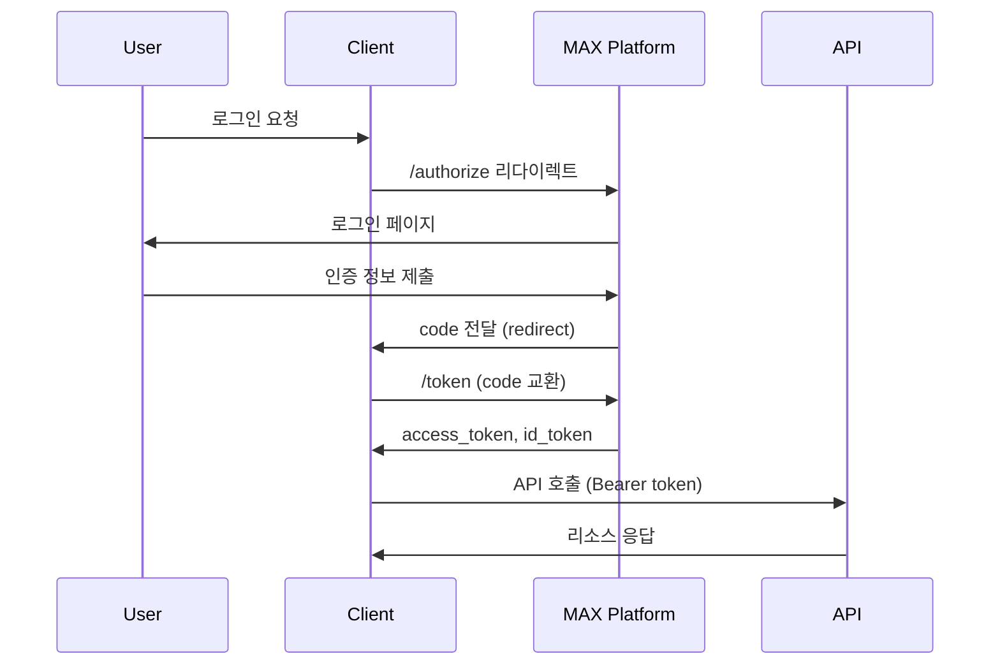

# MAX Platform OIDC & OAuth 2.0 개발자 가이드

## 목차

1. [개요](#개요)
2. [빠른 시작](#빠른-시작)
3. [OAuth 2.0 구현](#oauth-20-구현)
4. [OpenID Connect (OIDC) 구현](#openid-connect-oidc-구현)
5. [인증 플로우](#인증-플로우)
6. [API 엔드포인트 레퍼런스](#api-엔드포인트-레퍼런스)
7. [보안 고려사항](#보안-고려사항)
8. [마이그레이션 가이드](#마이그레이션-가이드)
9. [문제 해결](#문제-해결)

## 개요

MAX Platform은 OAuth 2.0과 OpenID Connect (OIDC) 1.0을 모두 지원하는 통합 인증 시스템을 제공합니다. 이 가이드는 개발자가 MAX Platform의 인증 시스템을 효과적으로 활용할 수 있도록 도와줍니다.

### 주요 특징

- **표준 준수**: OAuth 2.0 (RFC 6749) 및 OpenID Connect Core 1.0 완벽 지원
- **하위 호환성**: 기존 OAuth 2.0 클라이언트 변경 없이 작동
- **보안 강화**: RS256 서명, 자동 키 로테이션, nonce 검증
- **유연한 인증**: 다양한 grant types 및 response types 지원

### 용어 정리

- **OAuth 2.0**: 리소스 접근을 위한 인가(Authorization) 프레임워크
- **OpenID Connect**: OAuth 2.0 위에 구축된 인증(Authentication) 레이어
- **Access Token**: API 접근을 위한 토큰
- **ID Token**: 사용자 신원 정보를 담은 JWT 토큰 (OIDC 전용)
- **Refresh Token**: Access Token 갱신을 위한 토큰

## 빠른 시작

### 1. 클라이언트 등록

먼저 OAuth 클라이언트를 등록해야 합니다:

```bash
# 관리자 API를 통한 클라이언트 등록
POST /api/admin/oauth/clients
Authorization: Bearer {admin_token}
Content-Type: application/json

{
  "client_id": "my-app",
  "client_name": "My Application",
  "client_secret": "your-secure-secret",
  "redirect_uris": ["https://myapp.com/callback"],
  "allowed_scopes": ["openid", "profile", "email", "read:profile"],
  "client_type": "confidential",
  "oidc_enabled": true
}
```

### 2. 인증 URL 생성

```javascript
// OAuth 2.0 전용
const authUrl = new URL('http://localhost:8000/api/oauth/authorize');
authUrl.searchParams.append('response_type', 'code');
authUrl.searchParams.append('client_id', 'my-app');
authUrl.searchParams.append('redirect_uri', 'https://myapp.com/callback');
authUrl.searchParams.append('scope', 'read:profile');
authUrl.searchParams.append('state', generateRandomState());

// OIDC 지원 (openid 스코프 추가)
authUrl.searchParams.append('scope', 'openid profile email');
authUrl.searchParams.append('nonce', generateRandomNonce());
```

### 3. 토큰 교환

```javascript
const tokenResponse = await fetch('http://localhost:8000/api/oauth/token', {
  method: 'POST',
  headers: {
    'Content-Type': 'application/x-www-form-urlencoded',
  },
  body: new URLSearchParams({
    grant_type: 'authorization_code',
    code: authorizationCode,
    redirect_uri: 'https://myapp.com/callback',
    client_id: 'my-app',
    client_secret: 'your-secure-secret'
  })
});

const tokens = await tokenResponse.json();
// OAuth 2.0: { access_token, token_type, expires_in, refresh_token }
// OIDC: { access_token, token_type, expires_in, refresh_token, id_token }
```

## OAuth 2.0 구현

### Authorization Code Flow

가장 안전하고 권장되는 플로우입니다:

```javascript
// 1. 인증 요청
window.location.href = `http://localhost:8000/api/oauth/authorize?` +
  `response_type=code&` +
  `client_id=${clientId}&` +
  `redirect_uri=${encodeURIComponent(redirectUri)}&` +
  `scope=read:profile read:features&` +
  `state=${state}`;

// 2. 콜백 처리
const urlParams = new URLSearchParams(window.location.search);
const code = urlParams.get('code');
const state = urlParams.get('state');

// 3. 토큰 교환
const tokens = await exchangeCodeForToken(code);

// 4. API 호출
const response = await fetch('http://localhost:8000/api/oauth/userinfo', {
  headers: {
    'Authorization': `Bearer ${tokens.access_token}`
  }
});
```

### PKCE (Proof Key for Code Exchange)

공개 클라이언트(SPA, 모바일 앱)의 경우 PKCE 사용을 권장합니다:

```javascript
// 1. Code Verifier 및 Challenge 생성
const codeVerifier = generateRandomString(128);
const codeChallenge = await sha256(codeVerifier);
const codeChallengeMethod = 'S256';

// 2. 인증 요청에 추가
const authUrl = new URL('http://localhost:8000/api/oauth/authorize');
authUrl.searchParams.append('code_challenge', codeChallenge);
authUrl.searchParams.append('code_challenge_method', codeChallengeMethod);

// 3. 토큰 교환 시 verifier 제공
const tokens = await fetch('/api/oauth/token', {
  method: 'POST',
  body: new URLSearchParams({
    grant_type: 'authorization_code',
    code: authorizationCode,
    code_verifier: codeVerifier,
    // ... 기타 파라미터
  })
});
```

### Refresh Token 사용

```javascript
async function refreshAccessToken(refreshToken) {
  const response = await fetch('http://localhost:8000/api/oauth/token', {
    method: 'POST',
    headers: {
      'Content-Type': 'application/x-www-form-urlencoded',
    },
    body: new URLSearchParams({
      grant_type: 'refresh_token',
      refresh_token: refreshToken,
      client_id: clientId,
      client_secret: clientSecret
    })
  });
  
  return await response.json();
}
```

## OpenID Connect (OIDC) 구현

### Discovery

OIDC는 자동 구성을 위한 Discovery 엔드포인트를 제공합니다:

```javascript
// Discovery 정보 가져오기
const discovery = await fetch('http://localhost:8000/.well-known/openid-configuration')
  .then(res => res.json());

console.log(discovery);
// {
//   "issuer": "http://localhost:8000",
//   "authorization_endpoint": "http://localhost:8000/api/oauth/authorize",
//   "token_endpoint": "http://localhost:8000/api/oauth/token",
//   "userinfo_endpoint": "http://localhost:8000/api/oauth/userinfo",
//   "jwks_uri": "http://localhost:8000/api/oauth/jwks",
//   ...
// }
```

### ID Token 검증

ID Token은 JWT 형식으로 제공되며 검증이 필요합니다:

```javascript
import { verify } from 'jsonwebtoken';
import jwksClient from 'jwks-rsa';

// JWKS 클라이언트 설정
const client = jwksClient({
  jwksUri: 'http://localhost:8000/api/oauth/jwks'
});

// 키 가져오기
function getKey(header, callback) {
  client.getSigningKey(header.kid, (err, key) => {
    const signingKey = key.getPublicKey();
    callback(null, signingKey);
  });
}

// ID Token 검증
function verifyIdToken(idToken, clientId, nonce) {
  return new Promise((resolve, reject) => {
    verify(idToken, getKey, {
      audience: clientId,
      issuer: 'http://localhost:8000',
      algorithms: ['RS256']
    }, (err, decoded) => {
      if (err) return reject(err);
      
      // Nonce 검증
      if (decoded.nonce !== nonce) {
        return reject(new Error('Invalid nonce'));
      }
      
      resolve(decoded);
    });
  });
}
```

### OIDC 스코프와 Claims

OIDC는 표준화된 스코프와 claims를 제공합니다:

```javascript
// 표준 OIDC 스코프
const scopes = [
  'openid',      // 필수: OIDC 활성화
  'profile',     // 프로필 정보 (name, picture 등)
  'email',       // 이메일 주소 및 검증 상태
  'address',     // 주소 정보
  'phone',       // 전화번호 정보
  'offline_access' // Refresh Token 발급
];

// 요청 예시
const authUrl = `http://localhost:8000/api/oauth/authorize?` +
  `scope=openid profile email&` +
  `response_type=code&` +
  `client_id=${clientId}&` +
  `redirect_uri=${redirectUri}&` +
  `nonce=${nonce}`;

// ID Token에 포함되는 claims
{
  "iss": "http://localhost:8000",        // 발급자
  "sub": "user-uuid",                    // 사용자 ID
  "aud": "my-app",                       // 클라이언트 ID
  "exp": 1234567890,                     // 만료 시간
  "iat": 1234567890,                     // 발급 시간
  "auth_time": 1234567890,               // 인증 시간
  "nonce": "random-nonce",               // 재생 공격 방지
  "email": "user@example.com",           // 이메일 (email 스코프)
  "email_verified": true,                // 이메일 검증 여부
  "name": "홍길동",                      // 이름 (profile 스코프)
  "groups": ["developers"],              // 그룹 정보 (커스텀)
  "role": "admin"                        // 역할 정보 (커스텀)
}
```

## 인증 플로우

### 1. 표준 Authorization Code Flow (추천)



### 2. Implicit Flow (레거시, 비권장)

보안상 권장하지 않지만 레거시 지원을 위해 제공:

```javascript
// response_type=id_token token
const authUrl = `http://localhost:8000/api/oauth/authorize?` +
  `response_type=id_token token&` +
  `client_id=${clientId}&` +
  `redirect_uri=${redirectUri}&` +
  `scope=openid profile&` +
  `nonce=${nonce}`;

// 토큰은 URL fragment에 반환됨
// #access_token=...&id_token=...&token_type=Bearer&expires_in=3600
```

### 3. Hybrid Flow

Authorization Code와 토큰을 함께 받는 플로우:

```javascript
// response_type=code id_token
const authUrl = `http://localhost:8000/api/oauth/authorize?` +
  `response_type=code id_token&` +
  `client_id=${clientId}&` +
  `redirect_uri=${redirectUri}&` +
  `scope=openid profile&` +
  `nonce=${nonce}`;
```

## API 엔드포인트 레퍼런스

### 인증 엔드포인트

#### GET /api/oauth/authorize

사용자 인증 및 권한 부여를 시작합니다.

**파라미터:**
- `response_type` (필수): `code`, `id_token`, `token`, 또는 조합
- `client_id` (필수): 등록된 클라이언트 ID
- `redirect_uri` (필수): 등록된 리다이렉트 URI
- `scope` (필수): 요청할 권한 스코프
- `state` (권장): CSRF 방지를 위한 랜덤 값
- `nonce` (OIDC 필수): 재생 공격 방지
- `code_challenge` (PKCE): 코드 챌린지
- `code_challenge_method` (PKCE): `S256` 또는 `plain`
- `prompt` (선택): `none`, `login`, `consent`, `select_account`
- `max_age` (선택): 최대 인증 경과 시간(초)

**예시:**
```http
GET /api/oauth/authorize?
  response_type=code&
  client_id=my-app&
  redirect_uri=https://myapp.com/callback&
  scope=openid profile email&
  state=xyz123&
  nonce=abc456
```

### 토큰 엔드포인트

#### POST /api/oauth/token

인증 코드를 액세스 토큰으로 교환하거나 토큰을 갱신합니다.

**파라미터:**
- `grant_type` (필수): `authorization_code`, `refresh_token`, `client_credentials`
- `code` (authorization_code): 인증 코드
- `redirect_uri` (authorization_code): 원래 리다이렉트 URI
- `refresh_token` (refresh_token): 갱신 토큰
- `client_id` (필수): 클라이언트 ID
- `client_secret` (기밀 클라이언트): 클라이언트 시크릿
- `code_verifier` (PKCE): 코드 검증자

**응답:**
```json
{
  "access_token": "eyJ0eXAiOiJKV1QiLCJhbGc...",
  "token_type": "Bearer",
  "expires_in": 3600,
  "refresh_token": "8xLOxBtZp8",
  "id_token": "eyJ0eXAiOiJKV1QiLCJhbGc...",  // OIDC only
  "scope": "openid profile email"
}
```

### 사용자 정보 엔드포인트

#### GET /api/oauth/userinfo

인증된 사용자의 정보를 반환합니다.

**헤더:**
```http
Authorization: Bearer {access_token}
```

**응답 (OAuth 2.0):**
```json
{
  "sub": "user-uuid",
  "email": "user@example.com",
  "name": "홍길동",
  "groups": ["developers"],
  "is_admin": false,
  "group_id": "group-uuid",
  "group_name": "개발팀"
}
```

**응답 (OIDC):**
```json
{
  "sub": "user-uuid",
  "name": "홍길동",
  "given_name": "길동",
  "family_name": "홍",
  "email": "user@example.com",
  "email_verified": true,
  "locale": "ko-KR",
  "zoneinfo": "Asia/Seoul",
  "groups": ["developers"],
  "updated_at": 1234567890
}
```

### Discovery 엔드포인트

#### GET /.well-known/openid-configuration

OIDC 제공자 메타데이터를 반환합니다.

**응답:**
```json
{
  "issuer": "http://localhost:8000",
  "authorization_endpoint": "http://localhost:8000/api/oauth/authorize",
  "token_endpoint": "http://localhost:8000/api/oauth/token",
  "userinfo_endpoint": "http://localhost:8000/api/oauth/userinfo",
  "jwks_uri": "http://localhost:8000/api/oauth/jwks",
  "scopes_supported": ["openid", "profile", "email", ...],
  "response_types_supported": ["code", "id_token", ...],
  "id_token_signing_alg_values_supported": ["RS256", "HS256"],
  "claims_supported": ["sub", "name", "email", ...]
}
```

### JWKS 엔드포인트

#### GET /api/oauth/jwks

ID 토큰 검증을 위한 공개 키를 반환합니다.

**응답:**
```json
{
  "keys": [
    {
      "kty": "RSA",
      "use": "sig",
      "kid": "202501-abc12345",
      "alg": "RS256",
      "n": "0vx7agoebGcQSuu...",
      "e": "AQAB"
    }
  ]
}
```

### 토큰 취소 엔드포인트

#### POST /api/oauth/revoke

액세스 토큰 또는 리프레시 토큰을 취소합니다.

**파라미터:**
- `token` (필수): 취소할 토큰
- `token_type_hint` (선택): `access_token` 또는 `refresh_token`
- `client_id` (필수): 클라이언트 ID
- `client_secret` (기밀 클라이언트): 클라이언트 시크릿

## 보안 고려사항

### 1. HTTPS 사용

프로덕션 환경에서는 반드시 HTTPS를 사용하세요:

```javascript
// 개발 환경
const baseUrl = 'http://localhost:8000';

// 프로덕션 환경
const baseUrl = 'https://api.maxplatform.com';
```

### 2. State 파라미터 검증

CSRF 공격을 방지하기 위해 state 파라미터를 사용하세요:

```javascript
// 인증 요청 전
const state = generateRandomString();
sessionStorage.setItem('oauth_state', state);

// 콜백 처리
const returnedState = urlParams.get('state');
const savedState = sessionStorage.getItem('oauth_state');

if (returnedState !== savedState) {
  throw new Error('Invalid state parameter');
}
```

### 3. Nonce 검증 (OIDC)

재생 공격을 방지하기 위해 nonce를 검증하세요:

```javascript
// 인증 요청 전
const nonce = generateRandomString();
sessionStorage.setItem('oauth_nonce', nonce);

// ID Token 검증
const decoded = verifyIdToken(idToken);
if (decoded.nonce !== sessionStorage.getItem('oauth_nonce')) {
  throw new Error('Invalid nonce');
}
```

### 4. 토큰 저장

토큰을 안전하게 저장하세요:

```javascript
// 권장: 메모리 또는 세션 스토리지
sessionStorage.setItem('access_token', token);

// 비권장: 로컬 스토리지 (XSS 취약)
// localStorage.setItem('access_token', token);

// 서버 사이드: HttpOnly 쿠키
response.cookie('access_token', token, {
  httpOnly: true,
  secure: true,
  sameSite: 'strict'
});
```

### 5. 토큰 만료 처리

토큰 만료를 적절히 처리하세요:

```javascript
class TokenManager {
  constructor() {
    this.token = null;
    this.refreshToken = null;
    this.expiresAt = null;
  }
  
  async getValidToken() {
    // 만료 5분 전에 갱신
    if (!this.token || Date.now() >= this.expiresAt - 300000) {
      await this.refreshAccessToken();
    }
    return this.token;
  }
  
  async refreshAccessToken() {
    const response = await fetch('/api/oauth/token', {
      method: 'POST',
      body: new URLSearchParams({
        grant_type: 'refresh_token',
        refresh_token: this.refreshToken,
        client_id: clientId
      })
    });
    
    const data = await response.json();
    this.token = data.access_token;
    this.expiresAt = Date.now() + (data.expires_in * 1000);
    
    if (data.refresh_token) {
      this.refreshToken = data.refresh_token;
    }
  }
}
```

## 마이그레이션 가이드

### OAuth 2.0에서 OIDC로 마이그레이션

기존 OAuth 2.0 클라이언트를 OIDC로 마이그레이션하는 방법:

#### 1. 클라이언트 설정 업데이트

```sql
-- OIDC 활성화
UPDATE oauth_clients 
SET oidc_enabled = true,
    allowed_scopes = array_cat(allowed_scopes, ARRAY['openid', 'profile', 'email'])
WHERE client_id = 'your-client-id';
```

#### 2. 코드 변경사항

```javascript
// 기존 OAuth 2.0
const authUrl = buildAuthUrl({
  response_type: 'code',
  scope: 'read:profile',
  // ...
});

// OIDC 추가
const authUrl = buildAuthUrl({
  response_type: 'code',
  scope: 'openid read:profile',  // openid 스코프 추가
  nonce: generateNonce(),         // nonce 추가
  // ...
});

// 토큰 응답 처리
const tokens = await getTokens(code);
if (tokens.id_token) {
  // ID Token 검증 및 사용
  const userInfo = await verifyIdToken(tokens.id_token);
}
```

#### 3. 점진적 마이그레이션

```javascript
// 하이브리드 접근 방식
class AuthService {
  constructor(useOIDC = false) {
    this.useOIDC = useOIDC;
  }
  
  getAuthUrl(params) {
    const baseParams = {
      response_type: 'code',
      client_id: this.clientId,
      redirect_uri: this.redirectUri,
      state: generateState()
    };
    
    if (this.useOIDC) {
      return buildUrl('/api/oauth/authorize', {
        ...baseParams,
        scope: `openid ${params.scope}`,
        nonce: generateNonce()
      });
    } else {
      return buildUrl('/api/oauth/authorize', {
        ...baseParams,
        scope: params.scope
      });
    }
  }
}
```

## 문제 해결

### 일반적인 오류와 해결 방법

#### 1. Invalid Client Error

```json
{
  "error": "invalid_client",
  "error_description": "Client authentication failed"
}
```

**해결 방법:**
- 클라이언트 ID와 시크릿이 올바른지 확인
- 클라이언트가 활성화되어 있는지 확인
- 클라이언트 타입(public/confidential)이 맞는지 확인

#### 2. Invalid Redirect URI

```json
{
  "error": "invalid_request",
  "error_description": "Redirect URI mismatch"
}
```

**해결 방법:**
- 등록된 redirect_uri와 정확히 일치하는지 확인 (쿼리 파라미터 포함)
- URL 인코딩이 올바른지 확인

#### 3. Invalid Scope

```json
{
  "error": "invalid_scope",
  "error_description": "Requested scope is not allowed"
}
```

**해결 방법:**
- 클라이언트에 허용된 스코프인지 확인
- 스코프 이름이 정확한지 확인
- OIDC를 사용하려면 'openid' 스코프가 포함되어 있는지 확인

#### 4. ID Token 검증 실패

```javascript
JsonWebTokenError: invalid signature
```

**해결 방법:**
- JWKS 엔드포인트에서 올바른 공개 키를 가져오는지 확인
- 토큰의 `kid`가 JWKS의 키와 일치하는지 확인
- 알고리즘이 RS256인지 확인

### 디버깅 팁

#### 1. 토큰 디코딩

```javascript
// JWT 디코딩 (검증 없이)
function decodeToken(token) {
  const parts = token.split('.');
  const header = JSON.parse(atob(parts[0]));
  const payload = JSON.parse(atob(parts[1]));
  return { header, payload };
}

const decoded = decodeToken(idToken);
console.log('Header:', decoded.header);
console.log('Payload:', decoded.payload);
```

#### 2. 네트워크 요청 로깅

```javascript
// 인터셉터 설정
const originalFetch = window.fetch;
window.fetch = function(...args) {
  console.log('OAuth Request:', args);
  return originalFetch.apply(this, args)
    .then(response => {
      console.log('OAuth Response:', response);
      return response;
    });
};
```

#### 3. 상태 확인

```javascript
// OAuth 상태 디버거
class OAuthDebugger {
  static checkConfiguration() {
    return fetch('/.well-known/openid-configuration')
      .then(res => res.json())
      .then(config => {
        console.log('OIDC Configuration:', config);
        return config;
      });
  }
  
  static checkToken(token) {
    const decoded = decodeToken(token);
    const now = Date.now() / 1000;
    
    console.log('Token Status:');
    console.log('- Issued:', new Date(decoded.payload.iat * 1000));
    console.log('- Expires:', new Date(decoded.payload.exp * 1000));
    console.log('- Valid:', decoded.payload.exp > now);
    console.log('- Issuer:', decoded.payload.iss);
    console.log('- Audience:', decoded.payload.aud);
    
    return decoded;
  }
}
```

## 추가 리소스

### 표준 문서
- [OAuth 2.0 (RFC 6749)](https://tools.ietf.org/html/rfc6749)
- [OpenID Connect Core 1.0](https://openid.net/specs/openid-connect-core-1_0.html)
- [OAuth 2.0 Security Best Practices](https://tools.ietf.org/html/draft-ietf-oauth-security-topics)

### SDK 및 라이브러리
- **JavaScript**: [oidc-client-js](https://github.com/IdentityModel/oidc-client-js)
- **Python**: [authlib](https://authlib.org/)
- **Java**: [Spring Security OAuth](https://spring.io/projects/spring-security-oauth)
- **Go**: [go-oidc](https://github.com/coreos/go-oidc)

### 샘플 코드
- [MAX Platform OAuth Examples](https://github.com/maxplatform/oauth-examples)
- [OIDC Integration Samples](https://github.com/maxplatform/oidc-samples)

## 지원 및 문의

기술 지원이 필요하거나 버그를 발견한 경우:

- **이메일**: support@maxplatform.com
- **GitHub Issues**: https://github.com/maxplatform/backend/issues
- **개발자 포럼**: https://forum.maxplatform.com

---

*이 문서는 MAX Platform v2.0 기준으로 작성되었습니다.*
*최종 업데이트: 2025년 1월*