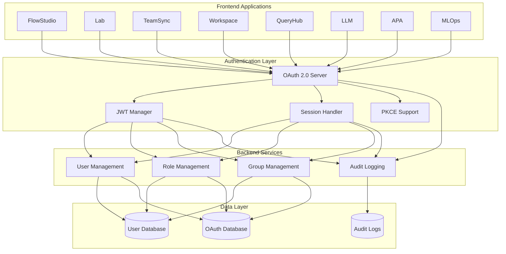
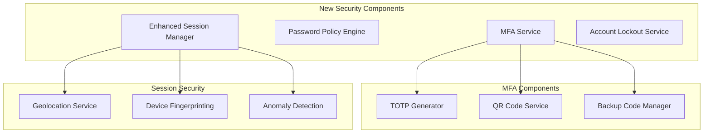
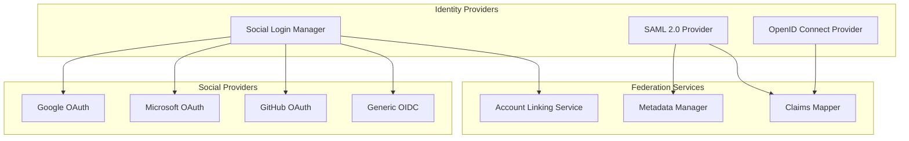
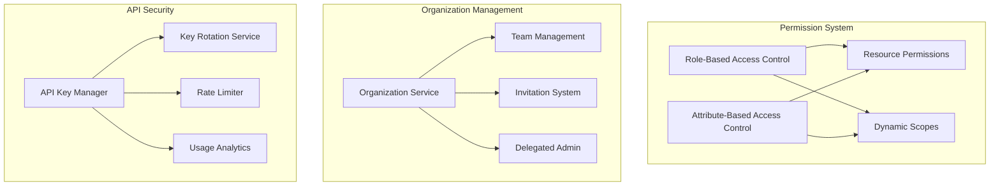
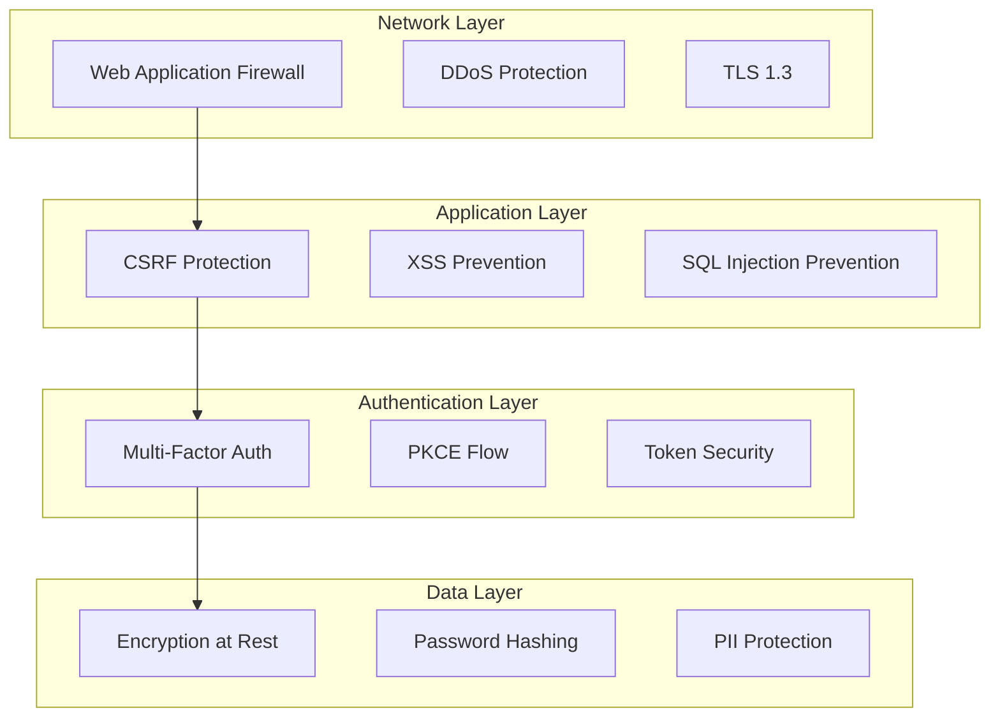
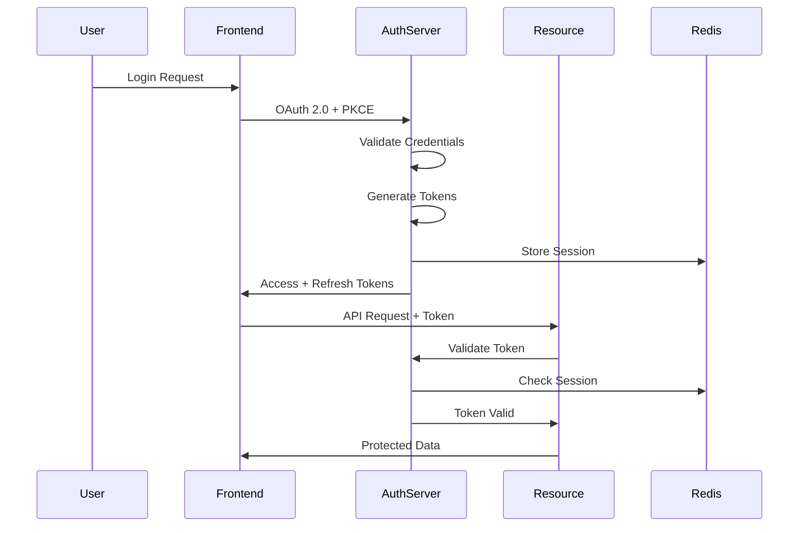
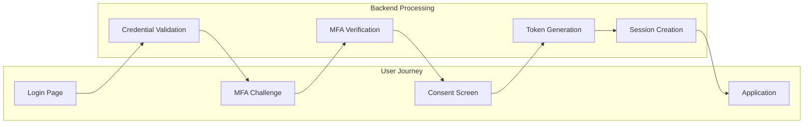
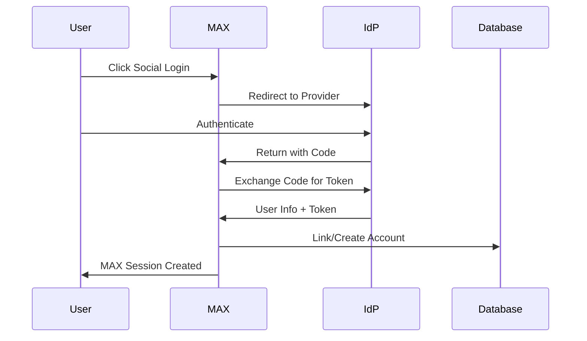
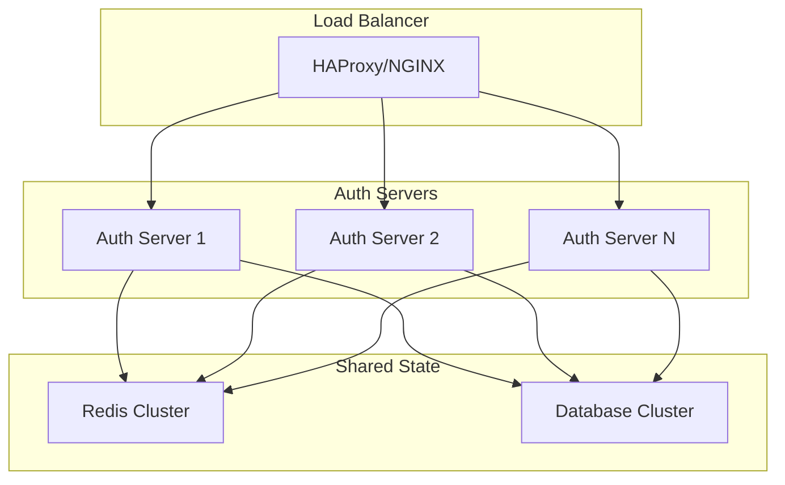
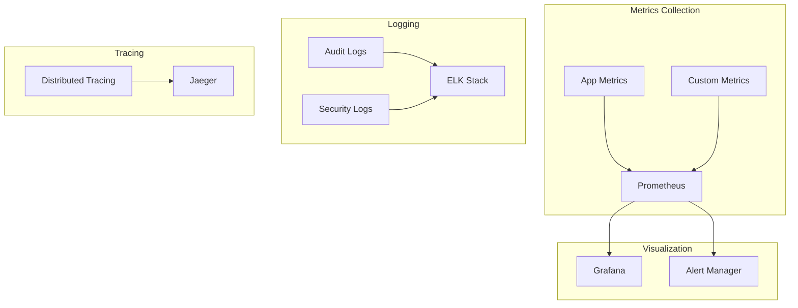

# MAX Platform Authentication Enhancement Architecture

## Overview

This document provides a comprehensive architectural overview of the MAX Platform authentication enhancement project, transforming the existing OAuth 2.0 system into an enterprise-grade identity and access management solution.

## Current State Architecture

### Existing Components

### Current Capabilities

- **OAuth 2.0 Authorization Code Flow with PKCE**
- **JWT-based Access and Refresh Tokens**
- **Multi-application SSO Support**
- **Basic User, Role, and Group Management**
- **Comprehensive Audit Logging**
- **Cross-origin Authentication Support**

## Enhanced Architecture Overview

### Phase 1: Core Security Enhancements

### Phase 2: Identity Federation Architecture

### Phase 3: Advanced Authorization

## Technical Stack

### Backend Technologies

- **Language**: Python (FastAPI)
- **Database**: PostgreSQL/MySQL/MSSQL (multi-database support)
- **Cache**: Redis (session storage, rate limiting)
- **Queue**: Celery/RabbitMQ (async operations)
- **Security**: PyJWT, cryptography, pyotp

### Frontend Technologies

- **Framework**: React 18+
- **State Management**: React Context API
- **UI Components**: Material-UI/Ant Design
- **Authentication**: Custom OAuth hooks
- **Security**: PKCE, secure storage

### Infrastructure

- **Container**: Docker
- **Orchestration**: Kubernetes
- **Load Balancer**: NGINX/HAProxy
- **Monitoring**: Prometheus/Grafana
- **Logging**: ELK Stack

## Security Architecture

### Defense in Depth

### Token Architecture

## Data Flow Architecture

### Authentication Flow

### Federation Flow

## Scalability Architecture

### Horizontal Scaling

### High Availability

- **Multi-region deployment** with geo-replication
- **Database clustering** with automatic failover
- **Redis Sentinel** for cache high availability
- **Circuit breakers** for service resilience
- **Health checks** and automatic recovery

## Monitoring Architecture

### Observability Stack

## Migration Strategy

### Phased Migration Approach

1. **Phase 1**: Deploy new security features alongside existing system
2. **Phase 2**: Gradual migration of applications to new features
3. **Phase 3**: Enable advanced features per application
4. **Phase 4**: Deprecate legacy authentication methods
5. **Phase 5**: Full cutover to enhanced system

### Backward Compatibility

- Maintain existing OAuth 2.0 endpoints
- Gradual feature enablement
- Legacy token support during transition
- Comprehensive migration tools
- Zero-downtime deployment strategy

## Performance Targets

### Response Time Goals

- **Authentication**: < 200ms average
- **Token Validation**: < 50ms
- **MFA Verification**: < 100ms
- **Session Lookup**: < 20ms (Redis)
- **API Endpoints**: < 100ms p95

### Capacity Planning

- **Concurrent Users**: 100,000+
- **Auth Requests**: 10,000 req/s
- **Token Validations**: 50,000 req/s
- **Session Storage**: 1M active sessions
- **Database Connections**: 1000 concurrent

## Disaster Recovery

### Backup Strategy

- **Database**: Hourly snapshots, point-in-time recovery
- **Redis**: AOF persistence, regular snapshots
- **Configuration**: Version controlled, encrypted backups
- **Secrets**: Hardware security module (HSM) backed
- **Audit Logs**: Immutable storage, long-term retention

### Recovery Procedures

1. **RTO (Recovery Time Objective)**: < 15 minutes
2. **RPO (Recovery Point Objective)**: < 1 hour
3. **Automated failover** for critical components
4. **Manual procedures** for complex scenarios
5. **Regular DR testing** and validation

## Next Steps

1. Review and approve architecture
2. Set up development environment
3. Begin Phase 1 implementation
4. Establish monitoring and metrics
5. Create detailed implementation guides

---

*This architecture document serves as the foundation for the MAX Platform authentication enhancement project. It will be updated as the implementation progresses and new requirements emerge.*